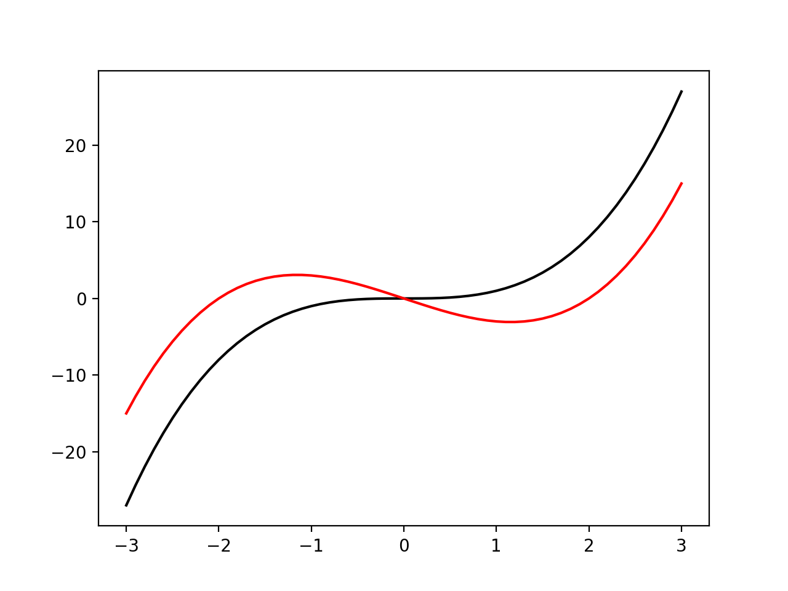

グラフに色をつけて表示させるには、グラフを表示するときに使ったpyplotの関数plotの引数に**color**というパラメータがあるので、そこに指定したい色を入力する。  

色以外にもplotには多くのパラメータが定義されている。詳しくは以下の公式レファレンスを参照する。  

- [pyplot.plot](https://matplotlib.org/3.1.1/api/_as_gen/matplotlib.pyplot.plot.html#matplotlib.pyplot.plot)


実行例を以下に示す。  

```python
>>> import numpy as np
>>> import matplotlib.pyplot as plt
>>> 
>>> #関数定義
>>> def f(x,w):
...     return (x-w)*x*(x+w)
... 
>>> 
>>> x = np.linspace(-3,3,61)
>>> x
array([-3. , -2.9, -2.8, -2.7, -2.6, -2.5, -2.4, -2.3, -2.2, -2.1, -2. ,
       -1.9, -1.8, -1.7, -1.6, -1.5, -1.4, -1.3, -1.2, -1.1, -1. , -0.9,
       -0.8, -0.7, -0.6, -0.5, -0.4, -0.3, -0.2, -0.1,  0. ,  0.1,  0.2,
        0.3,  0.4,  0.5,  0.6,  0.7,  0.8,  0.9,  1. ,  1.1,  1.2,  1.3,
        1.4,  1.5,  1.6,  1.7,  1.8,  1.9,  2. ,  2.1,  2.2,  2.3,  2.4,
        2.5,  2.6,  2.7,  2.8,  2.9,  3. ])
>>> 
>>> #y:f(x) = x**3
>>> y = f(x,0)
>>> 
>>> #y2:f(x) = (x-2)x(x+2)
>>> y2 = f(x,2)
>>> 
>>> #yは黒い線で描画
>>> plt.plot(x,y,color='black')
[<matplotlib.lines.Line2D object at 0x10d76c320>]
>>> 
>>> #y2は赤い線で描画
>>> plt.plot(x,y2,color='red')
[<matplotlib.lines.Line2D object at 0x10ea1f4e0>]
>>> 
>>> #グラフ表示
>>> plt.show()
>>> 
```

実行結果




因みに、colorに指定できる値は**matplotlib.colors.cnames**で確認することができる。

```python
>>> import matplotlib
>>> matplotlib.colors.cnames
{'aliceblue': '#F0F8FF', 'antiquewhite': '#FAEBD7', 'aqua': '#00FFFF', 'aquamarine': '#7FFFD4', 'azure': '#F0FFFF', 'beige': '#F5F5DC', 'bisque': '#FFE4C4', 'black': '#000000', 'blanchedalmond': '#FFEBCD', 'blue': '#0000FF', 'blueviolet': '#8A2BE2', 'brown': '#A52A2A', 'burlywood': '#DEB887', 'cadetblue': '#5F9EA0', 'chartreuse': '#7FFF00', 'chocolate': '#D2691E', 'coral': '#FF7F50', 'cornflowerblue': '#6495ED', 'cornsilk': '#FFF8DC', 'crimson': '#DC143C', 'cyan': '#00FFFF', 'darkblue': '#00008B', 'darkcyan': '#008B8B', 'darkgoldenrod': '#B8860B', 'darkgray': '#A9A9A9', 'darkgreen': '#006400', 'darkgrey': '#A9A9A9', 'darkkhaki': '#BDB76B', 'darkmagenta': '#8B008B', 'darkolivegreen': '#556B2F', 'darkorange': '#FF8C00', 'darkorchid': '#9932CC', 'darkred': '#8B0000', 'darksalmon': '#E9967A', 'darkseagreen': '#8FBC8F', 'darkslateblue': '#483D8B', 'darkslategray': '#2F4F4F', 'darkslategrey': '#2F4F4F', 'darkturquoise': '#00CED1', 'darkviolet': '#9400D3', 'deeppink': '#FF1493', 'deepskyblue': '#00BFFF', 'dimgray': '#696969', 'dimgrey': '#696969', 'dodgerblue': '#1E90FF', 'firebrick': '#B22222', 'floralwhite': '#FFFAF0', 'forestgreen': '#228B22', 'fuchsia': '#FF00FF', 'gainsboro': '#DCDCDC', 'ghostwhite': '#F8F8FF', 'gold': '#FFD700', 'goldenrod': '#DAA520', 'gray': '#808080', 'green': '#008000', 'greenyellow': '#ADFF2F', 'grey': '#808080', 'honeydew': '#F0FFF0', 'hotpink': '#FF69B4', 'indianred': '#CD5C5C', 'indigo': '#4B0082', 'ivory': '#FFFFF0', 'khaki': '#F0E68C', 'lavender': '#E6E6FA', 'lavenderblush': '#FFF0F5', 'lawngreen': '#7CFC00', 'lemonchiffon': '#FFFACD', 'lightblue': '#ADD8E6', 'lightcoral': '#F08080', 'lightcyan': '#E0FFFF', 'lightgoldenrodyellow': '#FAFAD2', 'lightgray': '#D3D3D3', 'lightgreen': '#90EE90', 'lightgrey': '#D3D3D3', 'lightpink': '#FFB6C1', 'lightsalmon': '#FFA07A', 'lightseagreen': '#20B2AA', 'lightskyblue': '#87CEFA', 'lightslategray': '#778899', 'lightslategrey': '#778899', 'lightsteelblue': '#B0C4DE', 'lightyellow': '#FFFFE0', 'lime': '#00FF00', 'limegreen': '#32CD32', 'linen': '#FAF0E6', 'magenta': '#FF00FF', 'maroon': '#800000', 'mediumaquamarine': '#66CDAA', 'mediumblue': '#0000CD', 'mediumorchid': '#BA55D3', 'mediumpurple': '#9370DB', 'mediumseagreen': '#3CB371', 'mediumslateblue': '#7B68EE', 'mediumspringgreen': '#00FA9A', 'mediumturquoise': '#48D1CC', 'mediumvioletred': '#C71585', 'midnightblue': '#191970', 'mintcream': '#F5FFFA', 'mistyrose': '#FFE4E1', 'moccasin': '#FFE4B5', 'navajowhite': '#FFDEAD', 'navy': '#000080', 'oldlace': '#FDF5E6', 'olive': '#808000', 'olivedrab': '#6B8E23', 'orange': '#FFA500', 'orangered': '#FF4500', 'orchid': '#DA70D6', 'palegoldenrod': '#EEE8AA', 'palegreen': '#98FB98', 'paleturquoise': '#AFEEEE', 'palevioletred': '#DB7093', 'papayawhip': '#FFEFD5', 'peachpuff': '#FFDAB9', 'peru': '#CD853F', 'pink': '#FFC0CB', 'plum': '#DDA0DD', 'powderblue': '#B0E0E6', 'purple': '#800080', 'rebeccapurple': '#663399', 'red': '#FF0000', 'rosybrown': '#BC8F8F', 'royalblue': '#4169E1', 'saddlebrown': '#8B4513', 'salmon': '#FA8072', 'sandybrown': '#F4A460', 'seagreen': '#2E8B57', 'seashell': '#FFF5EE', 'sienna': '#A0522D', 'silver': '#C0C0C0', 'skyblue': '#87CEEB', 'slateblue': '#6A5ACD', 'slategray': '#708090', 'slategrey': '#708090', 'snow': '#FFFAFA', 'springgreen': '#00FF7F', 'steelblue': '#4682B4', 'tan': '#D2B48C', 'teal': '#008080', 'thistle': '#D8BFD8', 'tomato': '#FF6347', 'turquoise': '#40E0D0', 'violet': '#EE82EE', 'wheat': '#F5DEB3', 'white': '#FFFFFF', 'whitesmoke': '#F5F5F5', 'yellow': '#FFFF00', 'yellowgreen': '#9ACD32'}
>>> 
```

また基本色として定義されているのが以下の値。一文字でも、正式名でも良い。  


'b':blue  
'g':green  
'r':red  
'c':cyan  
'm':magenta  
'y':yellow  
'k':black  
'w':white  

これ以外にカラーコード、CSSの色名もcolorに指定できる。  

