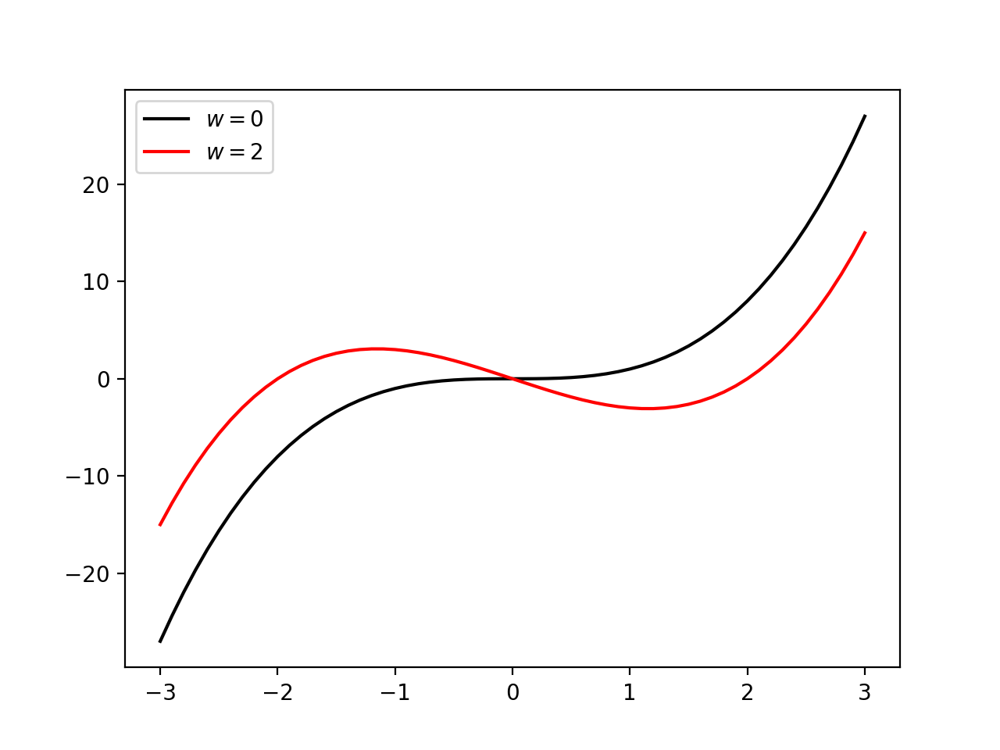

グラフに凡例を表示させるには、まずグラフを表示するときに使ったpyplotの関数plotの引数に**label**というパラメータがあるので、そこに指定する。  
凡例をグラフのどこに表示するかは自動で決まるが、こちらで指定したい場合はplotの関数**legend**を利用する。  

例として、前述のグラフに色をつけるで作成したグラフに凡例を表示する例を示す。  

```python
>>> import numpy as np
>>> import matplotlib.pyplot as plt
>>> 
>>> 
>>> def f(x,w):
...     return (x-w)*x*(x+w)
... 
>>> 
>>> x = np.linspace(-3,3,61)
>>> 
>>> #y:f(x) = x**3、w=0という凡例をつける
>>> y = f(x,0)
>>> plt.plot(x,y,color='black',label='$w=0$')
[<matplotlib.lines.Line2D object at 0x118e0b748>]
>>> 
>>> #y2:f(x) = (x-2)x(x+2)、w=2という凡例をつける
>>> y2 = f(x,2)
>>> plt.plot(x,y2,color='red',label='$w=2$')
[<matplotlib.lines.Line2D object at 0x118e0bb38>]
>>> 
>>> #グラフに凡例を表示
>>> plt.legend(loc="upper left")
<matplotlib.legend.Legend object at 0x113bbbf60>
>>> 
>>> plt.show()
>>> 
```

実行結果



グラフに凡例を表示する際は、legend関数の引数**loc**に表示させたい位置を入力する。  
入力できる値は以下の通り。  

- 'best'	
- 'upper right'  
- 'upper left'  
- 'lower left'  
- 'lower right'  
- 'right'  
- 'center left'  
- 'center right'  
- 'lower center'  
- 'upper center'  
- 'center'  

'best'にすると凡例を最適な位置に配置してくれる。

