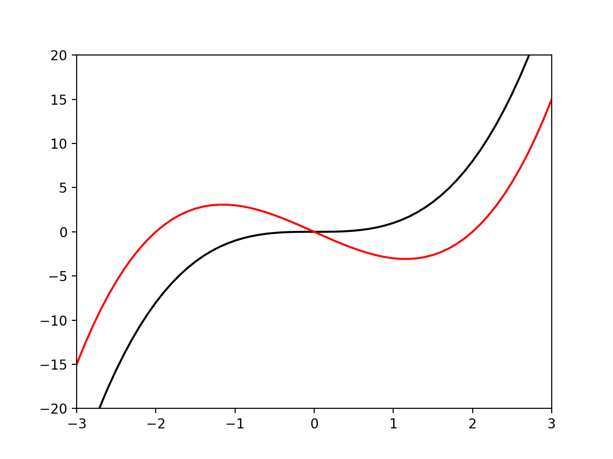

グラフの軸の表示範囲は入力した座標の最大値、最小値に基づいて決定されるが、  
こちらでx,y軸の表示範囲を指定したい場合、x軸は**xlim(min,max)**、y軸は**ylim(min,max)**という関数を使って指定する。  

例として、前述のグラフに色をつけるで作成したグラフに表示範囲を指定した例を示す。  

```python
>>> import numpy as np
>>> import matplotlib.pyplot as plt
>>> 
>>> 
>>> def f(x,w):
...     return (x-w)*x*(x+w)
... 
>>> 
>>> x = np.linspace(-3,3,61)
>>> 
>>> #y:f(x) = x**3、w=0という凡例をつける
>>> y = f(x,0)
>>> plt.plot(x,y,color='black',label='$w=0$')
[<matplotlib.lines.Line2D object at 0x118e0b748>]
>>> 
>>> #y2:f(x) = (x-2)x(x+2)、w=2という凡例をつける
>>> y2 = f(x,2)
>>> plt.plot(x,y2,color='red',label='$w=2$')
[<matplotlib.lines.Line2D object at 0x118e0bb38>]
>>> 
>>> #x軸は-3~3の範囲で表示
>>> plt.xlim(-3,3)
(-3, 3)
>>> 
>>> #y軸は-20~20の範囲で表示
>>> plt.ylim(-20,20)
(-20, 20)
>>> 
>>> plt.show()
>>> 
```

実行結果



-3≦x≦3、-20≦y≦20の範囲でグラフが表示された。  

