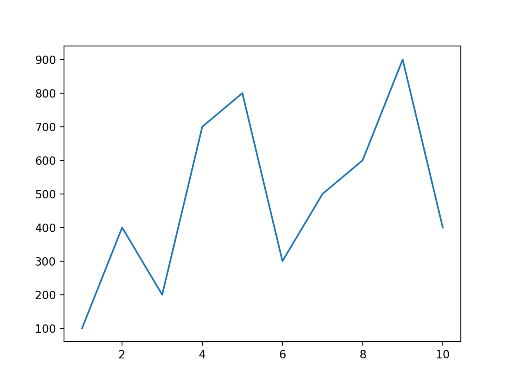

グラフを描くためには **matplotlib** の **pyplot** ライブラリを利用する。  
ここでは2次元の折れ線グラフを作成する。
そのために、グラフに描画するための座標データを作成する。

```python
>>> import numpy as np
>>> import matplotlib.pyplot as plt
>>> 
>>> #x軸データ
>>> x = np.array([1,2,3,4,5,6,7,8,9,10])
>>> #y軸データ
>>> y = np.array([100,400,200,700,800,300,500,600,900,400])
>>> 
>>> x
array([ 1,  2,  3,  4,  5,  6,  7,  8,  9, 10])
>>> y
array([100, 400, 200, 700, 800, 300, 500, 600, 900, 400])
>>> 
>>> #グラフ描画
>>> plt.plot(x,y)
[<matplotlib.lines.Line2D object at 0x105dd6a58>]
>>> #グラフ描写
>>> plt.show()
>>> 
```

実行結果




