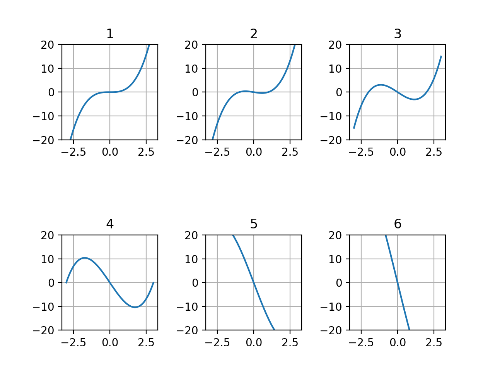

グラフを複数表示するにはpyplotの関数**subplot**を使う。  

`subplot(nrows, ncols, index)`

subplotを使うと縦nrows×横ncolsのマスにグラフを複数並べて表示できる。
場所の番号は左上から1,2,3..となっており、グラフをsubplotで表示させたい位置を引数indexに指定する。

実行例を以下に示す。

```python
>>> import numpy as np
>>> import matplotlib.pyplot as plt
>>> 
>>> def f(x,w):
...     return (x-w)*x*(x+w)
... 
>>> x = np.linspace(-3,3,61)
>>> 
>>> #subplotで表示する各グラフ間の間隔を指定する
>>> #wsapceは横間隔、hspaceは縦間隔
>>> plt.subplots_adjust(wspace=0.5,hspace=1.0)
>>> 
>>> #w:0~5でグラフ作成して表示
>>> for i in range(6):
...     plt.subplot(2,3,i+1)
...     plt.title(i+1)
...     plt.plot(x,f(x,i))
...     plt.ylim(-20,20)
...     plt.grid(True)
... 
<matplotlib.axes._subplots.AxesSubplot object at 0x11bb4f2e8>
Text(0.5, 1.0, '1')
[<matplotlib.lines.Line2D object at 0x11bb57ba8>]
(-20, 20)
<matplotlib.axes._subplots.AxesSubplot object at 0x11aa58b00>
Text(0.5, 1.0, '2')
[<matplotlib.lines.Line2D object at 0x11aa75c50>]
(-20, 20)
<matplotlib.axes._subplots.AxesSubplot object at 0x11aa58e10>
Text(0.5, 1.0, '3')
[<matplotlib.lines.Line2D object at 0x11aaaf5f8>]
(-20, 20)
<matplotlib.axes._subplots.AxesSubplot object at 0x11aa947b8>
Text(0.5, 1.0, '4')
[<matplotlib.lines.Line2D object at 0x11aae6f60>]
(-20, 20)
<matplotlib.axes._subplots.AxesSubplot object at 0x11aad0160>
Text(0.5, 1.0, '5')
[<matplotlib.lines.Line2D object at 0x11ab1f908>]
(-20, 20)
<matplotlib.axes._subplots.AxesSubplot object at 0x11ab01ac8>
Text(0.5, 1.0, '6')
[<matplotlib.lines.Line2D object at 0x11ab592b0>]
(-20, 20)
>>> 
>>> plt.show()
>>> 
```

実行結果  



