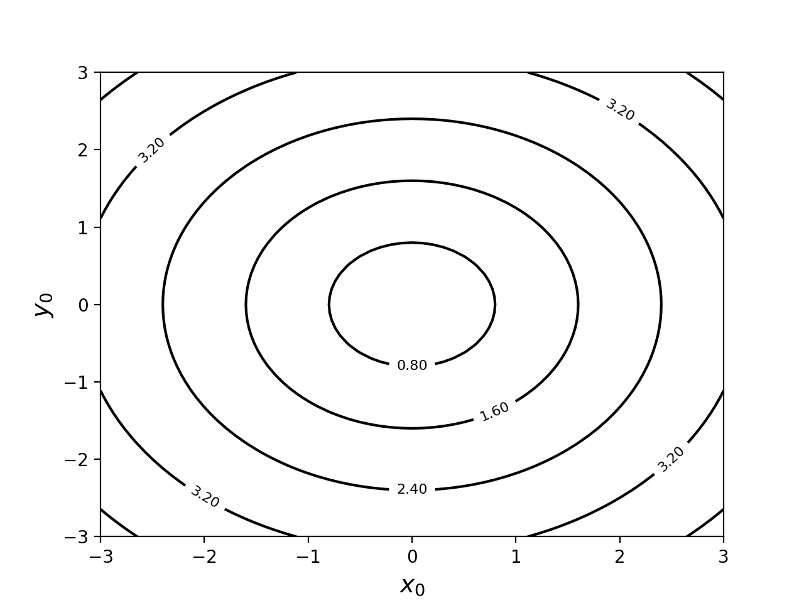

2変数関数のグラフとして、等高線プロットで表示するにはpyplotの関数**contour**を利用する。  

前述の2変数関数のグラフ(３D面グラフ)を作成するで定義した関数を等高線プロットに表示する例を示す。  

```python
>>> 
>>> import math
>>> import numpy as np
>>> import matplotlib.pyplot as plt
>>> 
>>> def f(x,y):
...     return math.sqrt(x**2 + y**2)
... 
>>> 
>>> x = np.linspace(-3,3,61)
>>> y = np.linspace(-3,3,61)
>>> 
>>> z = np.zeros((len(x),len(y)))
>>> 
>>> for xi in range(len(x)):
...     for yi in range(len(y)):
...             z[yi,xi] = f(x[xi],y[yi])
... 
>>> 
>>> #x,yの交点の座標（格子点）を作成する。xxには格子点のx座標、yyには格子点のy座標が入る
>>> xx,yy = np.meshgrid(x,y)
>>> 
>>> #contour関数で等高線プロット
>>> cont = plt.contour(xx,yy,z,5,colors='black')
>>> 
>>> #等高線に表示する高さラベル
>>> cont.clabel(fmt='%3.2f',fontsize=8)
<a list of 7 text.Text objects>
>>> 
>>> # x軸
>>> plt.xlabel('$x_0$',fontsize=14)
Text(0.5, 0, '$x_0$')
>>> 
>>> # y軸
>>> plt.ylabel('$y_0$',fontsize=14)
Text(0, 0.5, '$y_0$')
>>> 
>>> plt.show()
>>> 
```

実行結果  



contour関数にはx,y,z軸の値に加え、表示する高さのレベル（この例では5）を設定する。


