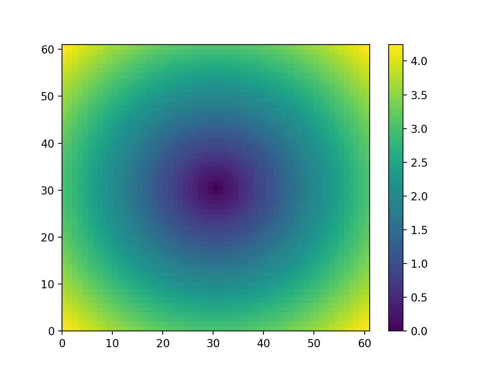
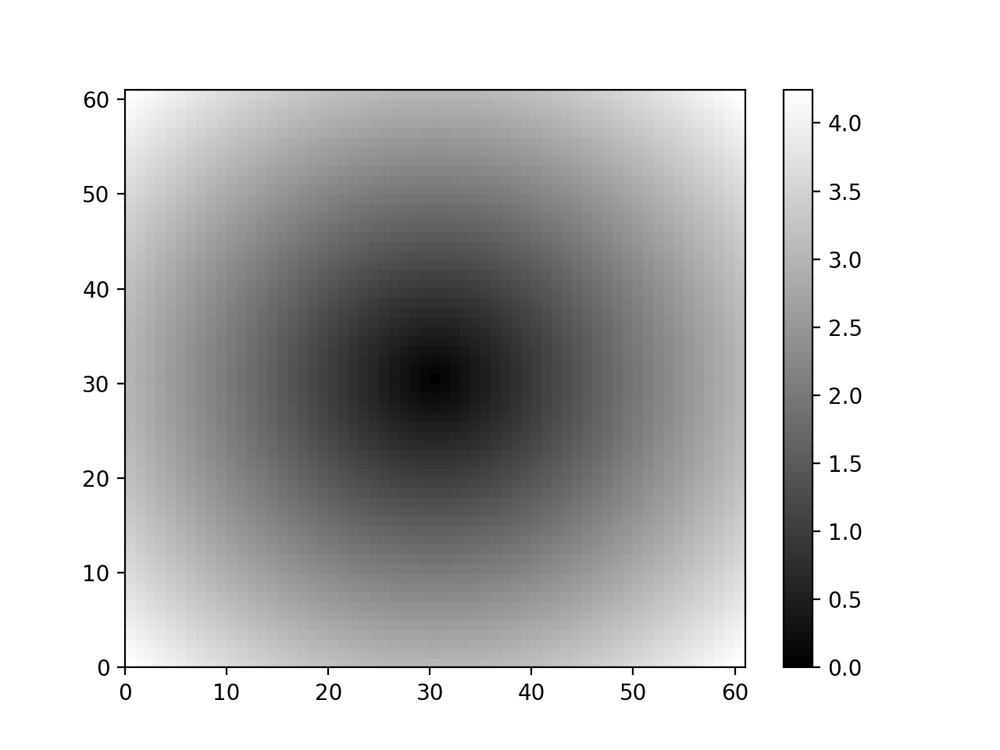

2変数関数のグラフとして、、ヒートマップで表示するにはpyplotの関数**pcolor**を利用する。  

前述の2変数関数を定義するで定義した関数をヒートマップに表示する例を示す。  

```python
>>> import math
>>> import numpy as np
>>> import matplotlib.pyplot as plt
>>> 
>>> def f(x,y):
...     return math.sqrt(x**2 + y**2)
... 
>>> 
>>> x = np.linspace(-3,3,61)
>>> y = np.linspace(-3,3,61)
>>> 
>>> z = np.zeros((len(x),len(y)))
>>> 
>>> for xi in range(len(x)):
...     for yi in range(len(y)):
...             z[yi,xi] = f(x[xi],y[yi])
... 
>>> 
>>> #zをpcolorでヒートマップにプロット 
>>> plt.pcolor(z)
<matplotlib.collections.PolyCollection object at 0x113347a58>
>>> 
>>> #ヒートマップの横にカラーバーを表示させる
>>> plt.colorbar()
<matplotlib.colorbar.Colorbar object at 0x113bf8eb8>
>>> 
>>> plt.show()
>>> 
```

実行結果  



ヒートマップのグラデーションの色はユーザー側で指定できる。指定したい場合は、plt.**gray()**、plt.**jet()**、plt.**pink()**など色を指定して行う。  
指定できる色は**help(pyplot.colormaps)**を参照すると記載されている。  
試しに、gray()を指定した例を示す。  

```python
>>> #ヒートマップの色調の指定。グレー
>>> plt.gray()
>>> 
>>> plt.pcolor(z)
<matplotlib.collections.PolyCollection object at 0x113f6fa20>
>>> 
>>> plt.colorbar()
<matplotlib.colorbar.Colorbar object at 0x115835e48>
>>> 
>>> plt.show()
>>> 
```

実行結果  



