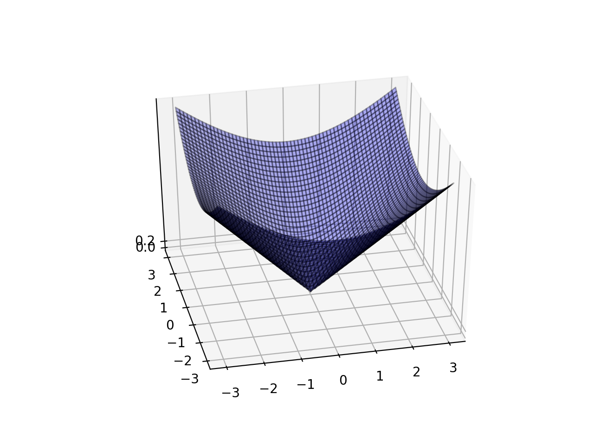

2変数関数のグラフとして、3D面グラフで表示するにはmpl_toolkits.mplot3dの関数**Axes3D**を利用する。  

前述の2変数関数を定義するで定義した関数を3D面グラフに表示する例を示す。  

```python
>>> 
>>> from mpl_toolkits.mplot3d import Axes3D
>>> 
>>> import math
>>> import numpy as np
>>> import matplotlib.pyplot as plt
>>> 
>>> def f(x,y):
...     return math.sqrt(x**2 + y**2)
... 
>>> 
>>> x = np.linspace(-3,3,61)
>>> y = np.linspace(-3,3,61)
>>> 
>>> z=np.zeros((len(x),len(y)))
>>> 
>>> for xi in range(len(x)):
...     for yi in range(len(y)):
...             z[yi,xi] = f(x[xi],y[yi])
... 
>>> #x,yの交点の座標（格子点）を作成する。xxには格子点のx座標、yyには格子点のy座標が入る
>>> xx,yy = np.meshgrid(x,y)
>>> 
>>> xx
array([[-3. , -2.9, -2.8, ...,  2.8,  2.9,  3. ],
       [-3. , -2.9, -2.8, ...,  2.8,  2.9,  3. ],
       [-3. , -2.9, -2.8, ...,  2.8,  2.9,  3. ],
       ...,
       [-3. , -2.9, -2.8, ...,  2.8,  2.9,  3. ],
       [-3. , -2.9, -2.8, ...,  2.8,  2.9,  3. ],
       [-3. , -2.9, -2.8, ...,  2.8,  2.9,  3. ]])
>>> 
>>> 
>>> yy
array([[-3. , -3. , -3. , ..., -3. , -3. , -3. ],
       [-2.9, -2.9, -2.9, ..., -2.9, -2.9, -2.9],
       [-2.8, -2.8, -2.8, ..., -2.8, -2.8, -2.8],
       ...,
       [ 2.8,  2.8,  2.8, ...,  2.8,  2.8,  2.8],
       [ 2.9,  2.9,  2.9, ...,  2.9,  2.9,  2.9],
       [ 3. ,  3. ,  3. , ...,  3. ,  3. ,  3. ]])
>>> 
>>> # subplot。projection='3d'の指定をする
>>> ax = plt.subplot(1,1,1,projection='3d')
>>>  
>>> # plot_surfaceで3D面グラフをプロットする
>>> ax.plot_surface(xx,yy,z,rstride=1,cstride=1,alpha=0.3,color='blue',edgecolor='black')
<mpl_toolkits.mplot3d.art3d.Poly3DCollection object at 0x11bbfcac8>
>>> 
>>> ax.set_zticks((0,0.2))
[<matplotlib.axis.XTick object at 0x11bbf5400>, <matplotlib.axis.XTick object at 0x1120316a0>]
>>> 
>>> ax.view_init(75,-95)
>>> 
>>> plt.show()
>>> 
```

実行結果  



**Axes3D**は3Dグラフを表示するのに使うライブラリである。  
**plot_surface**は3次元面グラフを作成するAxes3Dの関数である。plot_surfaceにグラフ表示したいx,y,z座標のデータを入力する。rstride,cstrideには表示するグリッド線の間隔を指定する。


