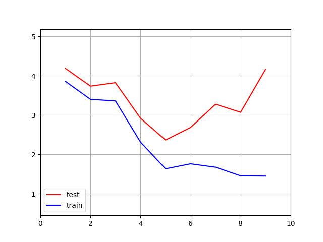

先述のホールドアウト検証では、訓練(テスト)データの選び方によって出力結果が変わってくることを話した。なるべく変化が少なくなるようにするにはどうすれば良いのだろうか。

方法の一つとして、**交差検証**という方法を示す。

これは簡単にいうとホールドアウト検証を分割した全パターンで行い、それぞれの出力の平均値を評価に利用するという方式である。

データを分割した個数で**K-分割交差検証**とも呼ぶ。

データがN個あるとき、Kは1≦K≦Nの範囲で分割を行える。最大の分割数はK=Nで、このときテストデータの個数は１個になる。この場合の交差検証のことを特別に**リーブワンアウト交差検定**と呼ぶ。

先ほどのホールドアウト検証において、分割したデータのうち一つをテストデータとおいた場合での実行を全パターン、行ってみる。

k分割交差検証を行うコードは以下の通り。(k_hold_cross_validation.py)

```python
import numpy as np
from linear_basis_function import mse
from linear_basis_function import design_matrix
from linear_basis_function import linear_basis_func

#k分割交差検証 x:入力データ、t:実測値、m:線形基底関数モデルの数、k:分割する個数
def k_hold_cross_validation(x,t,m,k):
    x=np.array(x)
    t=np.array(t)
    n=x.shape[0]
    mse_train=np.zeros(k)
    mse_test=np.zeros(k)
    mu=np.linspace(min(x),max(x),m)
    for i in range(k):
        x_train = x[np.fmod(range(n),k) != i]
        t_train = t[np.fmod(range(n),k) != i]
        x_test = x[np.fmod(range(n),k) == i]
        t_test = t[np.fmod(range(n),k) == i]
        w_train = design_matrix(x_train,t_train,mu,1)

        y_train = linear_basis_func(w_train,x_train,mu,1)
        mse_train[i] = mse(y_train,t_train)

        y_test = linear_basis_func(w_train,x_test,mu,1)
        mse_test[i] = mse(y_test,t_test)

    return mse_train,mse_test
```

例として、M=3,k=4とした時の実行結果は以下の通り。(k_hold_cross_validation_example.py)

```python
import numpy as np
from k_hold_cross_validation import k_hold_cross_validation

#入力値
x = np.load('x.npy')
#実測値
t = np.load('t.npy')

mse_train,mse_test=k_hold_cross_validation(x,t,3,4)
print(mse_train)
print(mse_test)
#標準偏差(mseの平均の平方根)の算出
print("train:{0}".format(np.sqrt(np.mean(mse_train))))
print("test :{0}".format(np.sqrt(np.mean(mse_test))))
```

実行結果

```
[11.34746956 11.29719213 14.20404757  8.14992362]
[13.17632534 12.04601311  3.21443304 21.05860186]
train:3.354051016302551
test :3.5176474150746544
```

実行結果において、最初のarrayは訓練データの平均二乗誤差、その次のarrayはテストデータの平均二乗誤差を示している。
k=4のため、データを４分割し、そのうちの一つをテストデータとして利用し、残りを訓練データとして利用するのを４パターン行うため、結果として配列の長さは４になる。
一つのMに対する評価指標としては、この算出した訓練データ及びテストデータの平均二乗誤差の標準偏差とする。

このコードを利用し、M:1~10の範囲で、分割数を最大にしたリーブワンアウト検証を利用して最適なMを求めてみることを考える。

リーブワンアウト検証を利用したMを求めるコードは以下の通り。(k_hold_cross_valisation_plot.py)

```python
import numpy as np
import matplotlib.pyplot as plt
from k_hold_cross_validation import k_hold_cross_validation

#入力値
x = np.load('x.npy')
#実測値
t = np.load('t.npy')

#分割数
k = len(x)
#m
M = range(1,10)

train=np.zeros(len(M))
test=np.zeros(len(M))

for i in range(len(M)):
    train_i,test_i=k_hold_cross_validation(x,t,M[i],k)
    train[i]=np.sqrt(np.mean(train_i))
    test[i]=np.sqrt(np.mean(test_i))


plt.xlim(min(M)-1,max(M)+1)
plt.ylim(min(min(train),min(test))-1,max(max(train),max(test))+1)

plt.plot(M,test,color='red',label='test')
plt.plot(M,train,color='blue',label='train')
plt.legend(loc='lower left')

plt.grid(True)
plt.show()
```

実行結果



となり、リーブワンアウト検証によりM=5の時にテストデータの誤差が最も小さくなり、最適ということになる。

