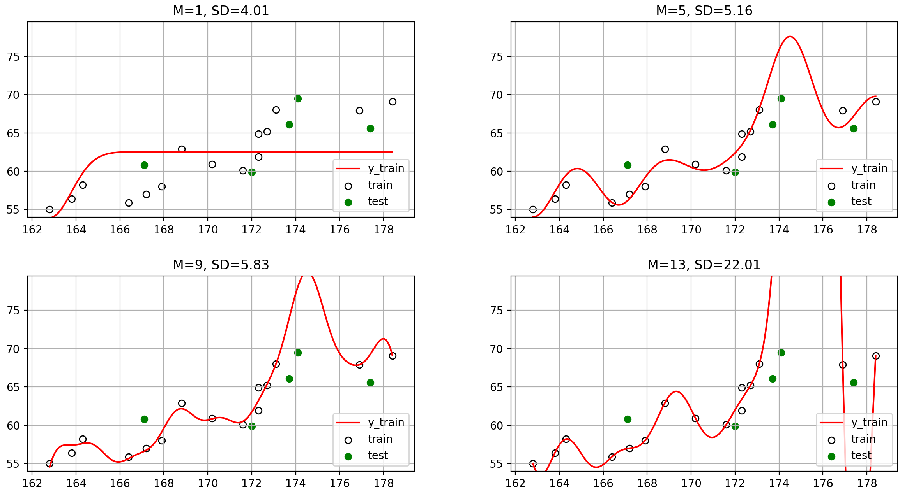
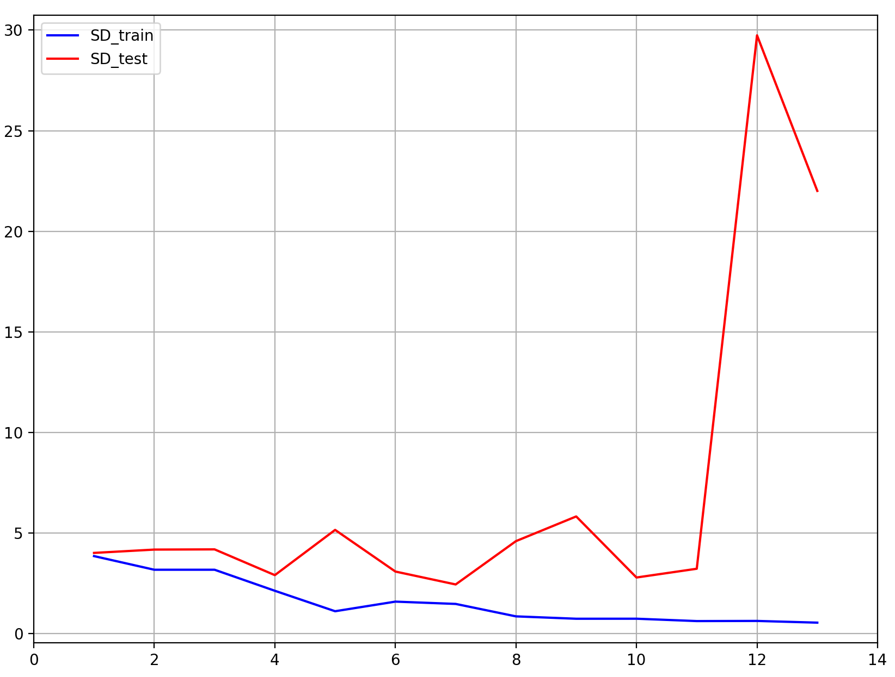

先述のオーバーフィッティング(過学習)の章で、Mを大きくすればするほど既存の入力データに対する精度が高くなり、未知の入力に対する予測精度が悪くなるという問題があった。最適なMはどう求めれば良いのだろうか？

その一つの方法として、**ホールドアウト検証**という手法を挙げる。

これは、今ある入力データをいくつかの集合に分割し、そのうちのいくつかを学習に使って予測式を作り、残りのデータでその予測式を使った結果の平均二乗誤差(または標準偏差SD)を算出することでMの評価基準とする、という方法である。

ここで、予測式を作るための学習に使うデータのことを**訓練データ (training data)**といい、作成した予測式の評価に用いるデータを**テストデータ (test data)**と呼ぶ。

では試しに、先述の線形基底関数モデルで利用したデータ(=直線モデル(線形回帰)で利用したデータ)を４分割し、初めの4分の３を訓練データとして学習させ、残りの4分の１をテストデータとして利用し、各Mの評価を行ってみよう。

コードを以下に記載する。(holdout_validation.py)

```python
import math
import matplotlib.pyplot as plt
import numpy as np
from linear_basis_function import mse
from linear_basis_function import design_matrix
from linear_basis_function import linear_basis_func

#入力値
x = np.load('x.npy')
#実測値
t = np.load('t.npy')

#mを設定
M=[1,5,9,13]

#訓練データ,全体の3/4
n=(len(x)//4)*3
x_train=x[:n]
t_train=t[:n]

#テストデータ
x_test=x[n:]
t_test=t[n:]

#メイン(プロット)
plt.figure(figsize=(20,7.5))
plt.subplots_adjust(wspace=0.25,hspace=0.3)

for i in range(len(M)):
    plt.subplot(2,2,i+1)

    m=M[i]

    #ガウス関数の中心 はxの最小値〜最大値の間で設定
    mu=np.linspace(min(x_train),max(x_train),m)
    #訓練データでw,y算出
    w_train = design_matrix(x_train,t_train,mu,1)
    y_test = linear_basis_func(w_train,x_test,mu,1)

    #標準偏差SD算出
    sd = math.sqrt(mse(y_test,t_test))

    #予測式を細かく表示させるためのデータ作成
    x_forplot = np.linspace(min(x_train),max(x_train),1000)
    y_forplot = linear_basis_func(w_train,x_forplot,mu,1)

    #プロット
    plt.scatter(x_train,t_train,c='white',label='train',edgecolors="black")
    plt.scatter(x_test,t_test,c='green',label='test')
    plt.xlim(min(x)-1,max(x)+1)
    plt.ylim(min(t)-1,max(t)+10)

    plt.plot(x_forplot,y_forplot,'-',color='red',label='y_train')
    plt.legend(loc='lower right')
    plt.title("M={0:d}, SD={1:.2f}".format(m,sd))

    plt.grid(True)
plt.show()
```

実行結果



となり、Mが高くなるほど訓練データへの誤差は少なくなるが、テストデータへの誤差（標準偏差）は大きくなる。

この場合で最適なMを調べるために、各Mにおいて訓練データとテストデータの誤差(標準偏差)を調べてみよう。

各Mにおいて訓練データとテストデータの誤差(標準偏差)を算出し、グラフを作成するコードを以下に記載する。

```python
import math
import matplotlib.pyplot as plt
import numpy as np
from linear_basis_function import mse
from linear_basis_function import design_matrix
from linear_basis_function import linear_basis_func

#入力値
x = np.load('x.npy')
#実測値
t = np.load('t.npy')

#訓練データ,全体の3/4
n=(len(x)//4)*3
x_train=x[:n]
t_train=t[:n]

#テストデータ
x_test=x[n:]
t_test=t[n:]

#M毎の標準偏差SD
sd_train=[]
sd_test=[]

#メイン(プロット)
plt.figure(figsize=(10,7.5))

M=[i for i in range(1,14)]

for m in M:

    #ガウス関数の中心 はxの最小値〜最大値の間で設定
    mu=np.linspace(min(x_train),max(x_train),m)
    #訓練データでw,y算出
    w_train = design_matrix(x_train,t_train,mu,1)
    y_test = linear_basis_func(w_train,x_test,mu,1)
    y_train = linear_basis_func(w_train,x_train,mu,1)

    #標準偏差SD算出
    sd_train.append(math.sqrt(mse(y_train,t_train)))
    sd_test.append(math.sqrt(mse(y_test,t_test)))

#プロット
plt.xlim(min(M)-1,max(M)+1)
plt.ylim(min(min(sd_train),min(sd_test))-1,max(max(sd_train),max(sd_test))+1)

plt.plot(M,sd_train,'-',color='blue',label='SD_train')
plt.plot(M,sd_test,'-',color='red',label='SD_test')
plt.legend(loc='higher left')

plt.grid(True)
plt.show()
```

実行結果



のようになり、この図よりテストデータに対して誤差が最も低くなるM=7,10あたりが最も適切なMであると推測できる。

よって、このホールドアウト検証で最適なMが決定できた。

しかし、今回はテストデータが分散しているため良いが、例えばテストデータがひとかたまりになる場合（テストデータを低い順または高い順から取ってくるなど）すると、また学習結果も悪くなるのは予想できると思う。つまり、実はホールドアウト検証はどれを訓練データ及びテストデータに選ぶかによって結果が変わってくるものなのである。

そこで、もう一つの検証方法についてを次章で述べる。

