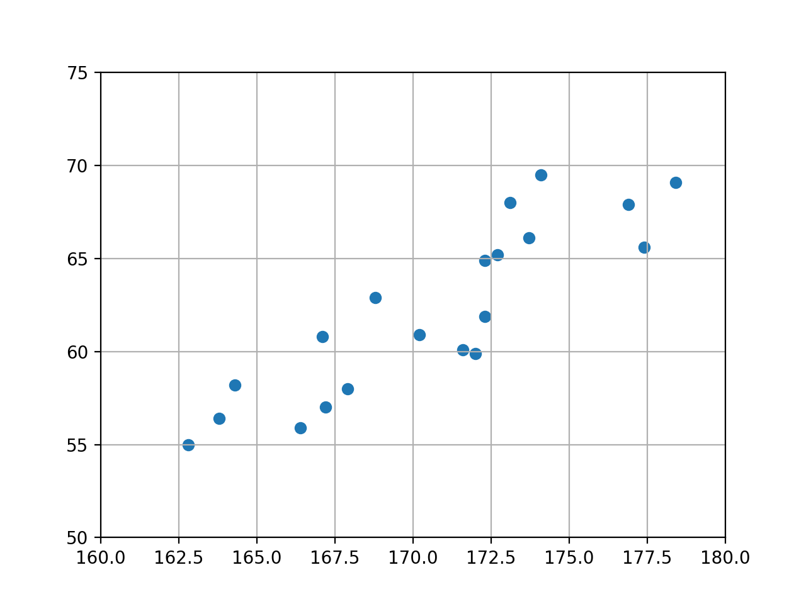
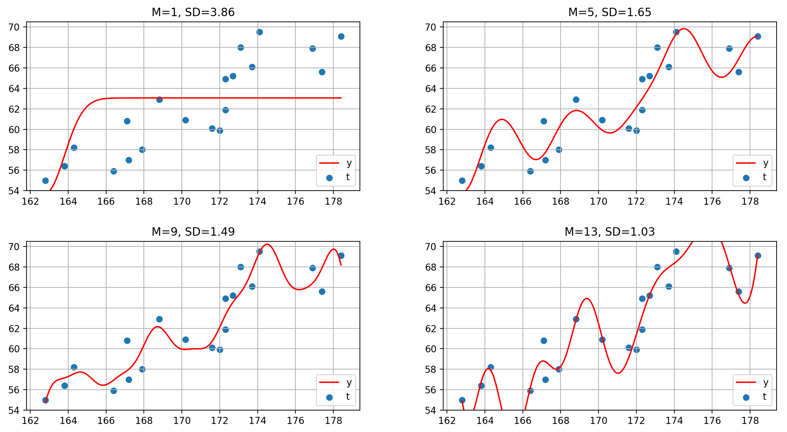

先ほどまでの章では、データの予測に直線モデルを利用していたが、勿論直線モデルを利用するのが必ずしも最適ではないという場合もある。

直線ではなく、曲線となるような関数をモデルにしてみるのはどうだろうか？ここではそれについて述べる。

と言っても曲線となる関数は色々あるが、今回はその中でも汎用性が高いと言われている**線形基底関数モデル**を利用する。

基底関数とは、元となる関数という意味で、先ほどの線形関数(y=w<sub>0</sub>x+w<sub>1</sub>)のxを基底関数φ(x)に置き換えたものが線形基底関数モデルになる。

基底関数には色々種類があるが、ここではガウス関数を基底関数と置いた場合を例にとる。

その場合の線形基底関数モデルの式は以下のようになる。

$$
\tag{1}  y(x, {\bf w} ) = w_{0} \phi_{0} (x) + w_{1} \phi_{1} (x) + w_{2} \phi_{2} (x) + \cdots + w_{M}
$$

ここでφ<sub>j</sub>(x)はガウス関数で、以下のように表される。

$$
\tag{2} \phi_{j} (x) = \exp( - \frac{ ( x - \mu_{j} )^2 }{ 2 v^2} )
$$

μ<sub>j</sub>はガウス関数φ<sub>j</sub>(x)の中心位置で、vは関数の広がりの程度を示す。

次に、この線形基底関数モデルの式を行列を用い表現することを考えてみる。

式(1)において、

$$
  {\bf w} = \left[
    \begin{array}{cccc}
      w_{0} \\
      w_{1} \\
      \vdots \\
      w_{M}
    \end{array}
  \right]
  ,
    {\bf \Phi} = \left[
    \begin{array}{cccc}
      \phi_{0} \\
      \phi_{1} \\
      \vdots \\
      \phi_{M}
    \end{array}
  \right]
$$

とおくと、式(1)は以下のように表される。

$$
\tag{3}  y({\bf x}, {\bf w} ) = \sum_{i=0}^{M} w_{i} \phi_{i} (x) = {\bf w} ^\mathrm{T} {\bf \Phi} ( {\bf x} )
$$

ここで、式(1)を見ても分かるように、第M項目はw<sub>M</sub>のみであり、　φ<sub>M</sub>(x) は実は存在しない。

実はφ<sub>M</sub>(x)は先述のN次元線形回帰モデルのところでもあったように、φ<sub>M</sub>(x)は式(3)での行列計算のために入れているダミーの基底関数であり、w<sub>M</sub>φ<sub>M</sub>(x) が w<sub>M</sub>になる様にφ<sub>M</sub>(x) = 1　とする。


この式(3)を用い、これまでと同様にして平均二乗誤差Jを求めてみよう。

実測値を{t<sub>n</sub>}とおくと、平均二乗誤差Jは次の式(4)で表される。

$$
\tag{4}  J( {\bf w} ) = \frac{1}{N} \sum_{n=0}^{N-1} ( {\bf w} ^\mathrm{T} {\bf \Phi} ( x_{n} ) - t_{n} ) ^2
$$

この式(4)だが、先述のN次元線形回帰モデルの式(4)に類似している。

$$
  J( {\bf w} ) = \frac{1}{N} \sum_{n=0}^{N-1} ( {\bf w} ^\mathrm{T} {\bf x}_{n} - t_{n} )^2
$$

<b>x</b><sub>n</sub>が<b>φ</b><sub>n</sub>(x)に変わったのみであり、そのため実はこの線形基底関数モデルにおいても、解はムーアーペンローズの擬似逆行列の形になる。

よって、Jを最小化する<b>w</b>は以下の式のようになる。

$$
\tag{5}   {\bf w} = ( {\bf \Phi} ^\mathrm{T}  {\bf \Phi} )^{-1} {\bf \Phi} ^\mathrm{T} {\bf t}
$$

ただし

$$
\tag{6}   
        {\bf \Phi}
        = 
                \left[
                    \begin{array}{cccc}
                    \phi_{0} (x_{0}) & \phi_{1} (x_{0}) & \cdots & \phi_{M} (x_{0}) \\
                    \phi_{0} (x_{1}) & \phi_{1} (x_{1}) & \cdots & \phi_{M} (x_{1}) \\
                    \vdots & \vdots & \ddots & \vdots \\
                    \phi_{0} (x_{N-1}) & \phi_{1} (x_{N-1}) & \cdots & \phi_{M} (x_{N-1})
                    \end{array}
                \right]
$$

である。この式(6)で表される行列を**計画行列**と言う。

基底関数としているガウス関数を多次元入力に対応させると、以下のようになる。

$$
\tag{7}   
        {\bf \Phi}
        = 
                \left[
                    \begin{array}{cccc}
                    \phi_{0} ({\bf x}_{0}) & \phi_{1} ({\bf x}_{0}) & \cdots & \phi_{M} ({\bf x}_{0}) \\
                    \phi_{0} ({\bf x}_{1}) & \phi_{1} ({\bf x}_{1}) & \cdots & \phi_{M} ({\bf x}_{1}) \\
                    \vdots & \vdots & \ddots & \vdots \\
                    \phi_{0} ({\bf x}_{N-1}) & \phi_{1} ({\bf x}_{N-1}) & \cdots & \phi_{M} ({\bf x}_{N-1})
                    \end{array}
                \right]
$$


では、以上の式をコードで実装してみよう。

まず、ガウス関数とそれを利用した線形基底関数モデルは以下のようになる。(linear_basis_function.py)

```python
import numpy as np
#ガウス関数 (式(2))
def gauss(x,mu,v):
    return np.exp(-(x-mu)**2/(2* v**2))


#線形基底関数モデル (式(1))
def linear_basis_func(w,x,mu,v):
    y=np.zeros_like(x)                  #xと同じ次数の零行列をyの初期値とする
    for i in range(len(w)-1):
        y = y + w[i]*gauss(x,mu[i],v)   #y+=wiφi(x)
    y = y + w[len(w)-1]                 #y+=wM
    return y


#平均二乗誤差MSE (式(4))
def mse(y,t):
    return np.mean((y-t)**2)
```

次に、計画行列を算出するコードを記載する。(linear_basis_function.py)

```python
import numpy as np
#計画行列算出 (式(7))
def design_matrix(x,t,mu,v):
    n=x.shape[0]
    m=len(mu)
    phi=np.ones((n,m+1))            #計画行列、初期値は全て１にする(最後の１列は全て１になる)
    for j in range(m):
        phi[:,j] = gauss(x,mu[j],v) #計画行列のj列目を算出
    phi_T=np.transpose(phi)

    b=np.linalg.inv(phi_T.dot(phi)) #(φ*φ^-1)^-1
    c=b.dot(phi_T)                  #(φ^T*φ^-1)^-1*φ^T
    w=c.dot(t)                      #(φ^T*φ^-1)^-1*φ^T*t
    return w
```


例として、直線モデルの章で利用したデータに対し、この線形基底関数モデルを適用させてみよう。

まず元データは以下のような図になる。



例としてmを1,4,7,10,13,16で設定した時のyを算出し、標準偏差SD(平均二乗誤差の平方根)とともにそれぞれプロットして表示する。

コードは以下の通り。(linear_basis_function_plot.py)

```python
import math
import matplotlib.pyplot as plt
import numpy as np
from linear_basis_function import mse
from linear_basis_function import design_matrix
from linear_basis_function import linear_basis_func

#入力値
x = np.load('x.npy')
#実測値
t = np.load('t.npy')

#mを設定
M=[1,5,9,13]

plt.figure(figsize=(20,7.5))
plt.subplots_adjust(wspace=0.25,hspace=0.3)

for i in range(len(M)):
    #2*2のi+1番目にプロット
    plt.subplot(2,2,i+1)
    m=M[i]

    #ガウス関数の中心 はxの最小値〜最大値の間で設定
    mu=np.linspace(min(x),max(x),m)
    #w,y算出
    w=design_matrix(x,t,mu,1)
    y=linear_basis_func(w,x,mu,1)

    #入力値xを(yを対応づけたまま)ソート
    xy=[[x[i],y[i]] for i in range(len(x))]
    xy.sort(key=lambda a:a[0])
    xi,yi=zip(*xy)

    #標準偏差SD
    sd = math.sqrt(mse(y,t))

    #プロット
    plt.scatter(x,t,label='t')
    plt.xlim(min(x)-1,max(x)+1)
    plt.ylim(min(t)-1,max(t)+1)

    plt.plot(xi,yi,'-',color='red',label='y')
    plt.legend(loc='lower right')
    plt.title("M={0:d}, SD={1:.2f}".format(m,sd))

    plt.grid(True)
plt.show()
```


実行結果



となり、直線モデルよりも誤差が少なく、汎用性の高い予測式が得られる。