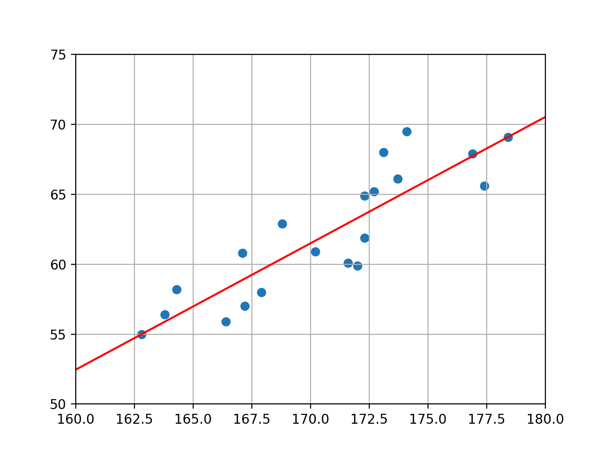

回帰問題の手法の一つである直線モデルについて。  

教師あり学習 で与えられた入力と結果から関係式を算出すると言うことを述べたが、
必ずしも100%正確な式を算出すると言うことでは無いことを念頭においてほしい。（と言うよりどのような入力に対して100%正解と言えるような値を算出することは不可能である。勿論算出する式は正確性を高くする事を目標に算出するが）  

関係式は、現入力データに対して最も誤差が少ないような結果を出力するような式を算出すると言うやり方で考える。  

その関係式だが、基本となる数式を元に算出を行う。この基本となる数式を**モデル**と呼ぶ。  

今回は例として、以下の身長と体重からなるデータを用意する。

|身長|体重|
|:---|:---|
|167.9|58.0|
|164.3|58.2|
|171.6|60.1|
|172.7|65.2|
|162.8|55.0|
|170.2|60.9|
|172.3|61.9|
|163.8|56.4|
|168.8|62.9|
|167.2|57.0|
|172.3|64.9|
|166.4|55.9|
|173.1|68.0|
|176.9|67.9|
|178.4|69.1|
|167.1|60.8|
|177.4|65.6|
|173.7|66.1|
|172.0|59.9|
|174.1|69.5|

プロットすると以下のような図になる。


今回は基本となる数式として直線の式(**直線モデル**)を利用して予測を行ってみる。  

このデータに対して、なんとなくだが、以下のような直線を引くとそれらしい予測を行えそうである。  



直線の式は以下の式のように表すことができる。

$$
y(x) = w_{0} x + w_{1}
$$

最適な直線モデルの式を求めるには、最適なw<sub>0</sub>とw<sub>1</sub>を求めれば良いのだが、どのように求めれば良いのか？  

そちらは次章で記載する。  

<参考>グラフのコード

```python
>>> import numpy as np
>>> import matplotlib.pyplot as plt
>>> 
>>> x = np.array([167.9,164.3,171.6,172.7,162.8,170.2,172.3,163.8,168.8,167.2,172.3,166.4,173.1,176.9,178.4,167.1,177.4,173.7,172.0,174.1])
>>> y = np.array([58.0,58.2,60.1,65.2,55.0,60.9,61.9,56.4,62.9,57.0,64.9,55.9,68.0,67.9,69.1,60.8,65.6,66.1,59.9,69.5])
>>> 
>>> plt.scatter(x,y)
<matplotlib.collections.PathCollection object at 0x11d2fcef0>
>>> plt.xlim(160,180)
(160, 180)
>>> plt.ylim(50,75)
(50, 75)
>>> plt.grid(True)
>>> plt.show()
>>> 
```

```python
>>> #↑でplt.gridまで行う
>>> def f(x):
...     return (0.9038 * x) - 92.1461
... 
>>> x2 = np.array([0,100,200])
>>> y2 = f(x2)
>>> 
>>> plt.plot(x2,y2,color='red')
[<matplotlib.lines.Line2D object at 0x120b47ba8>]
>>> 
>>> plt.show()
```

