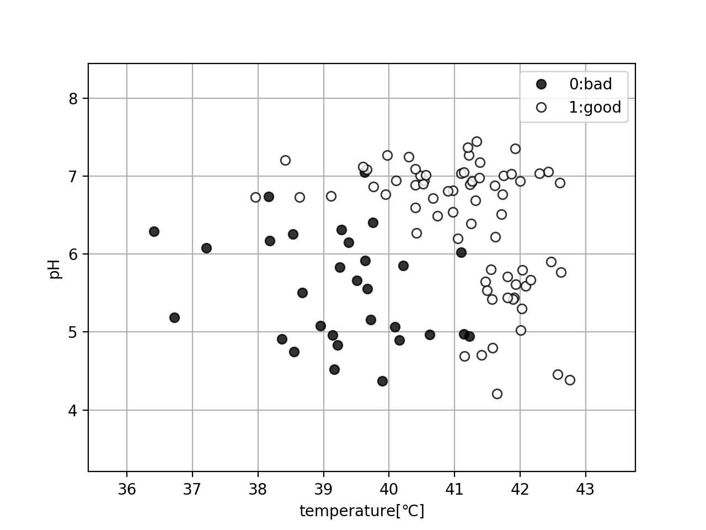
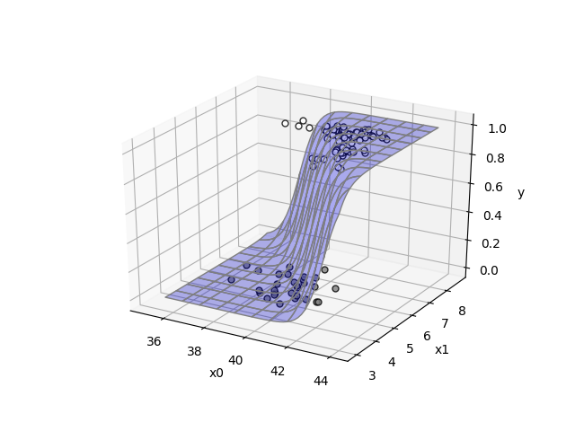
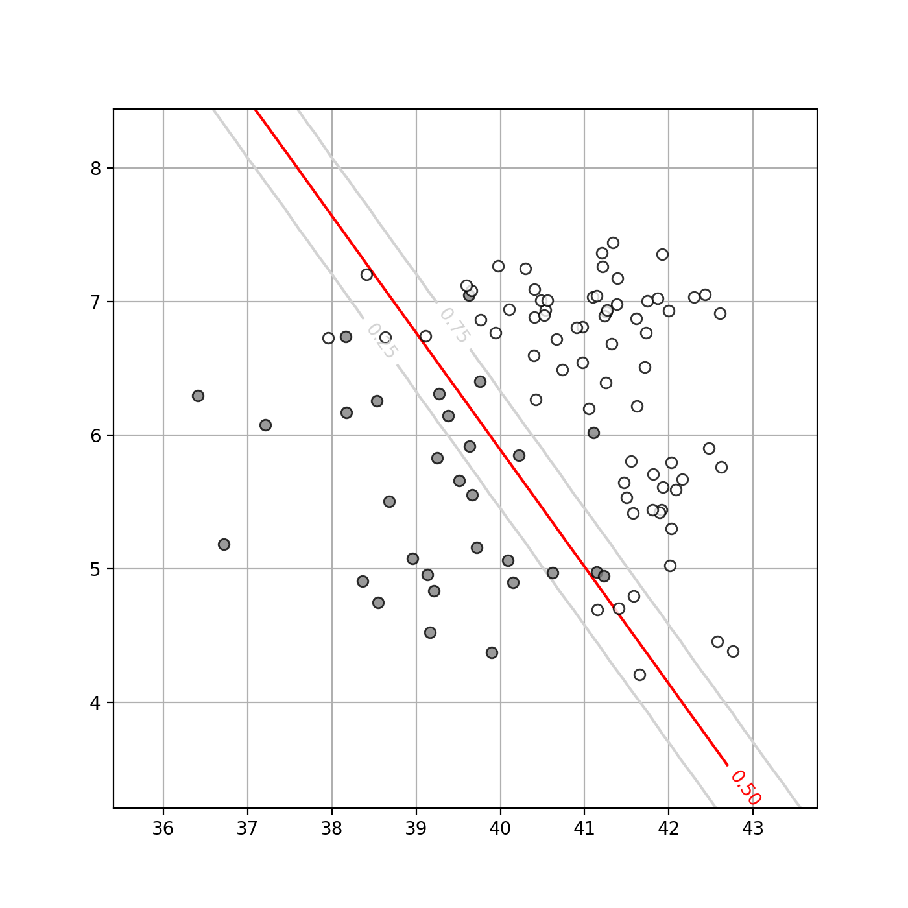

前章では１次元入力であったが、次は２次元入力の場合を考えてみる。

１次元入力２クラス分類で使用したデータに、pHのデータも加えた２次元入力のデータを新たに作成する。(入力データは[こちら](https://github.com/WAT36/python/blob/master/machine_learning/classification/x_2d2class.npy)、目標データは[こちら](https://github.com/WAT36/python/blob/master/machine_learning/classification/t_2d2class.npy))

図示すると以下のようになる。(コードは[こちら](https://github.com/WAT36/python/blob/master/machine_learning/classification/plot_2d_2class_inputdata.py))



このデータから、２次元入力２クラス分類についてを考えてみよう。


## ロジスティック回帰モデル

前述の１次元入力２クラス分類と同じく、２次元入力２クラス分類のときもロジスティック回帰モデルを適用することを考えてみる。２次元入力２クラス分類の場合のロジスティック回帰モデルはどのようになるだろうか。

１次元入力の場合は

$$
\begin{aligned}
\tag{1}  y  &=  \sigma ( w_{0} x + w_{1} ) \\
            &=  \frac{1}{1 + \exp(-(w_{0} x + w_{1}))}
\end{aligned}
$$

であった。

２次元入力の場合は、パラメータw<sub>0</sub>,w<sub>1</sub>,w<sub>2</sub>、入力変数をx<sub>0</sub>,x<sub>1</sub>と置いたとき、以下のように表される。

$$
\begin{aligned}
\tag{2}  y  &=  \sigma ( w_{0} x_{0} + w_{1} x_{1} + w_{2} ) \\
            &=  \frac{1}{1 + \exp(-(w_{0} x_{0} + w_{1} x_{1} + w_{2}))}
\end{aligned}
$$

ここから、最適なパラメータwを求めていこう。

１次元入力２クラス分類の時と同じく、平均交差エントロピー誤差関数は以下の式の通りになる。

$$
\tag{3} 
            E( { \bf w } ) =   - \frac{1}{N} \sum_{n=0}^{N-1} ( t_{n} \log y_{n} + (1 - t_{n}) \log (1 - y_{n}) ) 
$$

同様にしてパラメータw<sub>0</sub>,w<sub>1</sub>,w<sub>2</sub>での偏微分を求めると以下のようになる。


$$
\tag{4} \frac{\partial }{\partial w_{0} }　E( { \bf w } )
        = \frac{1}{N} \sum_{n=0}^{N-1} ( y_{n} - t_{n} ) x_{n,0}
$$


$$
\tag{5} \frac{\partial }{\partial w_{1} }　E( { \bf w } )
        = \frac{1}{N} \sum_{n=0}^{N-1} ( y_{n} - t_{n} ) x_{n,1}
$$

$$
\tag{6} \frac{\partial }{\partial w_{2} }　E( { \bf w } )
        = \frac{1}{N} \sum_{n=0}^{N-1} ( y_{n} - t_{n} )
$$

ここで、x<sub>n,i</sub>はx<sub>n</sub>のi番目の入力である。

よって、これらを元に勾配法を用いて、平均交差エントロピー誤差が最小となるようなパラメータ<b>w</b>の値を求めてみよう。

まず、２次元入力のロジスティック回帰モデルの[コード](https://github.com/WAT36/python/blob/master/machine_learning/classification/logistic_regression_2d.py)は以下の通り。

(logistic_regression_2d.py)

```python
from sigmoid import sigmoid
import numpy as np

#ロジスティック回帰モデル(２次元入力)
def logistic_regression_2d(w,x):
    x = w[0]*x[:,0] + w[1]*x[:,1] + w[2]
    return sigmoid(x)
```

２次元入力での平均交差エントロピー誤差の[コード](https://github.com/WAT36/python/blob/master/machine_learning/classification/cross_entropy_error_2d.py)は以下の通り。

(cross_entropy_error_2d.py)

```python
from logistic_regression_2d import logistic_regression_2d
import numpy as np

#交差エントロピー誤差
def cross_entropy_error_2d(w,x,t):
    y=logistic_regression_2d(w,x)
    cee=0
    for n in range(len(y)):
        cee -= (t[n]*np.log(y[n]) + (1-t[n])*np.log(1-y[n]))
    return cee


#平均交差エントロピー誤差
def ave_cross_entropy_error_2d(w,x,t):
    return cross_entropy_error_2d(w,x,t)/len(x)
```

続いて、平均交差エントロピー誤差の偏微分を求める[コード](https://github.com/WAT36/python/blob/master/machine_learning/classification/d_cee_2d.py)は以下の通り。

(d_cee_2d.py)

```python
from logistic_regression_2d import logistic_regression_2d
import numpy as np

#平均交差エントロピー誤差の微分(２次元入力)
def d_cee_2d(w,x,t):
    y = logistic_regression_2d(w,x)
    d_cee=np.zeros(3)
    for n in range(len(y)):
        #w0
        d_cee[0]+=(y[n]-t[n])*x[n,0]
        #w1
        d_cee[1]+=(y[n]-t[n])*x[n,1]
        #w2
        d_cee[2]+=y[n]-t[n]
    d_cee /= len(y)
    return d_cee
```

ではこれらを元に、１次元入力２クラス分類で行ったような勾配法を用いて、最適なパラメータ<b>w</b>を求めてみよう。

パラメータwを求める[コード](https://github.com/WAT36/python/blob/master/machine_learning/classification/fit_2d_2class.py)は以下の通り。

(fit_2d_2class.py)

```python
from cross_entropy_error_2d import ave_cross_entropy_error_2d
from scipy.optimize import minimize
from d_cee_2d import d_cee_2d
import numpy as np

#勾配法
def fit_2d_2class(w,x,t):
    result=minimize(ave_cross_entropy_error_2d,w,args=(x,t),jac=d_cee_2d,method="CG")
    return result.x
```

(solve_2d_2class.py)

```python
from fit_2d_2class import fit_2d_2class
import numpy as np

#入力値
x = np.load('x_2d2class.npy')
#実測値
t = np.load('t_2d2class.npy')

#wの初期値
w_init=[1,1,1]

#勾配法でwを求める
w=fit_2d_2class(w_init,x,t)

print("w0:{0}".format(w[0]))
print("w1:{0}".format(w[1]))
print("w2:{0}".format(w[2]))
```

実行結果

```
w0:2.2211059806431024
w1:2.5337217620823123
w2:-103.76947792619409
```

となり、パラメータ<b>w</b>が求められる。

よって、このwを使ったロジスティック回帰モデルを入力データとともに図示してみると、以下のようになる。(コードは[こちら](https://github.com/WAT36/python/blob/master/machine_learning/classification/surface_plot_2d_2class_logistic.py))。



これを元に、１次元入力２クラス分類の時と同様にして決定境界をロジスティック回帰モデルの値が0.5になる値のところに引いてみよう。

入力データ、ロジスティック回帰モデル及び決定境界を等高線プロットで表した図は以下の通り。(コードは[こちら](https://github.com/WAT36/python/blob/master/machine_learning/classification/contour_2d2class_plot.py))



この方法により、２次元入力２クラス分類の決定境界を求められる。