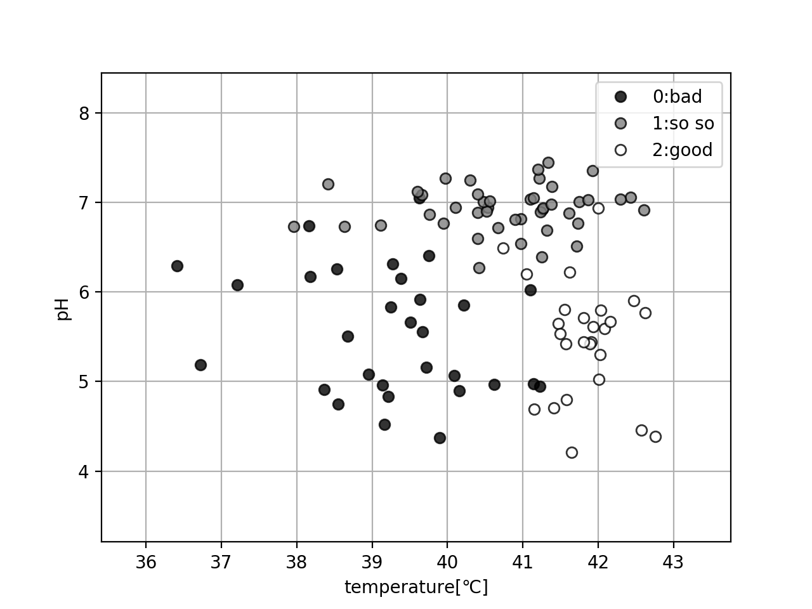
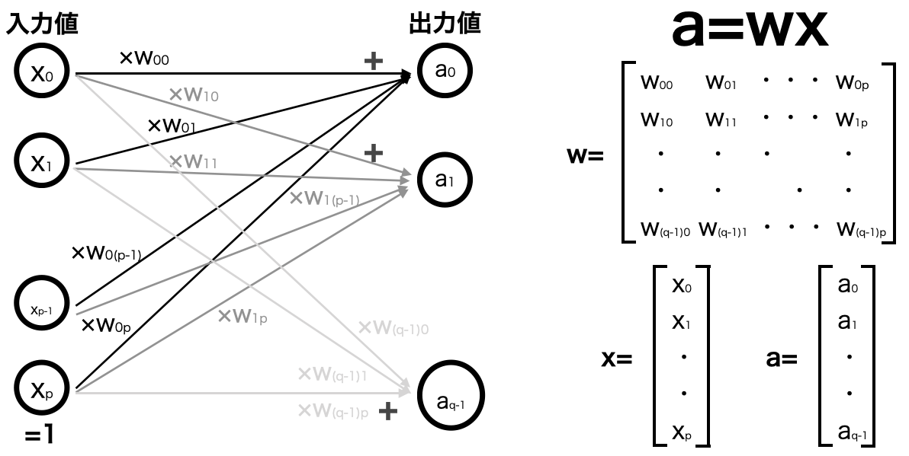
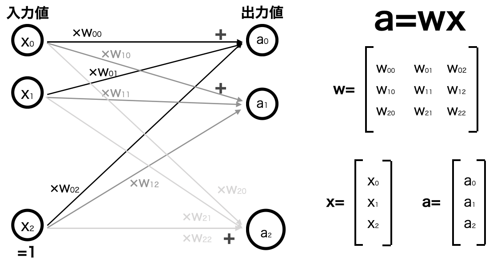
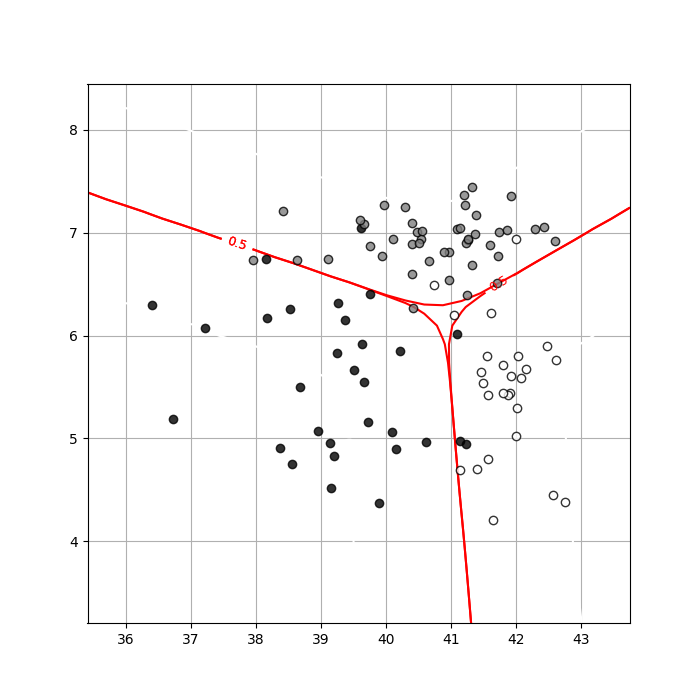

次は２次元入力において、３クラス分類を行うケースについてを考える。

先程の２次元入力２クラス分類のデータに、良いでも悪いでもない「まあまあ」というカテゴリ(クラス)を追加したようなデータを考えてみよう。

そのようなデータを新たに作成し(入力データは[こちら](https://github.com/WAT36/python/blob/master/machine_learning/classification/x_2d3class.npy)、目標データは[こちら](https://github.com/WAT36/python/blob/master/machine_learning/classification/t_2d3class.npy))、図示してみる。



ここから３クラス分類を行うための決定境界を求めてみる。

しかし３クラス以上の分類の時は、２クラス分類で使用したロジスティック回帰モデルを適用するのは難しい。(使用しているシグモイド関数が0または1に近い値を取るため)

そのため、入力データとパラメータを用いて計算した値を、シグモイド関数ではない方法を用いることで条件付き確率・交差エントロピー誤差・決定境界を求めることを考える。

では、シグモイド関数ではない方法に何があるだろうか。

方法の一つとして、ここでは**ソフトマックス関数**を利用することを考える。

ソフトマックス関数を利用することで、出力値が全て0以上1以下の値に収まるので、この値を条件付き確率として用いる。

p次元入力qクラス分類において、入力データx<sub>n</sub> (n=0,..,p-1)とした時、常に１を取る入力データx<sub>p</sub>を追加、出力値がq個得られるようにパラメータをq×(p+1)行列で用意し、以下のように計算して値を取る。



例として２次元入力３クラス分類においては以下のような設定をし、出力値を得る。



この図より、入力データ<b>x</b>とパラメータ<b>w</b>から出力データ<b>a</b>を以下のように計算する。

$$
\begin{aligned}
\tag{1}  a_{k}  &=  w_{k0} x_{0} + w_{k1} x_{1} + w_{k2} x_{2}  (k=0,1,2) \\
                &=  \sum_{i=0}^{p} w_{ki} x_{i}  (k=0,1,2)
\end{aligned}
$$

これにより、まず出力値a<sub>k</sub>を得られる。

次に、この出力値a<sub>k</sub>に対し、ソフトマックス関数を適用して0~1の値に収まらせ、条件付き確率とする。

まずはソフトマックス関数で用いる総和uを以下の式(2)で定義する。

$$
\begin{aligned}
\tag{2}  u  &=  \exp(a_{0}) + \exp(a_{1}) + \cdots + \exp(a_{q-1}) \\
            &=  \sum_{i=0}^{q-1} \exp(a_{i})
\end{aligned}
$$

これを利用し、出力値a<sub>k</sub>にソフトマックス関数を適用した出力値y<sub>k</sub>を以下の式(3)のように定義する。

$$
\tag{3}  y_{k}  =  \frac{ \exp(a_{k}) }{u}  (k=0,1,2)
$$

このy<sub>k</sub>を入力データ<b>x</b>がクラスkに属する条件付き確率とする。

例えばk=0の時(クラス0に分類される確率)は以下のようになる。

$$
\tag{4}  P( { \bf t} =[1,0,0] \mid { \bf x } )  =  y_{0}
$$

k=1の時(クラス1に分類される確率)は以下のようになる。

$$
\tag{5}  P( { \bf t} =[0,1,0] \mid { \bf x } )  =  y_{1}
$$

式(4),(5)を例として述べたが、P(t|x)を一般化すると以下の式(6)のようになる。

$$
\tag{6}  P( { \bf t} \mid { \bf x } )  =  {y_{0}}^{t_{0}} {y_{1}}^{t_{1}} {y_{2}}^{t_{2}}
$$

このように表すことで、例えばクラス０だったら<b>t</b>=[1,0,0]なのでP(<b>t</b>|<b>x</b>)=y<sub>0</sub> <sup>1</sup> y<sub>1</sub> <sup>0</sup> y<sub>2</sub> <sup>0</sup> = y<sub>0</sub> のようになる。

これにより、p次元入力qクラス分類において全ての入力データ<b>X</b>から全クラスデータ<b>T</b>が得られる確率は以下のように表される。

$$
\tag{6}  
\begin{aligned}
    P( { \bf T } \mid { \bf X } ) 
        &= \prod_{n=0}^{p-1} P( t_{n} \mid x_{n} )  \\
        &= \prod_{n=0}^{p-1} y_{n0}^{t_{n0}} y_{n1}^{t_{n1}} \cdots y_{n(q-1)}^{t_{n(q-1)}} \\
        &= \prod_{n=0}^{p-1} \prod_{k=0}^{q-1} (y_{nk})^{t_{nk}}
\end{aligned}
$$

これより、平均交差エントロピー誤差関数は以下のようになる。

$$
\tag{7}  
\begin{aligned}
    E( { \bf w } ) 
        &=  - \frac{1}{N} \log P( { \bf T } \mid { \bf X } ) \\
        &=  - \frac{1}{N} \log \prod_{n=0}^{p-1} P( t_{n} \mid x_{n} ) \\
        &=  - \frac{1}{N} \sum_{n=0}^{p-1} \sum_{k=0}^{q-1} t_{nk} \log y_{nk}
\end{aligned}
$$

次に、勾配法で利用するためこの平均交差エントロピー誤差をw<sub>ki</sub>で偏微分した結果を求めてみると以下のようになる。

$$
\tag{8} \frac{\partial }{\partial w_{ki} }E( { \bf w } )
        = \frac{1}{N} \sum_{n=0}^{p-1} ( y_{nk} - t_{nk} ) x_{ni}
$$

では、これらより勾配法を利用して決定境界を求めてみよう。

諸関数を求めるコードは以下のとおり。

```python
from scipy.optimize import minimize
import numpy as np


#ロジスティック回帰モデル(２次元入力３クラス分類)
def logistic_regression_2d_3class(w,x):
    #w:1*9行列 -> 3*3行列
    w=w.reshape((3,3))
    #x:n*2行列 (xの転置)
    n=len(x)
    #a:n*3行列
    a=np.zeros((n,3))
    for k in range(3):
        a[:,k] = np.exp( w[k,0]*x[:,0] + w[k,1]*x[:,1] +w[k,2] )
    #u:aの１行の要素の合計、n*1行列にする
    u = np.sum(a,axis=1)
    u = u.reshape(n,1)
    #y:n*3行列
    y = a/u
    return y


#平均交差エントロピー誤差（２次元入力３クラス分類用）
def cross_entropy_error_for_2d_3class(w,x,t):
    #w:1*9行列 -> 3*3行列
    w=w.reshape((3,3))
    #x:n*2行列（xの転置）
    #t:n*3行列（t[i]がクラスkにb分類された時t[i.k]=1,それ以外は0）
    y=logistic_regression_2d_3class(w,x)
    N=y.shape[0]
    #cee:平均交差エントロピー誤差
    cee=0
    for n in range(N):
        for k in range(3):
            cee = cee - (t[n,k] * np.log(y[n,k]))
    cee = cee / N
    return cee


#平均交差エントロピー誤差の偏微分（２次元入力３クラス分類用）
def d_cee_for_2d_3class(w,x,t):
    #w:1*9行列 -> 3*3行列
    w=w.reshape((3,3))
    #x:n*2行列（xの転置）
    #t:n*3行列（t[i]がクラスkにb分類された時t[i.k]=1,それ以外は0）
    y=logistic_regression_2d_3class(w,x)
    #d_cee:3*3 (クラスの数k*(xの次元+1)) 行列
    d_cee=np.zeros((3,3))
    N=x.shape[0]
    for n in range(N):
        for k in range(3):
            d_cee[k,:] = d_cee[k,:] + (y[n,k]-t[n,k])*np.r_[x[n,:],1]
    d_cee = d_cee / N
    #3*3->1*1行列(minimizeの仕様上)で返す
    return d_cee.reshape(-1)

#勾配法
def fit_2d_3class(w,x,t):
    result = minimize(cross_entropy_error_for_2d_3class,w,args=(x,t),jac=d_cee_for_2d_3class,method="CG")
    return result.x
```

次に、決定境界及びデータをプロットするコードは以下のとおり。

```python
from logistic_regression_2d_3class import logistic_regression_2d_3class
from logistic_regression_2d_3class import cross_entropy_error_for_2d_3class
from logistic_regression_2d_3class import fit_2d_3class
from plot_2d_3class import plot_2d_3class
import matplotlib.pyplot as plt
import numpy as np

def contour_for_2d_3class(w,x):
    xn=30
    x0=np.linspace(min(x[:,0])-1,max(x[:,0])+1,xn)
    x1=np.linspace(min(x[:,1])-1,max(x[:,1])+1,xn)

    xx0,xx1=np.meshgrid(x0,x1)
    y=np.zeros((xn,xn,3))
    for i in range(xn):
        wk=logistic_regression_2d_3class(w,np.concatenate([xx0[:,i].reshape(xn,1),xx1[:,i].reshape(xn,1)],1))
        for j in range(3):
            y[:,i,j]=wk[:,j]
    for j in range(3):
        cont=plt.contour(xx0,xx1,y[:,:,j],levels=(0.25,0.5,0.75),colors=['lightgray','red','lightgray'])
        cont.clabel(fmt='%1.1f',fontsize=9)
    plt.grid(True)


#入力値
x = np.load('x_2d3class.npy')
#目標値
t = np.load('t_2d3class.npy')
#目標値をn*3行列にする
temp_t=t
t=np.zeros((t.shape[0],3))
for i in range(t.shape[0]):
    t[i,temp_t[i]]=1

w_init=np.zeros((3,3))

w=fit_2d_3class(w_init,x,t)

cee=cross_entropy_error_for_2d_3class(w,x,t)

print("CEE={0:.2f}".format(cee))

plot_2d_3class(x,temp_t)
contour_for_2d_3class(w,x)
plt.show()
```

実行結果

```
CEE=0.23
```


また、これにより出力した図は以下のようになる。



