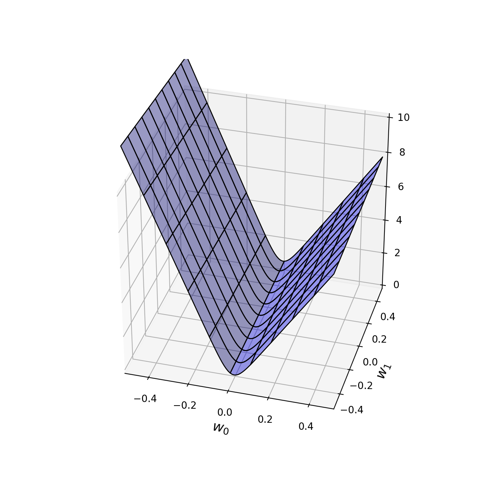
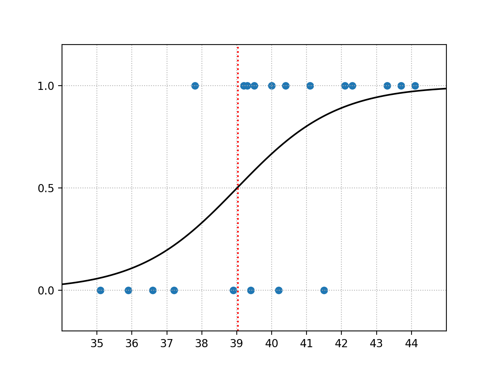

前述の平均交差エントロピー誤差

$$
\tag{1}
    - \frac{1}{N} \log P( { \bf T } \mid { \bf X } ) 
        = - \frac{1}{N} \sum_{n=0}^{N-1} ( t_{n} \log y_{n} + (1 - t_{n}) \log (1 - y_{n}) ) 
$$

が最小となる値はどのように求めるべきか。

１次元入力２クラス分類の章で用いた入力データで、平均交差エントロピー誤差を可視化してみよう。グラフ表示したものを以下に示す([コード](https://github.com/WAT36/python/blob/master/machine_learning/classification/cee_visualize.py))



この図より最小値はw<sub>0</sub>=0のあたりだろうと推測できる。

前に述べた平均二乗誤差のところでは解析解を算出することで求められたが、今回も解析解を求めることは可能だろうか。

実は、平均交差エントロピー誤差はシグモイド関数を含んでいるため、解析解を求めることは不可能である。

ならばどのようにして求めるのが良いか？

そこで方法として、平均二乗誤差の章でも述べた、**勾配法**を用いて求めることを考えてみる。

まず、平均交差エントロピー誤差を以下のように置き換える。


$$
\begin{aligned}
\tag{2}
    E_{n} ( { \bf w } )
        &= - ( t_{n} \log y_{n} + (1 - t_{n}) \log (1 - y_{n}) )
\end{aligned}
$$

$$
\begin{aligned}
\tag{3} E( { \bf w } )
        &= - \frac{1}{N} \log P( { \bf T } \mid { \bf X } ) \\
        &= - \frac{1}{N} \sum_{n=0}^{N-1} ( t_{n} \log y_{n} + (1 - t_{n}) \log (1 - y_{n}) ) \\
        &=   \frac{1}{N} \sum_{n=0}^{N-1} E_{n} ( { \bf w } )
\end{aligned}
$$

このE(<b>w</b>)に勾配法を適用して、最適な<b>w</b>を求めることを考える。

まず、式(3)をw<sub>0</sub>で偏微分すると以下のようになる。

$$
\begin{aligned}
\tag{4} \frac{\partial }{\partial w_{0} }　E( { \bf w } )
        &= \frac{1}{N} \frac{\partial }{\partial w_{0} } \sum_{n=0}^{N-1} E_{n} ( { \bf w } ) \\
        &= \frac{1}{N} \sum_{n=0}^{N-1} \frac{\partial }{\partial w_{0} } E_{n} ( { \bf w } )
\end{aligned}
$$

ここで

$$
\tag{5}
   y_{n} =  \sigma ( a_{n} )  =  \frac{1}{1 + \exp(- a_{n}) } 
$$

$$
\tag{6}
   a_{n} =  w_{0} x_{n} + w_{1} 
$$

とおくと、合成関数の微分より

$$
\tag{7}
   \frac{\partial E_{n}( { \bf w } ) }{\partial w_{0} } 
        =  \frac{\partial E_{n}( { \bf w } ) }{\partial y_{n} } \cdot
           \frac{\partial y_{n} }{\partial a_{n} } \cdot
           \frac{\partial a_{n} }{\partial w_{0} }
$$

であり、また

$$
\begin{aligned}
\tag{8}
   \frac{\partial E_{n}( { \bf w } ) }{\partial y_{n} } 
        &=  \frac{\partial }{\partial y_{n} } (- ( t_{n} \log y_{n} + (1 - t_{n}) \log (1 - y_{n}) )) \\
        &=  - \frac{ t_{n} }{ y_{n} } + \frac{ 1 - t_{n} }{ 1 - y_{n} } \\
        &=  \frac{ y_{n} - t_{n} }{ (1-y_{n}) y_{n} }
\end{aligned}
$$

$$
\begin{aligned}
\tag{9}
   \frac{\partial y_{n} }{\partial a_{n} } 
        &=  \frac{\partial }{\partial a_{n} }   \frac{1}{1 + \exp(- a_{n}) }  \\
        &=  \frac{ \exp(- a_{n}) }{ (1 + \exp(- a_{n}))^2 }  \\
        &=  \left( 1- \frac{ 1 }{ 1 + \exp(- a_{n}) } \right) \left( \frac{ 1 }{ 1 + \exp(- a_{n}) } \right) \\
        &=  (1 - y_{n}) y_{n}
\end{aligned}
$$

$$
\begin{aligned}
\tag{10}
   \frac{\partial a_{n} }{\partial w_{0} } 
        &=  \frac{\partial }{\partial w_{0} }  ( w_{0} x_{n} + w_{1} )  \\
        &=  x_{n} 
\end{aligned}
$$

なので、式(4)は

$$
\begin{aligned}
\tag{11} \frac{\partial }{\partial w_{0} }　E( { \bf w } )
        &= \frac{1}{N} \sum_{n=0}^{N-1} \frac{\partial }{\partial w_{0} } E_{n} ( { \bf w } ) \\
        &= \frac{1}{N} \sum_{n=0}^{N-1} 
                \frac{\partial E_{n}( { \bf w } ) }{\partial y_{n} } \cdot
                \frac{\partial y_{n} }{\partial a_{n} } \cdot
                \frac{\partial a_{n} }{\partial w_{0} } \\
        &= \frac{1}{N} \sum_{n=0}^{N-1} \frac{ y_{n} - t_{n} }{ (1-y_{n}) y_{n} } \cdot
                (1 - y_{n}) y_{n} \cdot
                x_{n} \\
        &= \frac{1}{N} \sum_{n=0}^{N-1} ( y_{n} - t_{n} ) x_{n}
\end{aligned}
$$

となる。同様にして、w<sub>1</sub>で偏微分した時は

$$
\tag{12}
   \frac{\partial E_{n}( { \bf w } ) }{\partial w_{1} } 
        =  \frac{\partial E_{n}( { \bf w } ) }{\partial y_{n} } \cdot
           \frac{\partial y_{n} }{\partial a_{n} } \cdot
           \frac{\partial a_{n} }{\partial w_{1} }
$$

$$
\begin{aligned}
\tag{13}
   \frac{\partial a_{n} }{\partial w_{1} } 
        &=  \frac{\partial }{\partial w_{1} }  ( w_{0} x_{n} + w_{1} )  \\
        &=  1  \\
\end{aligned}
$$

となるから、式(12),(8),(9),(13)より

$$
\begin{aligned}
\tag{14} \frac{\partial }{\partial w_{1} }　E( { \bf w } )
        &= \frac{1}{N} \sum_{n=0}^{N-1} \frac{\partial }{\partial w_{1} } E_{n} ( { \bf w } ) \\
        &= \frac{1}{N} \sum_{n=0}^{N-1} 
                \frac{\partial E_{n}( { \bf w } ) }{\partial y_{n} } \cdot
                \frac{\partial y_{n} }{\partial a_{n} } \cdot
                \frac{\partial a_{n} }{\partial w_{1} } \\
        &= \frac{1}{N} \sum_{n=0}^{N-1} \frac{ y_{n} - t_{n} }{ (1-y_{n}) y_{n} } \cdot
                (1 - y_{n}) y_{n} \cdot
                1 \\
        &= \frac{1}{N} \sum_{n=0}^{N-1} ( y_{n} - t_{n} )
\end{aligned}
$$

となる。この式(11),(14)から勾配法を利用して求めていく。

式(11),(14)の値を求める[コード](https://github.com/WAT36/python/blob/master/machine_learning/classification/d_cee.py)は以下の通り。


(d_cee.py)


```python
import numpy as np
from logistic_regression import logistic_regression

#平均交差エントロピー誤差の微分
def d_cee(w,x,t):
    y = logistic_regression(w,x)
    d_cee=np.zeros(2)
    for n in range(len(y)):
        #w0
        d_cee[0]+=(y[n]-t[n])*x[n]
        #w1
        d_cee[1]+=y[n]-t[n]
    d_cee /= len(y)
    return d_cee
```

この関数を用い、勾配法で最適なwを求めていく。平均二乗誤差の章ではfor文ループで求めていたが、実はループを用いずに最適解を求める方法がある。

それが**scipy.optimize**ライブラリに含まれる **minimize()** 関数である。

minimize関数に勾配法で最適解を求めたい関数、変数の初期値、関数の引数、関数の導関数(微分した関数)、勾配法の種類(method="CG")を指定すると、勾配法を用いて最適解を導出してくれる。


[コード](https://github.com/WAT36/python/blob/master/machine_learning/classification/cee_solve.py)を以下に記載する。

(cee_solve.py)

```python
from cross_entropy_error import ave_cross_entropy_error
from scipy.optimize import minimize
from d_cee import d_cee
import numpy as np

def cee_solve(w_init,x,t):
    ans = minimize(ave_cross_entropy_error,w_init,args=(x,t),jac=d_cee,method="CG")
    return ans.x

w_init=[1,1]

#入力値
x = np.load('x.npy')
#実測値
t = np.load('t.npy')

w_ans=cee_solve(w_init,x,t)
print("w0:{0}".format(w_ans[0]))
print("w1:{0}".format(w_ans[1]))
```

実行結果

```
$ python cee_solve.py 
w0:0.7024819393205183
w1:-27.405983513314283
```

のように、最適なw<sub>0</sub>、w<sub>1</sub>が求められる。

それではこの答えをもとに、１次元入力２クラス分類の章で使用したデータ、そして本章で求めたロジスティック回帰モデルおよび決定境界を図示してみよう。

図示した結果を以下に示す(コードは[こちら](https://github.com/WAT36/python/blob/master/machine_learning/classification/cee_solve_plot.py))



また、コードの実行結果は

```
w0:0.7024819393205183
w1:-27.405983513314283
決定境界：x=39.03903903903904
```

となる。


以上より、ロジスティック回帰モデルを利用して求めた決定境界は39.03..[℃]と決まる。

入力データがガウス分布に従い生成されたという過程の元だが、これが確率を用いて分類を行う方法の一例となる。

