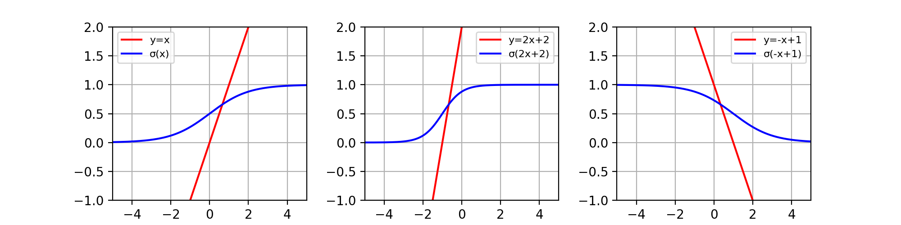
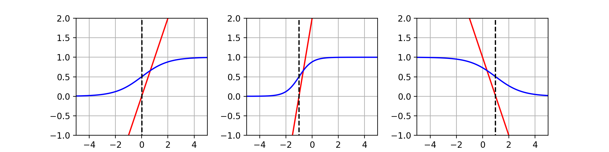

前述の１次元入力２クラス分類において、最適な決定境界を引くにはどうすれば良いのだろうか。

方法の一つとして**ロジスティック回帰モデル**がある。

ただし、これが利用できるのは入力データが**ガウス分布**によって生成された時である。

実は入力データがガウス分布に従っているとき、この１次元入力２クラス分類の条件付き確率P(t=1|x)はロジスティック回帰モデルで表せることがわかっている。

前述の１次元入力２クラス分類で扱った入力データがガウス分布により生成されたデータであると仮定しよう。

ロジスティック回帰モデルとは、以下の直線モデル(式(1))

$$
\tag{1}  y  =  w_{0} x + w_{1} \\
$$

が与えられた時に、式(2)で表されるモデルである。

$$
\begin{aligned}
\tag{2}  y  &=  \sigma ( w_{0} x + w_{1} ) \\
            &=  \frac{1}{1 + \exp(-(w_{0} x + w_{1}))}
\end{aligned}
$$

ここで,σ(x)はシグモイド関数であり、以下の式(3)で表される関数である。

$$
\tag{3}  \sigma (x)  =  \frac{1}{ 1 + \exp( -x )}
$$

ロジスティック回帰モデルにより、出力は0~1の間に限定される。

例として、y=x,y=2x+2,y=-x+1のロジスティック回帰モデルは以下のようになる。

この図より、決定境界をy=0.5となるxに引くと、以下のように表される。

ところで、このロジスティック回帰モデルで使用した直線モデルは何なのか？

入力データに対して、どのような直線モデルを用いれば良いのか？

実は、この1次元入力2クラス分類において、このデータに一番合うようなロジスティック回帰モデル　をなす直線モデルのパラメータ(w0,w1)を求めるのが、この分類問題を解く考え方である。

そのための方法を次章以降で述べる。