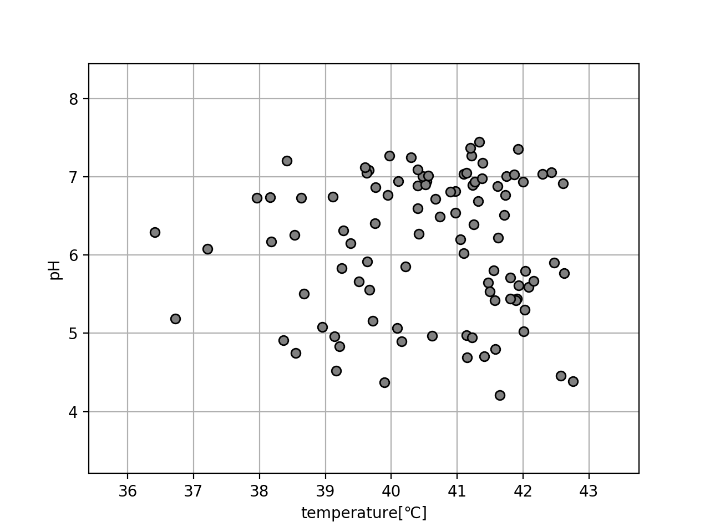

教師あり学習の分類では、入力データに対し分類後のクラス(カテゴリ)が与えられていたが、ここでは入力データからデータをクラスに分類していくことを考える。この手法を**クラスタリング**という。

教師あり学習で利用した２次元入力のデータを見てみよう。図示したものを以下に記載する。なお、今回は教師なし学習のため、目標値は利用しない。

このデータから、データの似ている者同士を同じクラスとして分類していくことがクラスタリングである。

クラスタリングの手法としてはいくつか存在する。まずはK-means法についてを次章で説明する。