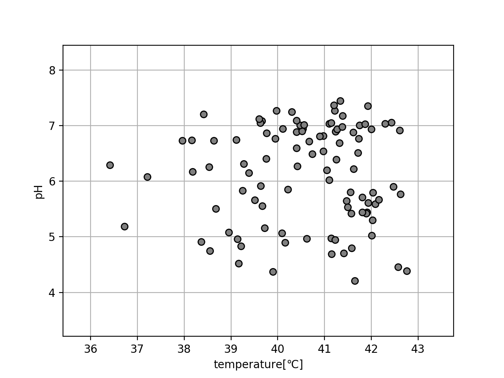
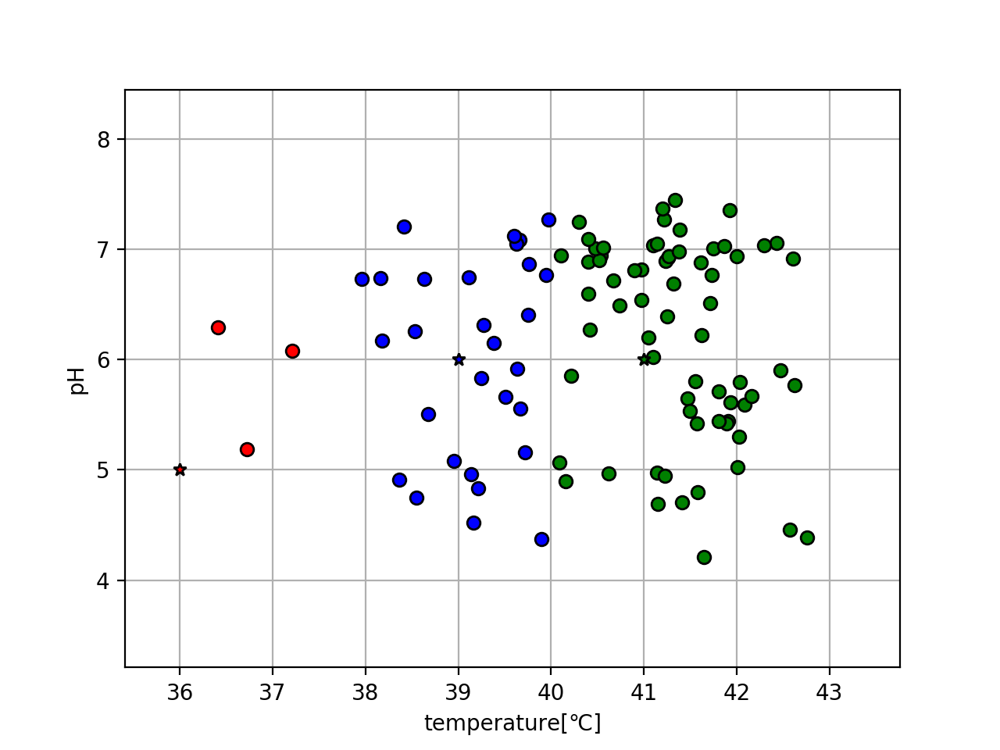

クラスタリングの手法の一つ、K-means法についてを述べる。

先ほども示した以下のデータを例にとって、大まかな手順を、以下に記載しながら進める。



## 1. クラスタの数を定める

K-means法では、まずデータを分けるクラスタの数を定める。

例として、ここでは分けるクラスタを３つと設定しよう。


## 2. 各クラスタの中心位置を定める

次に、それぞれのクラスタの中心位置を示す座標(ベクトル)を定める。

中心位置を示すベクトルを<b>μ</b>とし、1.で定めた数だけ用意する。

k番目のクラスタの中心ベクトルは以下のように表す。

$$
\tag{1}  {\bf \mu}_{k}  =  
                \left[
                    \begin{array}{cc}
                    \mu_{k0}  & \mu_{k1} 
                    \end{array}
                \right]
$$

ここでは入力データの次元が２次元なので、μ<sub>k</sub>も２次元ベクトルとなる。

また、クラスタは３つと定めたので、k=0,1,2となる。

例として、μを以下のように定めてみよう。

μ<sub>0</sub> = [38,6],μ<sub>1</sub> = [40,6],μ<sub>2</sub> = [42,6]

## 3. 入力データが属するクラスタ(ベクトル)の用意

次に、各入力データが属するクラスタを示すベクトル<b>R</b>を用意する。

$$
\tag{2}  {\bf R}  =  
                \left[
                    \begin{array}{c}
                    {\bf r}_{0} \\
                    {\bf r}_{1} \\
                    \vdots \\
                    {\bf r}_{N-1} \\
                    \end{array}
                \right]
$$

また、

$$
\tag{3}  {\bf r}_{k}  =  
                \left[
                    \begin{array}{cc}
                    r_{k0}  & r_{k1} & r_{k2}
                    \end{array}
                \right]
$$

とする。<b>r</b><sub>k</sub>の要素数はクラスタの数に一致する。今回はクラスタは３つなので、<b>r</b><sub>k</sub>はr<sub>k2</sub>まで用意する。


また、r<sub>ki</sub>は、k番目の入力データがクラスタiに属する場合に1,そうでない場合0をとる変数とする。

$$
\tag{4}
r_{nk} = 
\begin{cases}
    1 & (入力データkがクラスタiに属する場合)  \\
    0 & (入力データkがクラスタiに属さない場合)
\end{cases}
$$


これらにより、<b>R</b>は以下のように表される。

$$
\tag{5}  {\bf R}  =  
                \left[
                    \begin{array}{ccc}
                    r_{00} & r_{01} & r_{02} \\
                    r_{10} & r_{11} & r_{12} \\
                    \vdots & \vdots & \vdots \\
                    r_{n-1,0} & r_{n-1,1} & r_{n-1,2} \\
                    \end{array}
                \right]
$$

最初は、全ての入力データがクラスタ0に属する(r<sub>k0</sub>=1)として初期化する。

以上により、クラスタの中心位置を示すベクトル<b>μ</b>、入力データが属するクラスタの行列<b>R</b>の準備が完了した。

ここから、行列<b>R</b>を計算していくことにより各入力データが属するクラスタを決定していく。


## 4. 入力データが属するクラスタを導出する

各入力データが属するクラスタはどのように計算し決定すれば良いのか？

方法としては、

**各入力データを、最も中心位置が近いクラスターに属させる**

とする。

そこで、各入力データに対し、各クラスターの中心との距離を計算し、一番距離が近いクラスターに属させる、という事を全データに対して行う。

これにより、行列<b>R</b>の値を定めていく。


## 5. クラスタの中心位置を調整する

次に、クラスタの中心位置<b>μ</b>を、先ほど決定した入力データの値に基づき、更新していく。

方法としては、

**クラスタの中心位置を、そのクラスタに属している入力データの平均値にする**

とする。

i番目の入力データを<b>x<sub>i</sub></b> = [x<sub>i,0</sub>,x<sub>i,1</sub>]とおくと、計算式としては以下の通りになる。

$$
\tag{6}
\begin{aligned}
    \mu_{k,0} = \frac{1}{N_{k}}  \sum_{x_{i} \in クラスタk}^{} x_{i0} \\
    \mu_{k,1} = \frac{1}{N_{k}}  \sum_{x_{i} \in クラスタk}^{} x_{i1} \\
\end{aligned}
$$

ここで、N<sub>k</sub>はクラスタkに属する入力データの個数とする。

## 6. 手順4・5を繰り返し行う

手順4,5を繰り返し行い、手順4により属するクラスタが変わる入力データが一つも無くなったときに終了する。


以上の手順により、K-means法によるクラスタリングが行える。

では、コードを実装して実際にクラスタリングを行ってみよう。

クラスタリングを行うコードを以下に示す。(k_means.py)

```python
import numpy as np

k=-1
x=[]
mu=[]
R=[]

#R計算
def calc_r(X,Mu):

    #初期化　入力データx、μとR用意
    x=np.array(X)
    mu=np.array(Mu)
    k=len(mu)
    R=np.zeros((len(x),k))

    for i in range(len(x)):
        ri=np.zeros(k)
        ri[0]=1
        R[i]=ri

    flag=True
    count=1

    while(flag):
        flag=False

        #Rを計算し更新
        for i in range(len(x)):
            d=[(x[i][0]-mu[j][0])**2 + (x[i][1]-mu[j][1])**2  for j in range(k)]
            ri=np.zeros(k)
            ri[d.index(min(d))]=1
            if(not np.allclose(R[i],ri)):
                flag=True
            R[i]=ri

        #μを調整
        for i in range(k):
            x_i=x[R[:,i]==1]
            mu_ix=np.mean(x_i[:,0])
            mu_iy=np.mean(x_i[:,1])
            mu[i]=np.array([mu_ix,mu_iy])
        
        count+=1
    
    return mu,R
```

これを使いプロットを行うコードを示す。(do_k_means.py)

```python
from k_means import calc_r
import matplotlib.pyplot as plt
import numpy as np

#入力値
x = np.load('x.npy')

#クラスタの中心位置
mu=np.array([[38,6],[40,6],[42,6]])

#クラスタ計算
mu,r = calc_r(x,mu)

#プロット
color=['red','blue','green']

#各入力データをクラスタリング結果(色分け)とともに表示
for i in range(len(mu)):
    plt.plot(x[r[:,i]==1,0],x[r[:,i]==1,1],linestyle='none',markeredgecolor='black',marker='o',color=color[i])

#各クラスタの中心位置を表示(★型)
for i in range(len(mu)):
    plt.plot(mu[i,0],mu[i,1],linestyle='none',markeredgecolor='black',marker='*',color=color[i])

plt.xlim([min(x[:,0])-1,max(x[:,0])+1])
plt.ylim([min(x[:,1])-1,max(x[:,1])+1])

plt.xlabel('temperature[℃]')
plt.ylabel('pH')

plt.grid(True)
plt.show()
```

実行結果




これにより、k-means法によるクラスタリングが行えた。