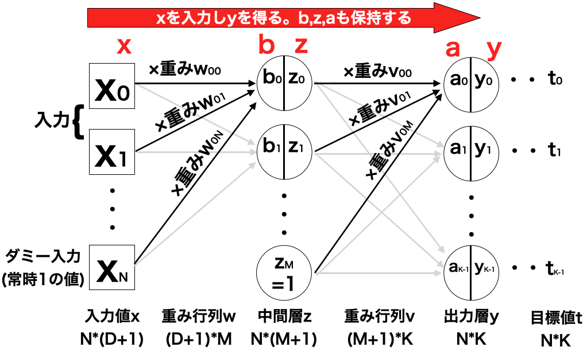
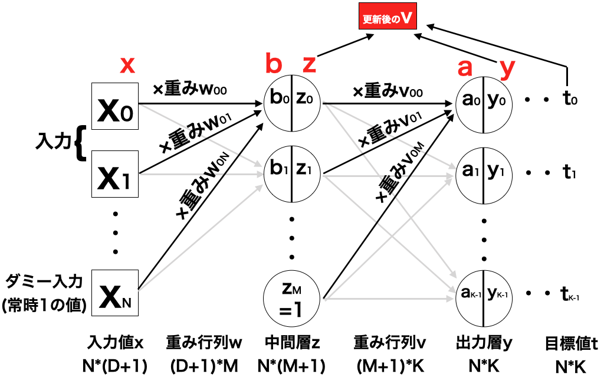
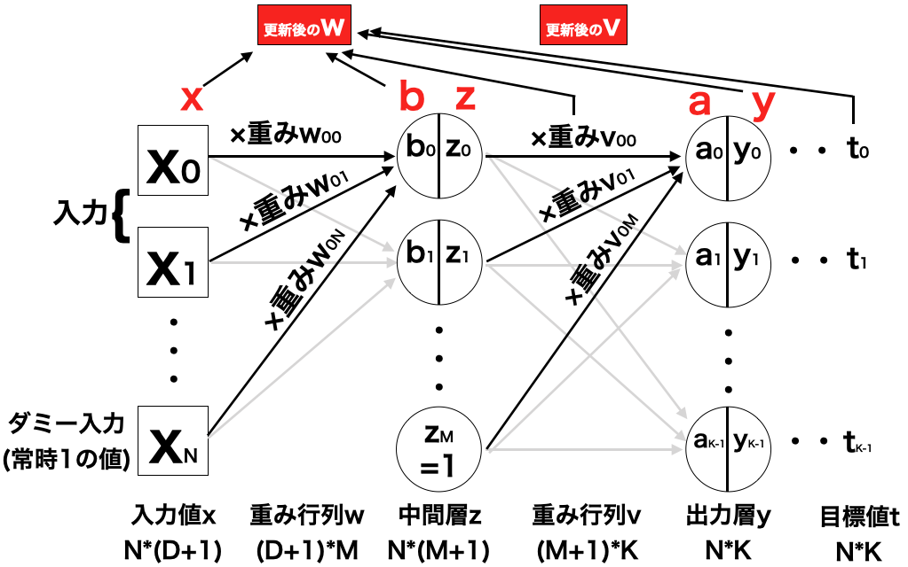
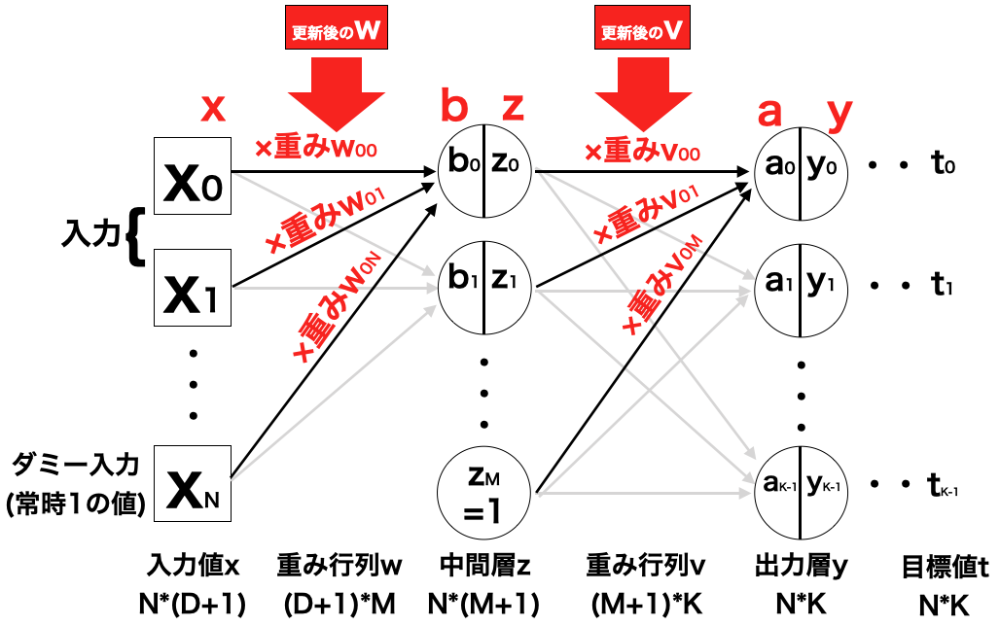

誤差逆伝搬法（バックプロパゲーション）はフィードフォワードネットワークモデルに学習をさせる方法として有名な方法であり、これはネットワークの出力と目標値との誤差の情報を使って、出力層、中間層へと重みを更新していくことから、この名がついている。しかし、実態は勾配法そのものである。

まずは、前章のn1つ分に対する交差エントロピー誤差Enを以下のように考える。

$$
\tag{1}  E_{n} ( { \bf w } ,{ \bf v } ) = - \sum_{n=0}^{N-1} \sum_{k=0}^{K-1} t_{nk} \log (y_{nk}) 
$$

これを利用して、以下のように置き換える。

$$
\tag{2}  E ( { \bf w } ,{ \bf v } ) = - \frac{1}{N} \sum_{n=0}^{N-1} \sum_{k=0}^{K-1} E_{n} ( { \bf w } ,{ \bf v } )
$$

ここから、重み行列の各パラメータに対する偏微分を行なっていこう。誤差関数をwjiで偏微分すると、以下のようになる。

$$
\tag{3}  
\begin{aligned}
\frac{\partial E}{ \partial w_{ji} } 
    &= - \frac{\partial }{ \partial w_{ji} } \frac{1}{N} \sum_{n=0}^{N-1} E_{n} \\
    &= \frac{1}{N} \sum_{n=0}^{N-1} \frac{\partial E_{n} }{ \partial w_{ji} }
\end{aligned}
$$

また、パラメータには<b>v</b>もあるので、vkjに対しても偏微分を行う。すると、式(3)と同じようになる。

この式に出てくる、∂En/∂wjiと∂En/∂vkjを求めてみることを考える。まずは、∂En/∂vkjを見てみよう。

偏微分の連鎖律を使って、∂En/∂vkjは以下のように置き換えられる。

$$
\tag{4}  \frac{ \partial E_{n} }{ \partial v_{kj} } = \frac{\partial E_{n} }{\partial a_{k}}  \frac{\partial a_{k} }{\partial v_{kj} } 
$$

この式(4)において、まずは例として出力値の数を3(K=3),k=0の場合を見てみる。

すると、∂En/∂a0は、Eを変形して以下のように置き換えられる。

$$
\tag{5}  \frac{ \partial E_{n} }{ \partial a_{0} } = \frac{\partial }{\partial a_{0}} ( -t_{0} \log y_{0} -t_{1} \log y_{1} -t_{2} \log y_{2} )
$$

ここで、tiは目標データなのでskで変化することはないが、yiは入力総和a0から算出されるので、関係している。

これにより式(16)は以下のように置き換えられる。

$$
\tag{6}  \frac{ \partial E_{n} }{ \partial a_{0} } = -t_{0} \frac{1}{y_{0}} \frac{\partial y_{0}}{\partial a_{0}} -t_{1} \frac{1}{y_{1}} \frac{\partial y_{1}}{\partial a_{0}} -t_{2} \frac{1}{y_{2}} \frac{\partial y_{2}}{\partial a_{0}}
$$

u=exp(a0)+exp(a1)+exp(a2)とおいて計算すると

$$
\tag{7}  
\begin{aligned}
\frac{\partial y_{0}}{\partial a_{0}}
    &= \frac{\partial }{ \partial a_{0} } \frac{ \exp (a_{0}) }{u} \\
    &= \frac{ \exp (a_{0}) u - \exp (a_{0}) \exp (a_{0}) }{ u^2 }  \\
    &= \frac{\exp (a_{0})}{u} ( \frac{u - \exp (a_{0})}{u} ) \\
    &= \frac{\exp (a_{0})}{u} ( 1- \frac{\exp (a_{0})}{u} ) \\
    &= y_{0} (1 - y_{0})
\end{aligned}
$$

また、i≠0の時は

$$
\tag{8}  
\begin{aligned}
\frac{\partial y_{i}}{\partial a_{0}}
    &= \frac{\partial }{ \partial a_{0} } \frac{ \exp (a_{i}) }{u} \\
    &= \frac{ 0* u - \exp (a_{i}) \exp (a_{0}) }{ u^2 }  \\
    &= \frac{ - \exp (a_{i}) \exp (a_{0}) }{ u^2 }  \\
    &= - \frac{\exp (a_{i})}{u} \frac{\exp (a_{0})}{u} \\
    &= - y_{i} y_{0}
\end{aligned}
$$

となる。これら式(7)(8)を使うと、式(6)は

$$
\begin{aligned}
\tag{9}  \frac{ \partial E_{n} }{ \partial a_{0} } 
        &= -t_{0} (1-y_{0}) +t_{1} y_{0} +t_{2} y_{0} \\
        &= ( t_{0} + t_{1} + t_{2} )y_{0} - t_{0} \\
        &= y_{0} - t_{0} 
\end{aligned}
$$

のように置き換えられる。同様にして

$$
\tag{10}  \frac{ \partial E_{n} }{ \partial a_{1} } = y_{1} - t_{1}
$$

$$
\tag{11}  \frac{ \partial E_{n} }{ \partial a_{2} } = y_{2} - t_{2}
$$

となる、これから

$$
\tag{12}  \frac{ \partial E_{n} }{ \partial a_{k} } = y_{k} - t_{k}
$$

と表せる。

では次に、式(4)の右部分である∂ak/∂vkjを見てみよう。同じくまずは例として出力値の数を3(K=3),k=0の場合を見てみる。すると、a0は以下のようになる。

$$
\tag{13}  a_{0}= v_{00} z_{0} + v_{01} z_{1} + v_{02} z_{2}
$$

ので、この式(13)から以下の式が成り立つ。

$$
\tag{14}  \frac{ \partial a_{0} }{ \partial v_{0i} } = z_{i}
$$

k=1,2...の場合でも同様の結果が得られるので、式(14)は以下の式のようにも置き換えられる。

$$
\tag{15}  \frac{ \partial a_{k} }{ \partial v_{ki} } = z_{i}
$$

では、この結果を式(15)と合わせてみよう。すると、以下のようになる。

$$
\begin{aligned}
\tag{16}  \frac{ \partial E_{n} }{ \partial v_{kj} } 
    &= \frac{\partial E_{n} }{\partial a_{k}}  \frac{\partial a_{k} }{\partial v_{kj} } \\
    &= (y_{k} - t_{k})z_{j}
\end{aligned}
$$

この式(16)を利用して、勾配法でパラメータvkjを更新していくための漸化式を以下のように定める。

$$
\tag{17}  v_{kj}(t+1)
    = v_{kj}(t) - \alpha \frac{\partial E_{n} }{\partial v_{kj} }
    = v_{kj}(t) - \alpha (y_{k} - t_{k})z_{j}
$$

ここで、αは0~1の値を取る実数である。

以上より、∂E/∂vkjが求められた。

次に、もう一つの重み行列である<b>w</b>のパラメータwjiの偏微分を求めてみよう。

こちらも先ほどと同様に、連鎖律を使って以下のように求めていく。ここで、シグモイド関数をh(x)とおく。

$$
\tag{18}
\begin{aligned}
\frac{ \partial E_{n} }{ \partial w_{ji} } 
    &= \frac{\partial E_{n} }{\partial b_{j}} \cdot \frac{\partial b_{j} }{\partial w_{ji} } \\
    &= ( \sum_{k=0}^{K-1} \frac{\partial E_{n} }{\partial a_{k}} \cdot \frac{\partial a_{k} }{\partial z_{j}} ) \frac{\partial z_{j} }{\partial b_{j} } \cdot  \frac{\partial  }{\partial w_{ji}} \sum_{i=0}^{D} w_{ji} x_{i} \\
    &= ( \sum_{k=0}^{K-1} (y_{k}-t_{k}) \cdot \frac{\partial }{\partial z_{j}} \sum_{j=0}^{M} v_{kj} z_{j} ) \frac{\partial }{\partial b_{j} } h(b_{j}) \cdot x_{i} \\
    &= ( \sum_{k=0}^{K-1} (y_{k}-t_{k}) \cdot v_{kj} ) h'(b_{j}) \cdot x_{i} \\
\end{aligned}
$$

この式(18)において、入力層の重み行列<b>w</b>の偏微分は、先述の中間層の重み行列<b>v</b>のパラメータ及び偏微分の結果を利用して算出している形になっていることがわかる。つまり、出力結果で生じた誤差を逆方向に伝達させて計算しているともみることができる。

この性質から、フィードフォワードニューラルネットワークモデルの勾配法が、誤差逆伝搬法（バックプロパゲーション）とも呼ばれている。

長くなったが、誤差逆伝搬法の一連の手順を以下にまとめる。

<ol>
<li>入力値、重み行列から出力値を算出する</li>

<li>中間層の出力z,出力層の出力y,目標データtから、新しい重み行列vの値を算出する（まだ更新はしない）</li>

<li>入力データx,中間層の入力総和b,重み行列v,出力層の出力y,目標データtから、新しい重み行列wの値を算出する（まだ更新はしない）</li>

<li>算出した新しい重み行列v,wのパラメータを更新する</li>

</ol>

この手順を繰り返すことで、誤差逆伝搬法を行なっていく。

では、コードを書いて学習させてみよう。[こちら](https://github.com/WAT36/python/blob/master/machine_learning/deeplearning/back_propagation.ipynb)のJupyter Notebookに誤差逆伝搬法のコードを記載する。

Notebookの結果より、誤差逆伝搬法は数値微分法よりも計算速度が速くなることが解る。