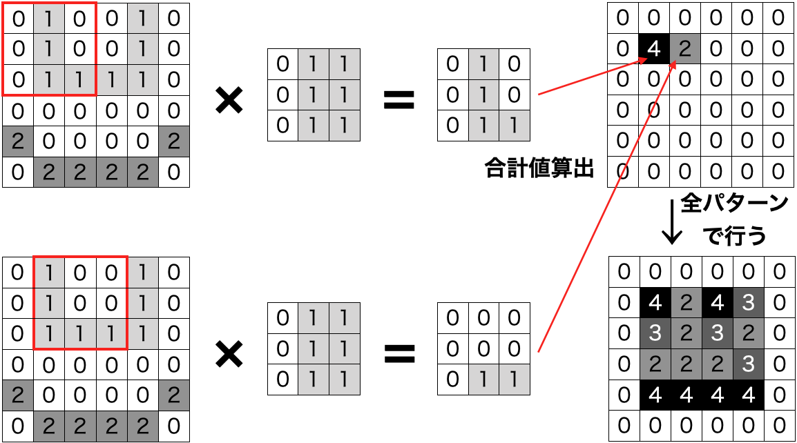
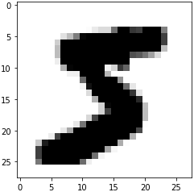
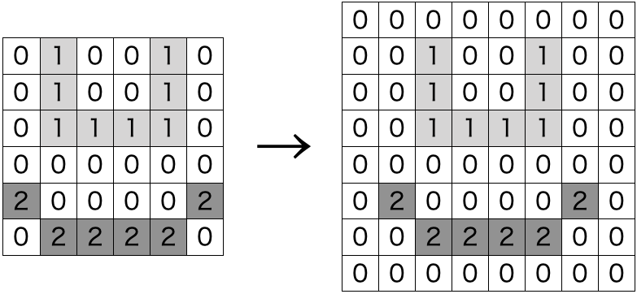
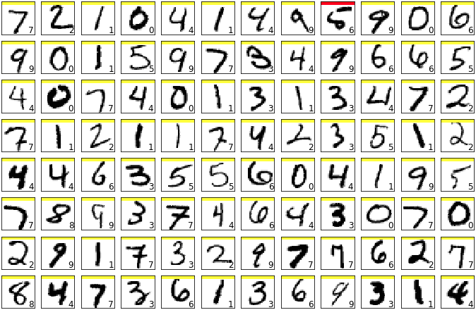

先述の手書き文字認識の章で、活性化関数を変えるなどして認識精度の向上を図ったが、もっと精度を上げるための方法はないだろうか？

ここで、先述の方法では、入力画像を１次元のベクトルに変換して学習を行わせており、２次元画像の空間の情報を考慮していないというところに着目する。（要は、画像の縦方向の関連性、画像の直線や曲線と言ったような画像の情報を見ていないということ。）

画像の空間の情報を取り出す方法として、**空間フィルター**という画像処理の手法がある。

## 空間フィルター

空間フィルターは、２次元の行列で表される。フィルターを画像の一部分に当て嵌め、画像の一部分とフィルターとの要素の積の和を、画像をスライドさせながら画像の全領域で求めていく。

このような計算を、**畳み込み演算 (Convolution)**と呼ぶ。

例として、以下のような(縦のエッジを強調する)空間フィルターを定義し、適用してみよう。

```python
>>> #空間フィルター
>>> import numpy as np
>>> filter = np.array([[0,1,1],[0,1,1],[0,1,1]])
>>> print(filter)
[[0 1 1]
 [0 1 1]
 [0 1 1]]
```

畳み込み演算を、以下のように画像の全要素にスライドさせながら計算していき、その和を計算して値を算出していく。



この例から、画像の位置(i,j)のピクセル値をx(i,j)、3*3のフィルターをh(i,j)とした場合、畳み込み演算で得られる値をg(i,j)とおくと、以下のような式が成り立つ。


\tag{1}  g(i,j) = \sum_{u=-1}^{1} \sum_{v=-1}^{1} x(i+u,j+v) h(u+1,v+1)


では、先程の画像にこのフィルターを適用して図示してみよう。以下にコードを示す。

```python
#フィルター適用
def do_filter(x,f):
    filtered=np.zeros((len(x),len(x[0])))
    for i in range(len(x)):
        if(i==0 or i==len(x)-1):
            continue
        else:
            for j in range(len(x[0]-3)):
                if(j==0 or j==len(x[0])-1):
                    continue
                else:
                    gij=0
                    for u in range(-1,2):
                        for v in range(-1,2):
                            gij+=x[i+u][j+v]*f[u+1][v+1]
                    filtered[i][j]=gij
    return filtered

#図示
x0_filtered=do_filter(x0,filter)
plt.figure()
plt.imshow(x0_filtered,interpolation='nearest',vmin=0,vmax=255,cmap='binary')
plt.show()
```

実行結果



ここで、フィルターを適用すると元の画像の一番外側の行列のデータが算出されず失われるという欠点がある。

そこで、一番外側のデータも算出させるために、元の画像データの外側に一つ分からのデータを追加させておく。こうすることで、元の画像データ全ての要素にフィルターが適用される。この追加する一列分の空のデータのことを**パディング**という。例を以下に示す。



また、画像の全要素に適用するためにフィルターを１要素ずつずらしていたが、これは2でも3でも任意の間隔でずらすことができる。この間隔のことを**ストライド**という。

## 畳み込みニューラルネットワーク

フィルターを使ったニューラルネットワークを**畳み込みニューラルネットワーク**、または**コンボリューションニューラルネットワーク (Convolution Neural Network:CNN)**と呼ぶ。

フィルターを利用することで様々な画像処理が行えるが、このCNNでは、フィルター自体を学習させる。

入力として、元となる入力画像と、フィルターを何種か用意する。

そして、入力画像を用意したフィルター全てで適用する。その結果、入力は入力画像の要素数×フィルターの枚数となる。

それらをニューラルネットワークの入力層に入力し、最終的に10個の出力層に出力させる。

一連の流れをKerasで実装した例を以下に示す。

```python
#CNN
model2=Sequential()
#コンボリューション層定義、3*3のフィルターを8枚使用、パディング使用(same)、input_shape:入力画像のサイズ
model2.add(Conv2D(8,(3,3),padding='same',input_shape=(28,28,1),activation='relu'))
#コンボリューション層の出力の次元を(バッチ数、フィルター数*出力画像縦幅*出力画像横幅)にさせる
model2.add(Flatten())
#出力層定義、10個で活性化関数はソフトマックス関数
model2.add(Dense(10,activation='softmax'))
model2.compile(loss='categorical_crossentropy',optimizer=Adam(),metrics=['accuracy'])

history=model2.fit(x_train,y_train,epochs=20,batch_size=1000,verbose=1,validation_data=(x_test,y_test))
score=model2.evaluate(x_test,y_test,verbose=0)

print('交差エントロピー誤差:',score[0])
print('正答率:',score[1])
```

このモデルで、先述の時と同じようにテストデータを評価すると以下のようになる。



先述までの結果と比べると、遥かに分類精度が良くなっていることがわかる。

空間フィルター、畳み込みニューラルネットワークにより空間情報を取り入れることにより、分類精度が向上する。この技術は、手書き数字だけでなく、その他の画像認識にも応用可能である。

なお、前章と合わせた一連の実装例を[こちら](https://github.com/WAT36/python/blob/master/machine_learning/deeplearning/mnist.ipynb)のNotebookに記載したので、参考として載せておく。