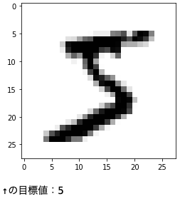
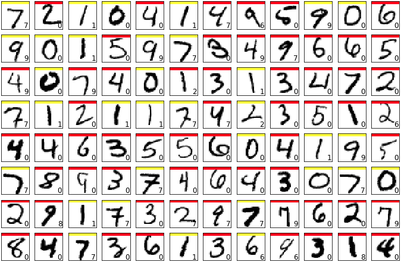
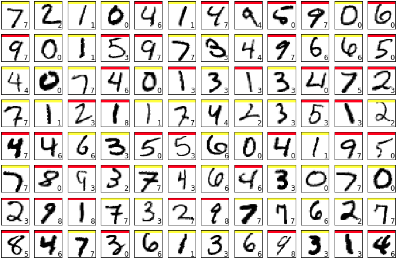

ここでは、実用的な問題への応用として、手書き数字をニューラルネットワークを使って認識させてみることを考えてみる。

## MNISTデータベース

手書き文字のデータは、**MNIST**と呼ばれるデータセットを利用する。

MNISTデータセットは、Kerasから以下のように利用することができる。

```python
from keras.datasets import mnist

# trainに60000個の訓練用データ、testに10000個のテストデータが入る
(x_train,y_train),(x_test,y_test) = mnist.load_data()
```

ここで、x_trainには60000*28*28の配列変数で、0~255の値をとるデータが入る。

また、y_trainには60000*1の配列変数で、画像の認識結果である0-9の値が入る。

例として、データを一つとって図示してみよう。以下にその過程を示す。

```python
#最初のデータだけ図示
x0 = x_train[0]

# ヒートマップにして表示
plt.figure()
plt.imshow(x0,interpolation='nearest',vmin=0,vmax=255,cmap='binary')
plt.show()

#ちなみに認識結果（目標値）は
print('↑の目標値：{0}'.format(y_train[0]))
```

実行結果




## ２層フィードフォワードニューラルネットワークでの学習

では、このデータをニューラルネットワークを用いて学習させてみよう。まずはデータの前処理を行う。

MNISTでの入力データは1つにつき28*28の配列変数だったので、まずはこれを1*784の形に変形させる。

また、値を実数として扱うためにfloat型に変換し、255で割って0~1の範囲に値を収める。

そして、目標データもKerasの関数を使って1-of-K符号化法で変換する。

これらを、テストデータに対しても行わせる。

以上の流れをコードで実装すると、以下のようになる。(訓練データのみ)

```python
#行列の型を変換
x_train = x_train.reshape(60000,28*28)
#float型に変換
x_train = x_train.astype('float32')
#0~1の値に収める
x_train = x_train/255
#目標データも1-of-K符号化法で表す
y_train = np_utils.to_categorical(y_train,10)
```

次に、中間層、活性化関数を以下のように定義する。

```python
#ニューラルネットワークの定義
from keras.models import Sequential
from keras.layers import Dense,Activation
from keras.optimizers import Adam

#モデルの定義
model = Sequential()
#784次元を入力とする16個の中間層を定義する。活性化関数はシグモイド関数
model.add(Dense(16,input_dim=784,activation='sigmoid'))
#10個の出力層を定義する。活性化関数はソフトマックス関数
model.add(Dense(10,activation='softmax'))
#学習方法の設定。目的関数を交差エントロピー誤差、学習の評価として正答率を計算、アルゴリズムをAdamに設定
model.compile(loss='categorical_crossentropy',optimizer=Adam(),metrics=['accuracy'])

#学習を行わせる。trainは訓練データ、全データを学習に使う回数:10、validation_dataにテストデータ。(verbose=1で進行状況表示)
history=model.fit(x_train,y_train,epochs=10,batch_size=1000,verbose=1,validation_data=(x_test,y_test))
#学習の評価値を出力
score=model.evaluate(x_test,y_test,verbose=0)
```

ここで、学習を行う(model.fit)時は交差エントロピー誤差を勾配法を用いて最小値を計算しにいくのだが、勾配法だと局所解に嵌った場合抜け出せなくなり、正しい最小値が得られないという場合がありうる。

そこで、別の方法として、**確率的勾配法**という手法を用いてここでは計算を行なっている。

確率的勾配法とは、複数個のデータセットを用いて勾配を計算しパラメータを更新する方法である。これにより、場合によっては局所解から脱出できることがある。

確率的勾配法で用いるデータセットの個数として、コードではbatch_size=1000(1000個)と指定している。


次に、学習させたモデルを用いてテストデータを何個か評価させてみよう。

評価させるためのコードを以下に示す。

```python
y=model.predict(x_test)
plt.figure(2,figsize=(12,8))
plt.gray()
for i in range(12*8):
    plt.subplot(8,12,i+1)
    x=x_test[i,:]
    x=x.reshape(28,28)
    plt.pcolor(1-x)
    wk=y[i,:]
    prediction=np.argmax(wk)
    plt.text(22,25.5,"%d" % prediction, fontsize=12)
    if prediction != np.argmax(y_test[i,:]):
        plt.plot([0,27],[1,1],color='red',linewidth=5)
    else:
        plt.plot([0,27],[1,1],color='yellow',linewidth=5)
    plt.xlim(0,27)
    plt.ylim(27,0)
    plt.xticks([],"")
    plt.yticks([],"")

plt.show()  
```

実行結果



黄線が正しく認識できたデータ、赤線が認識できなかったデータを表しているが、この結果を見ると、うまく認識されていないケースが多いように見える。

そのため、どこか改良してみることを考えてみよう。ここでは、途中の活性化関数を別のものにさせてみる。


## ReLU活性化関数

活性化関数として、シグモイド関数ではなくReLU (Rectified Linear Unit)関数を用いてみることを考えてみよう。

ReLU関数とは以下の式で表される関数である。

$$
\tag{1}  h(x)
    \begin{cases}
        x & (x>0) \\
        0 & (otherwise)
    \end{cases}
$$

シグモイド関数は入力値がどのように変化しても常に1に近い値を出力するので、入力の変化が出力に反映されにくくなる。

その結果、誤差関数の偏微分が0に近い値になり、勾配法による学習が遅くなるという欠点があった。

そのため、このようなReLU関数を用いることで、その問題を解決することが可能になる。

では、先程のコードで、中間層の活性化関数を'relu'に変えて実行してみよう。


```python
#モデルの定義
model = Sequential()
#784次元を入力とする16個の中間層を定義する。活性化関数はReLU関数
model.add(Dense(16,input_dim=784,activation='relu'))
#10個の出力層を定義する。活性化関数はソフトマックス関数
model.add(Dense(10,activation='softmax'))
#学習方法の設定。目的関数を交差エントロピー誤差、学習の評価として正答率を計算、アルゴリズムをAdamに設定
model.compile(loss='categorical_crossentropy',optimizer=Adam(),metrics=['accuracy'])
```

こちらで先ほどと同じようにテストデータを評価すると以下のようになる。



少しだけではあるが精度は良くなったように見える。だが、もう少し精度を上げることはできないだろうか？

ここで少し機械学習とはそれるが、画像処理の技術を適用することを次章で考えてみる。