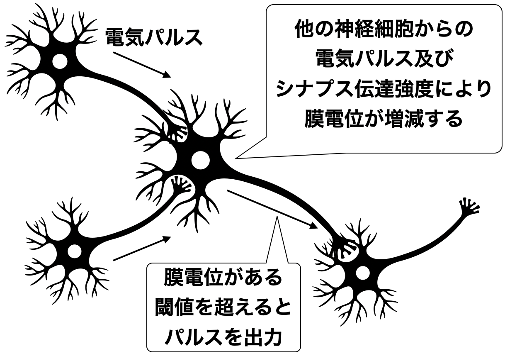
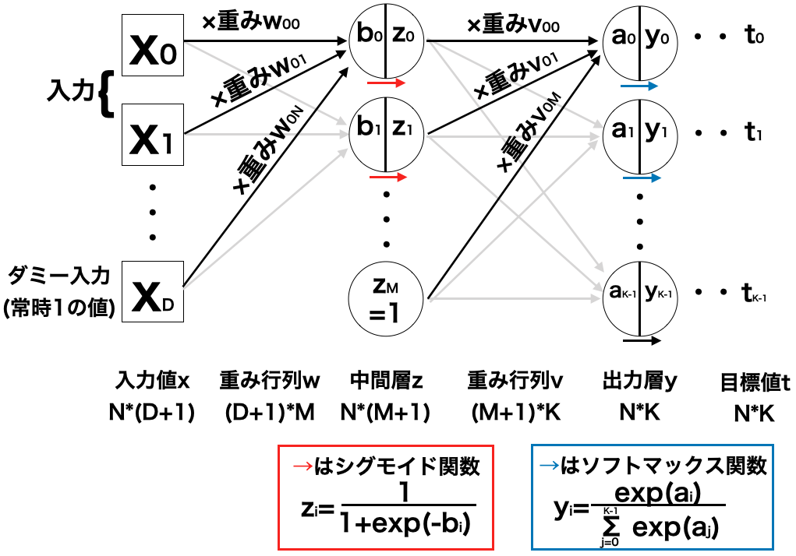
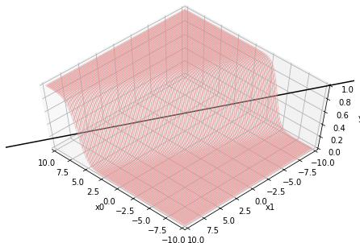

ニューラルネットワークとは、人間の神経細胞を模した数理モデルである**ニューロンモデル**を利用した機械学習のアルゴリズムである。

ニューロンモデルを幾層にも組み合わせて計算を行なっていく方法で、より多くのニューロンモデルを使用した物は**ディープラーニング**とも呼ばれる。

## 神経細胞

人間の脳にある神経細胞は核と軸索と呼ばれる部位からなり、軸索の先をシナプスと呼ばれるインターフェースで別の神経細胞に繋げる形で幾つにも繋がっている。

神経細胞は、他の細胞から電気的なパルスを受け取り、また対応するシナプスの状態によりその電気パルスをどれほど受け取るか(シナプス伝達強度)が違ってくるため、神経細胞内の電位(膜電位)が大きく変化したりする。

そして、膜電位がある一定の値(閾値)を超えると、その神経細胞は次の神経細胞へ、電気的なパルスを発信する。それが連続された構造になっている。(下図)

## ニューロンモデル

ニューロンモデルは、この神経細胞の動きを模した数理モデルで、下図のように表される。

入力値は、正も負も値を取る実数(図中のx0〜xn-1)とし、それぞれにシナプス伝達強度とした**重み**(図中のw0〜wn-1)をかける。そしてその和を取ったものを**入力総和**(図中のa)として計算する。

$$
\tag{1}  a = w_{0} x_{0} + w_{1} x_{1} + \cdots + w_{n-1} x_{n-1}
$$

なお、図にもあるように、n-1番目の重みは切片としてそのまま用いるので、xn-1=1とする。

$$
\tag{2}  a = w_{0} x_{0} + w_{1} x_{1} + \cdots + w_{n-1}
$$

式(1)は以下のように書き換えられる。

$$
\tag{3}  a = \sum_{i=0}^{n-1} w_{i} x_{i} 
$$

そして、この入力総和aを、シグモイド関数を使って出力値yに置き換え、出力する。

$$
\tag{4}  y = \frac{1}{1 + \exp(-a) }
$$

この一連の流れは、教師あり学習で出てきたロジスティック回帰に似ており、重みや入力総和によって決定境界が引かれ、それを境に出力が0か1に別れる、とみることもできる。

例えば、N(入力値の個数)=2、重みをw0=-2,w1=1,w2=2とした場合の出力値yのグラフは以下のようになる。

（コード類は[こちら](https://github.com/WAT36/python/blob/master/machine_learning/deeplearning/neural_network.ipynb)のJupyter Notebookにまとめたのでご参考に）

この図より、直線-2x0+x1+2=0 (w0x0+w1x1+w2x2=0)を境に出力値は0か1に大きく分かれる事となる。

## ニューラルネットワークモデル

先述のニューロンモデルをいくつも組み合わせた、ニューロンモデルの集合体のモデルのことを**ニューラルネットワークモデル**という。

ニューラルネットワークモデルにはいくつか種類があるが、ここでは一方向にのみ流れる**フィードフォワードニューラルネット**を考える。

ここでは、入力層と出力層の間に中間層が1つの**2層フィードフォワードニューラルネットワークモデル**とする。下に図を示す。

重み行列が2つあるので（中間層を第１層、出力層を第２層と呼ぶことからもある）、これから２層フィードフォワードニューラルネットワークモデルと呼ぶ。（入力層も合わせて３層と呼ぶこともある）

中間層には、前述のニューロンモデルと同じように、ダミー入力として常に１の値をとるパラメータを加える。

重み行列**z**において、aiからbjへの重みをzjiとおくと、以下の式が成り立つ。

$$
\tag{5}  b_{j} = \sum_{i=0}^{n-1} z_{ji} a_{i}
$$

中間層では、この式(5)により算出した結果を、シグモイド関数に通すことで出力値を得る。出力値をc、シグモイド関数をh()とおくと、以下の式が成り立つ。

$$
\tag{6}  c_{j} =  h( b_{j} )
$$

ここで、シグモイド関数は入力総和から何らかの出力を決定づける関数ということで、**活性化関数**とも呼ばれている。

次に出力層において、中間層の出力と重み行列から式(5)の計算を行なった最終的な出力値biに対して、最後にソフトマックス関数を適用することにより２層フィードフォワードニューラルネットワークモデルの出力値yiを得る。

$$
\tag{7}  y_{i} = \frac{ \exp(a_{i}) }{ \sum_{j=0}^{K-1} \exp(a_{j}) }
$$

ここまでの一連の処理をコードにまとめてみよう。

と言いたいが、ここに記載するとかなり長くなるので、[こちら](https://github.com/WAT36/python/blob/master/machine_learning/deeplearning/FNN.ipynb)のJupyter Notebookにコードを記載する。

では、この２層フィードフォワードニューラルネットワークモデルを利用した学習法を考えてみよう。

その方法の一つを、次章で紹介する。
