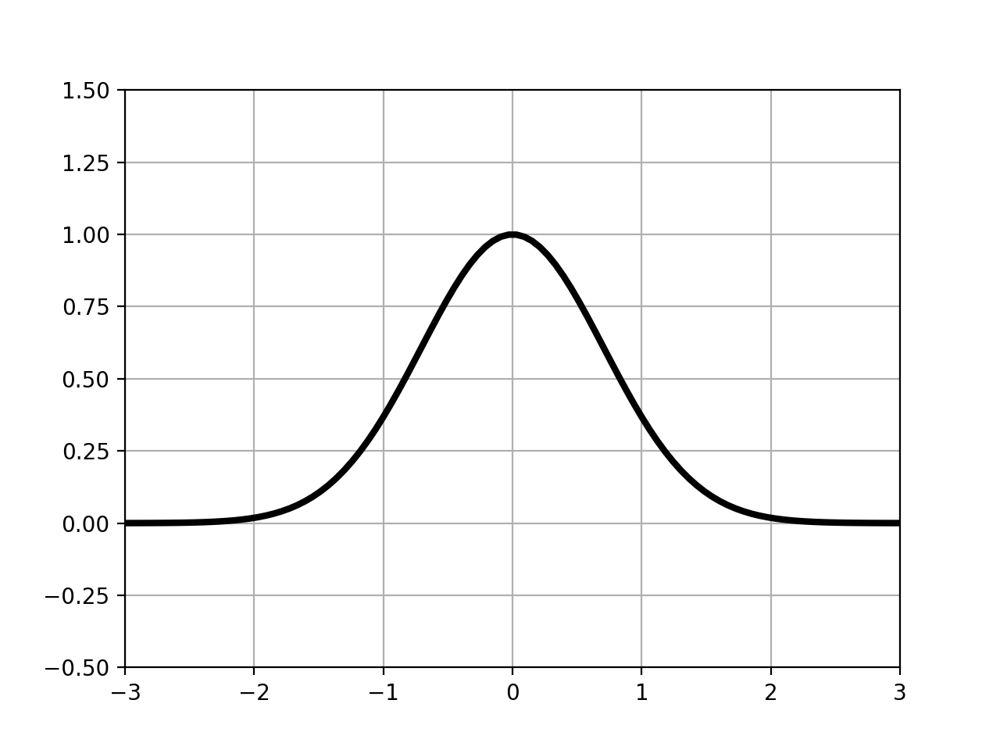

ガウス関数は以下の式で表される関数である。  

$$
a \exp \left(- \frac{ ( x - \mu )^2 }{\sigma^2} \right)
$$

ここで、式中の変数は以下の意味を持つ。

- μ：中心(平均)
- σ：標準偏差
- a：高さ(係数)

ここで、

$$
a = \frac{1}{ \sqrt{2 \pi \sigma^2} }
$$

とした時、xで積分すると1になるため、確率密度関数としても使われる。

例として、a=1,μ=0,σ=1とした時のガウス関数を示す。

```python
>>> import numpy as np
>>> import matplotlib.pyplot as plt
>>> 
>>> #ガウス関数
>>> def gauss(a,mu,sigma):
...     return a * np.exp( -(x-mu)**2 / sigma**2 )
... 
>>> 
>>> x=np.linspace(-3,3,100)
>>> plt.plot(x,gauss(1,0,1),'black',linewidth=3)
[<matplotlib.lines.Line2D object at 0x11740d908>]
>>> 
>>> plt.ylim(-0.5,1.5)
(-0.5, 1.5)
>>> plt.xlim(-3,3)
(-3, 3)
>>> plt.grid(True)
>>> plt.show()
>>> 
```

実行結果



