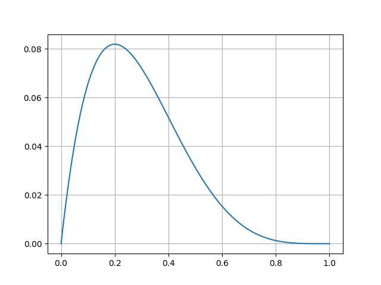

当たりとハズレがそれぞれ何個か入ったくじがあり、当たりが出た時を１、ハズレが出た時を０と設定する。

この時、n回目にくじを引いた時の結果をTn、及び行列Tを以下のように設定する。

$$
\begin{aligned}
\tag{1}  {\bf T}    &=  \left[
                            \begin{array}{ccc}
                                T_{1} & \cdots & T_{N} 
                            \end{array}
                        \right]
\end{aligned}
$$

試しにくじを５回引き、その結果がT=[0,0,0,0,1]だったとする。

ここで、くじを引いた時に当たりが出る確率をp (0≦p≦1) とした時、この事象が発生する確率はどうなるだろうか。

その確率をL(p)とすると、

$$
\tag{2} L(p) = (1-p)^4  p 
$$

となる。

ここで、pがいくつの時に、このような事象が最も出やすくなるだろうか。

この事象が最も出やすくなるようなpの値を考えることにより、当たりが出る確率pの値を推定してみることを考えてみよう。

ちなみに、L(p)はpの色々な値における尤もらしさを表す関数とみなすことができ、このような尤もらしさのことを**尤度**といい、それを関数で表したものを**尤度関数**という。

例えばL(p)において、p=0.1の時の尤度(L(0.1))は0.06561、p=0.2の時の尤度(L(0.2))は0.08192となる。

ここで、**最尤法**という方法を用いて求めることにしてみよう。これは尤度関数を最大にするものを求める推定量とするというものである。

また、このような尤度関数L(p)を最大にするようなpのことを**最尤推定値**、それにより得られる関数の値を**最尤推定量**という。

今回の例にあてはめてみると、L(p)を最大にするような最尤推定値pを求める。では、そのようなpを求めてみよう。

L(p)をpで微分すると以下のようになる。

$$
\tag{3}  \frac{dL(p)}{dp} = (1-p)^3 (1-5p)
$$

この式より、p=0.2が最尤推定値になり、およびその最尤推定量は0.08192となる。

念のため、L(p)を図で表すと以下のようになる。この図でもp=0.2の時にL(p)が最大になることは明らかである。

これより、求めるpの値は0.2であり、この時にT=[0,0,0,0,1]といった事象が最も出やすくなる、ということになる。

## 対数尤度

先ほどはL(p)を微分することで求めたが、対数を取ることで計算が楽になる場合もあるので、その計算方法も示す。

式(2)において、両辺の対数を取ると以下のようになる。

$$
\tag{4}  \log L(p) = 4 \log (1-p) + \log p
$$

この式(4)において、log L(p)を最大にするpを求めれば、そのpはL(p)を最大にするpにもなるので、ここからpを求めるのも良い。

式(4)のように、対数をとった尤度を**対数尤度**という。

$$
\begin{aligned}
\tag{5}  \frac{d log L(p)}{dp}    
            &=  \frac{d}{dp} [ 4 \log (1-p) + \log p ] \\
            &=  \frac{-4}{1-p} + \frac{1}{p} \\
            &=  \frac{1-5p}{(1-p)p} = 0 \\
            &\Leftrightarrow  p = \frac{1}{5}
\end{aligned}
$$

この方法でも、p = 1/5 (=0.2) と求められる。