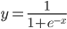
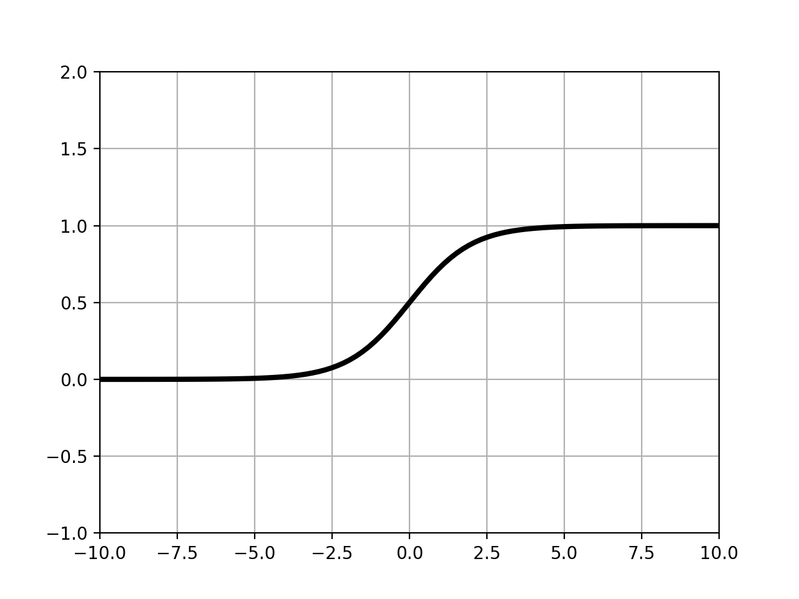

機械学習でよく用いられるシグモイド関数についてを述べる。

シグモイド関数とは以下の式で定義される関数である。  



シグモイド関数をプロットして表示する。

```python
>>> import numpy as np
>>> import matplotlib.pyplot as plt
>>> 
>>> x = np.linspace(-10,10,100)
>>> y = 1/(1 + np.exp(-x))
>>> 
>>> 
>>> plt.plot(x,y,'black',linewidth=3)
[<matplotlib.lines.Line2D object at 0x1109dde10>]
>>> 
>>> plt.ylim(-1,2)
(-1, 2)
>>> plt.xlim(-10,10)
(-10, 10)
>>> plt.grid(True)
>>> plt.show()
>>> 
```

実行結果




