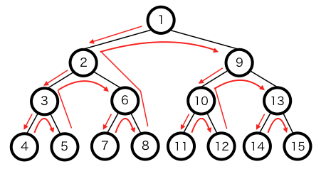
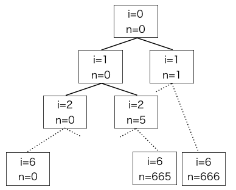

探索の手法の一つである深さ優先探索についてを述べる。

深さ優先探索とは、ある状態から始めてそこから遷移出来なくなるまで状態を進めていき、遷移出来なくなったら１つ前の状態に戻ってそこから別の状態へと遷移し、また遷移出来なくなったら１つ前の状態に戻る、を繰り返して全ての状態を探索していく手法である。

状態遷移が木構造の様な図で表される時に適用しやすい。

探索のイメージは下図の通り。



例として、以下の様な問題を考えてみる。

>
>1,5,10,50,100,500円玉を１枚ずつ持っている時、k円をちょうど支払う事が可能かを判定しなさい。
>

深さ優先探索を用いて考えると、全ての硬貨において使う/使わないで場合分けし、使った硬貨の金額の和がk円に等しくなればOK、その様なパターンが１つもなければ払えないという事になる。

コードでの実装例は以下の通り。(python)

```python:coin_dfs.py
#coin_dfs.py

#k円、標準入力から
print("k:",end="")
k=int(input())

coin=[1,5,10,50,100,500]

#硬貨の場合分けを深さ優先探索で調べる、iが場合分けした硬貨の枚数、nが現在の金額
def dfs(i,n):

    #全て調べ終わったら判定
    if(i==6):
        return n==k
    
    #coin[i]を使わない場合
    if( dfs(i+1,n) ):
        return True
    
    #coin[i]を使う場合
    if( dfs(i+1,n+coin[i])):
        return True

    #どの場合もTrueにならなかった → 払えないのでFalse
    return False

print(dfs(0,0))
```

実行例

```
$ python coin_dfs.py 
k:3
False
$ python coin_dfs.py 
k:50
True
```

なお、この問題における探索のイメージは以下の図の通りである。



i==6となった時に金額nがkに等しければTrueが返る。