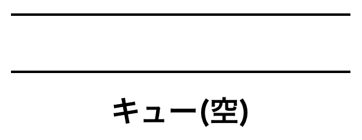
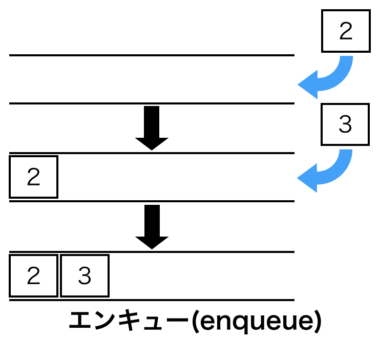
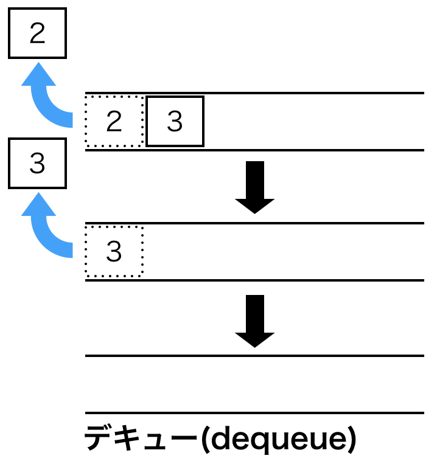

幅優先探索を実装する時にキューと言うデータ構造を使用するのが良いそうなので、
今回はキューについてを調べて見た。（幅優先探索については後日・・機会あれば）

# キューとは

>キュー（英: queue）、あるいは待ち行列はコンピュータの基本的なデータ構造の一つ。データを先入れ先出しのリスト構造で保持するものである。キューからデータを取り出すときには、先に入れられたデータから順に取り出される。キューにデータを入れることをエンキュー(enqueue)、取り出すことをデキュー(dequeue)という。(Wikipediaより)

図にすると以下のような構造を持つデータ構造である。



イメージとしては筒のようなもの。  
キューの中にキューの後ろからデータを入れる事ができ（エンキュー）、  
キューの先頭からデータを取り出す事ができる（デキュー）。  
構造上取り出せるデータはキューに入れた順となる。  
エンキュー、デキューを下図に示す。  






# Pythonでの実装方法

Pythonにはキューを実装するには、 **collections** モジュールの **deque** 型を利用する。  
このdeque型だが、キューに加えスタックの機能も持ったようなデータ構造であり、使い方次第ではスタックとしても使用できる。  
今回はキューとして利用することを前提に説明する。

## キューの作成

dequeをインポートしてキューのオブジェクトを作成する。

```python
>>> from collections import deque
>>> 
>>> a=deque()
>>> 
```

## キューへの要素の追加

dequeに要素を追加するには**append**()メソッドで行う。  
appendメソッドにより、要素がキューの右側から追加される。  
本来のキューの使い方ではないが、左から追加するには**appendleft**()メソッドを使う。  

```python
>>> a
deque([])
>>> 
>>> a.append(1)
>>> a
deque([1])
>>> 
>>> a.append(2)
>>> a
deque([1, 2])
>>> 
>>> a.appendleft(3)
>>> a
deque([3, 1, 2])
>>> 
```

### キューに別リストの要素を一挙に追加

キューに別のリストにある要素を一挙に追加したい時は**extend**メソッドを使う。  
キューの左から追加したい時は**extendleft**メソッドを使う。（リストの左の要素から順にキューに追加されていく。）
```python
>>> a
deque([1])
>>> 
>>> b=[2,3,4]
>>> 
>>> a.extend(b)
>>> 
>>> a
deque([1, 2, 3, 4])
>>> 
>>> a.extendleft(b)
>>> 
>>> a
deque([4, 3, 2, 1, 2, 3, 4])
>>> 
```

## キューから要素を取り出す・削除

dequeから要素を取り出すときは**pop**メソッドを使う。  
popメソッドにより、dequeの右側から要素を一つ削除し、その要素が返される。  
dequeの左側から要素を取り出したい時は**popleft**メソッドを使う。

また、dequeから特定の要素を削除したい時は**remove**メソッドを使う。  
deque.remove(x) でdeque内に最初に現れるxを削除する。

```python
>>> a
deque([3, 1, 2])
>>> 
>>> a.pop()
2
>>> a
deque([3, 1])
>>> 
>>> a.popleft()
3
>>> a
deque([1])
>>> 
>>> 
>>> a.append(2)
>>> a.append(2)
>>> a.append(3)
>>> 
>>> 
>>> a
deque([1, 2, 2, 3])
>>> 
>>> a.remove(2)
>>> a
deque([1, 2, 3])
>>> 
```

### キューから要素を全削除する

キューから要素を全て削除するには**clear**メソッドを使う。

```python
>>> a
deque([1, 2, 3])
>>> 
>>> a.clear()
>>> 
>>> a
deque([])
>>> 
```

## キューの要素の順を逆にする

キュー内の要素の順番を逆にするには**reverse**メソッドを使う。

```python
>>> a
deque([1, 2, 3, 4])
>>> 
>>> a.reverse()
>>> 
>>> a
deque([4, 3, 2, 1])
>>> 
```

-----------

今後活用していきたい。

