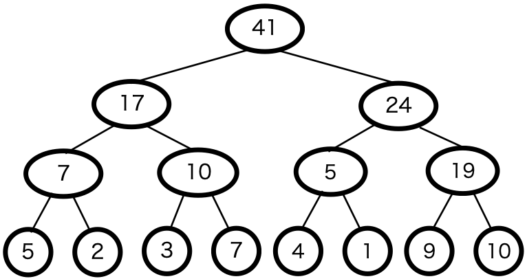
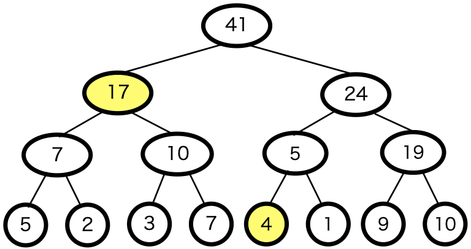
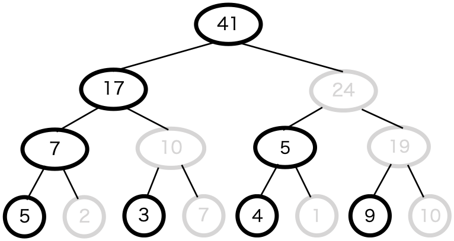
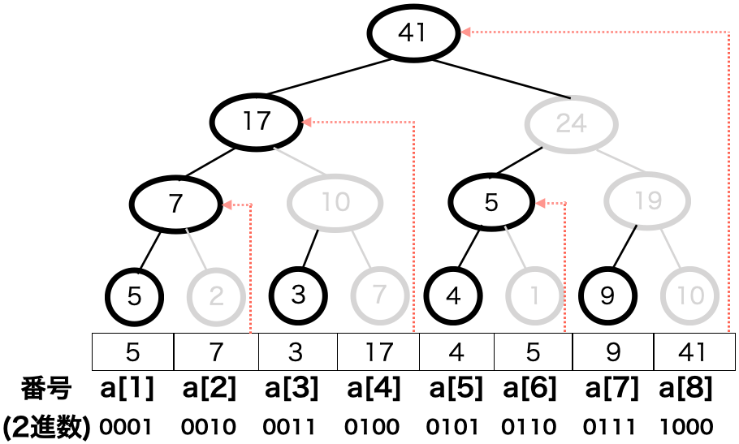
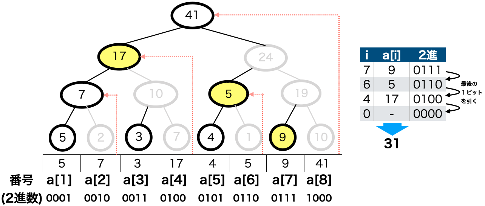
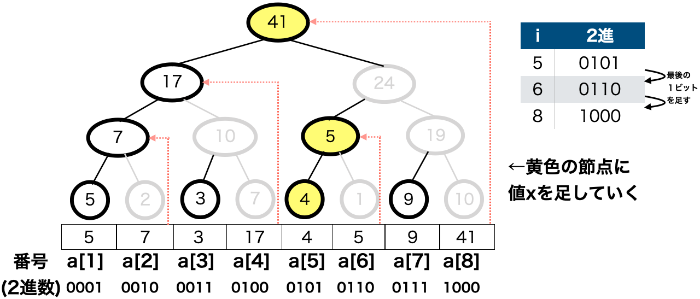

Binary Indexed Tree(BIT)は、セグメント木を応用したデータ構造で、リスト(数列)a<sub>n</sub>が与えられた時、次のことが行える。

- iが与えられた時、a<sub>1</sub>...a<sub>i</sub>の和を計算する。
- i,xが与えられた時、a<sub>i</sub>+=xとする。

BITをどのように表すかだが、セグメント木と同様に、リストの各要素を木の葉の要素にならべる。

例として、以下のリストをBITで表すと、以下のような図で表される。

```
a=[5,2,3,7,4,1,9,10]
```



BITでは、節点の値にその節点が示す区間の値の和を設定する。

ここから、例えばi=5を入力した時、a<sub>1</sub>〜a<sub>5</sub>までの和を求めるが、この求め方もセグメント木の時と同様に、a<sub>1</sub>〜a<sub>5</sub>の区間を示す節点を取り出してきて、その値の和を求めれば良い。この例の時、以下のような図で表され、和は17+4=21が返る。



ここで、BITにおいては、区間内の和を示しているので、実は各節点の2つ目の子になっている節点は必要ないことがわかる。(iが与えられた時は2つ目の子の要素は計算に使わない。i,xが与えられた時でa<sub>i</sub>が親節点の2つ目の子になっていた場合、a<sub>i</sub>を示す節点の値を書き換えなくても、その親節点から上の接点の要素を書き換えれば、その他の計算には影響を与えないため。)

そのため、BITは以下のようにも置き換えられる。



この図で、灰色の節点は必要のない節点を表す。

ここで、BITを表すリスト(及び配列)とBITの節点を以下の図のように対応づける。



ここで、リストのインデックスを２進数で表したとき、２進数の1桁目が1のところは一番深いところの要素(要素1つ分の区間の節点)を表し、その1つ上の要素はリストのインデックス(２進数)の1桁目が1で2桁目が1である・・・というように表せる。BITでは、この性質を用いて計算をすることが多い。

ではまず、このデータ構造を用いて、「iが与えられた時、a<sub>1</sub>...a<sub>i</sub>の和を計算する」方法を以下に示す。

a<sub>i</sub>までの和を求めるには、iの２進数表記の数を利用して、以下のように行う。

1. a[i]の値を加える。
2. iの２進数表記において、一番下の"1"を減算する。(i -= i & -i) 
3. i==0なら1.で加えた値を出力して終了する。そうでない場合は1.へ戻る

例えばi=7の時は以下の通り。




次に、「i,xが与えられた時、a<sub>i</sub>+=xとする。」方法だが、これは先ほどと逆で、iに一番下の"1"を加算していく。以下にその手順を示す。

1. a[i]にxを加える。
2. i==len(a)なら、1.で加えた値を出力して終了する。
3. iの２進数表記において、一番下の"1"のビットに1を加算する。(i += i & -i) 

例えばi=5の時は以下の通り。



では、これら一連のデータ構造と動作をコードで実装してみよう。例を以下に示す。

```python
class BinaryIndexedTree:
    def __init__(self,a):
        #BITを表すリストaを入力
        #ただしaの長さは2**nとする
        #数合わせのためにa[1]~a[len(a)]をBITとする
        self.bit=[0]
        self.bit.extend(a)

    def sum(self,i):
        ans=0
        while i>0:
            ans+=self.bit[i]
            i -= i & -i
        return ans
    
    def add(self,i,x):
        while i<len(self.bit):
            self.bit[i]+=x
            i += i & -i
```

例で用いたBITをこのコードに入力すると、以下のようになる。

```python
a=[5,7,3,17,4,5,9,41]
bit_a=BinaryIndexedTree(a)

#i=7までのaの和
print("a[7]までの和:{}".format(bit_a.sum(7)))

print("加える前のBIT:{}".format(bit_a.bit[1:]))

#a[5]に1を足す
bit_a.add(5,1)

print("加えた後のBIT:{}".format(bit_a.bit[1:]))
```

実行結果

```
a[7]までの和:31
加える前のBIT:[5, 7, 3, 17, 4, 5, 9, 41]
加えた後のBIT:[5, 7, 3, 17, 5, 6, 9, 42]
```