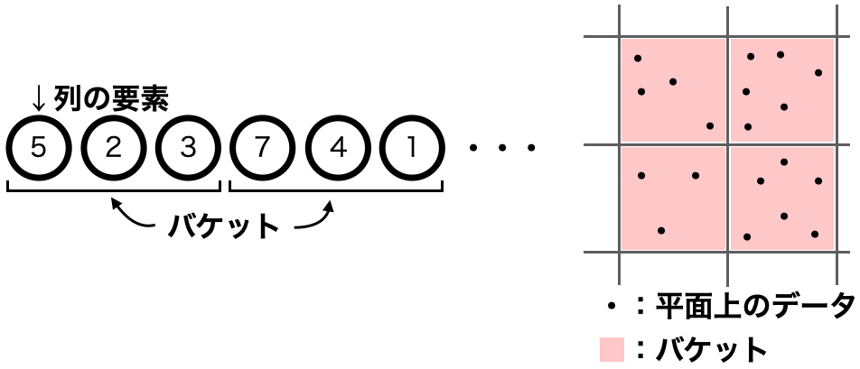

まずバケット法とは、列、または平面状に散らばったデータを**バケット**と呼ばれる単位に分割して、バケットにデータを管理させる方法である。例を以下に示す。



平方分割とは、n個の要素を√n個のバケットにまとめて管理する方法のことを言う。

ここでは、セグメント木の時と同様に、RMQをこの平方分割で実装する方法についてを考えよう。

数列a<sub>0</sub>,a<sub>1</sub>,・・・,a<sub>n-1</sub>がある時、次の2つの処理について√n個のバケットを用いて解くことを考える。

- s,tが与えられた時、a<sub>s</sub>,・・・,a<sub>t</sub>の最小値を求める。
- i,xが与えられた時、a<sub>i</sub>の値をxに変更する。

まず、長さnの数列aを、[√n]個のバケットに分割する。

前者の最小値を求める処理については、求めたい区間内に完全に含まれているバケットについてはそのバケットの最小値を利用し、求めたい区間にあってかつ属するバケットが完全にその区間に含まれていない要素については、個々の要素の最小値を見る。

そうすることにより得た値の最小値が、求める区間内での最小値になる。

後者の値を更新する処理については、要素の値を更新したら、そのバケットの最小値も再度計算し直す。最小値は、そのバケットの最小値と更新した値を比較した小さい方になる。

以上が、平方分割(バケット法)の方法になる。では、これをコードで実装してみよう。実装例を以下に示す。

```python
import math
INF=float("inf")

class Bucket:
    def __init__(self,a):
        #元のリスト
        self.a=a
        #平方分割用バケット用意
        b=int(math.sqrt(len(a))//1)
        #１バケットあたりのデータの個数
        self.b=b
        bucket=[]
        b_start=0
        b_end=b
        while True:
            if(b_end>=len(a)):
                bucket.append(min(a[b_start:]))
                break
            else:
                bucket.append(min(a[b_start:b_end]))
                b_start+=b
                b_end+=b
        #バケット
        self.bucket=bucket
    
    #a[s]~a[t]の最小値を求める
    def query(self,s,t):
        ans=INF
        x=s

        #(a[s]~)個々の要素の計算
        if(x%self.b != 0 and x<=t):
            ans=min(ans,self.a[x])
            x+=1
        
        #(a[s]~a[t]が１バケット内のとき)最小値を返す
        if(x>t):
            return ans
        #(そうでないとき)バケット計算
        else:
            while (x+self.b<=t):
                ans=min(ans,self.bucket[x//self.b])
                x+=self.b
        
        #(~a[t])個々の要素の計算
        if(t-x+1==self.b):
            #(a[t]がバケット内の最後の要素であったとき)
            ans=min(ans,self.bucket[x//self.b])
            return ans
        else:
            #そうでないときは１個ずつ見る
            while x<=t:
                ans=min(ans,self.a[x])
                x+=1
            return ans

    #a[i]をxに変更
    def update(self,i,x):
        self.a[i]=x
        #a[i]があるバケットのインデックス
        j=i//self.b
        self.bucket[j]=min(self.bucket[j],x)
```

試しに、セグメント木のページで利用した例と同じリストを使ってみよう。

```python
a=[5,2,3,7,4,1,9,10]
buc=Bucket(a)

#a[1]~a[4]までの最小値
print("a{0}~a{1}までの最小値:{2}".format(1,4,buc.query(1,4)))

#a[0]を0に変える
buc.update(0,0)
print("バケット:{}".format(buc.a))
```

実行結果は以下の通り。

```
a1~a4までの最小値:2
バケット:[0, 2, 3, 7, 4, 1, 9, 10]
```