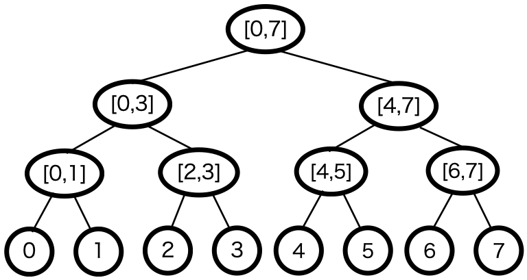
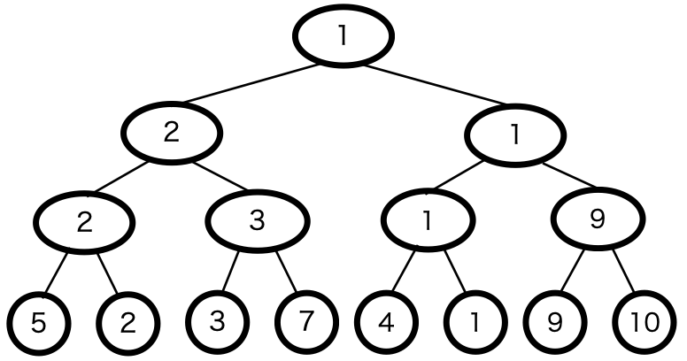
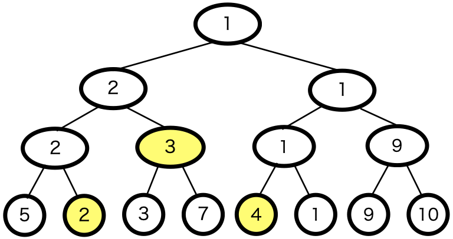
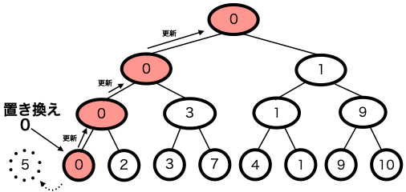

セグメント木は区間と二分木を組み合わせたようなデータ構造である。例えば長さ8のリストをセグメント木で表すと以下のようになる。



ここで、セグメント木の節点にどのようなデータを持たせるかによって、様々な機能を持つ木を作ることができる。

ここでは、RMQ(Range Minimum Query)を実現するセグメント木を例として見ていく。

RMQとは、リスト(及び数列)上で、指定した区間内の最小値を求めるという問題である。

まず、例として以下のような数列があったとする。

```
a=[5,2,3,7,4,1,9,10]
```

この数列において、i,j(0≦i≦j<|a|)を入力したときに、a[i]からa[j]の区間内での最小値を求めることを考えてみよう。

## セグメント木を使った最小値の求め方

この数列をセグメント木で、節点にその節点が示す区間の最小値を入力すると以下のようになる。



ここで、区間を示す値i,jを入力したとき、どのようにして最小値を求めれば良いか。

方法は、セグメント木中で区間[i,j]を示すような値を取り出し、その最小値を求めれば良いのである。

例えば、i=1,j=4の時は、以下のセグメント木の黄色い節点が[1,4]を示すことになり、この値の最小値「2」が区間[i,j]の最小値となる。



i,jが与えられた時に、セグメント木を使って区間[i,j]の最小値を取り出す方法は、セグメント木の根から以下の手順を再帰的に求める。

- [i,j]とその節点が示す区間が全く交差していなければ、最小値を計算するのに影響しない値を返す。(intの最大値など)
- [i,j]にその節点が示す区間が含まれるならば、その節点の持つ値を返す。
- 上の2つのいずれでもない場合は、2つの子ノードについてこの手順を行い、その2つの最小値を返す。

## セグメント木の値の更新

aの要素を更新する時、セグメント木中の節点の値も更新しなければならない。その場合の計算方法はどうすれば良いか？

これは、セグメント木の葉の要素(a[i])から更新し、その後親要素へ順に最小値を計算、更新させていく。

例として、a[0]を0と置き換えた時の一連の流れを以下の図に示す。



## コードでの実装例

これまでの一連の機能について、セグメント木を(Python)コードで実装した例を以下に示す。

```python
import math

#最小値計算に影響を与えないほどの大きい値
MAX=float('inf')

class SegmentTree:
    #初期化,リストaからセグメント木を作成
    def __init__(self,a):
        #n:リストaの長さ
        self.n=len(a)
        #node:n以上で最小の２の冪乗 - 1（セグメント木の節点の数）
        self.node= 2**int(-(-math.log2(self.n)//1)) - 1
        #leaf:セグメント木の葉の数
        self.leaf=2**(int(-(-math.log2(self.n)//1)) + 1 ) - 1
        #segtree:セグメント木
        self.segtree=[MAX for _ in range(self.leaf)]
        #セグメント木の葉にリストの値セット
        for i in range(self.n):
            self.segtree[self.node+i]=a[i]
        #セグメント木の節点の値を計算してセット
        for i in range(self.node-1,-1,-1):
            self.segtree[i]=min(self.segtree[2*i],self.segtree[2*i+1])

    #k番目の値をaに変更
    def update(self,k,a):
        k+=(2**self.n)-1
        self.segtree[k]=a
        #登りながら更新
        while k>0:
            k=(k-1)//2
            self.segtree[k]=min(self.segtree[2*k+1],self.segtree[2*k+2])

    #[i,j]の最小値を求める
    #kは節点の番号、l,rはその節点が対応している区間[l,r]のこと。
    #一番最初(根)の時はquery(i,j,0,0,n)とする。
    def query(self,i,j,k,l,r):
        #[i,j)と[l,r]が交差しなければ、MAXを返す
        if(r<=i or j<=l):
            return MAX

        #[a,b]が[i,j]を完全に含んでいれば、節点の値を返す
        if(i<=l and r<=j):
            return self.segtree[k]
        else:
            #そうでない時は、2つの子の最小値を返す
            vl=self.query(i,j,2*k+1,l,(l+r)//2)
            vr=self.query(i,j,2*k+2,(l+r)//2,r)
            return min(vl,vr)

#例で示した値を入力する
a=[5,2,3,7,4,1,9,10]
st=SegmentTree(a)
print(st.query(1,4,0,0,7))

```

実行結果

```
2
```