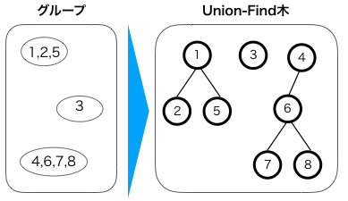
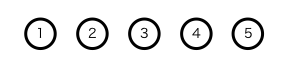
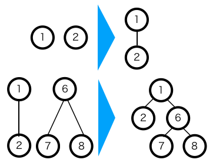
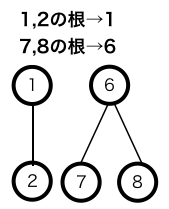

Union-Find木について。

Union-Find木は要素のグループ分けを管理するデータ構造である。
1つ以上の要素を含むグループが何個かあった時、次の事が行える。  

- 2つのグループをマージする
- 2つの要素が同じグループに含まれているか判定する

注意としては、グループを分割することはできないという事。  
例としては、以下のような図になる。

Union-find木は特に根や次数等は決まっておらず、グループ内の要素がすべて含まれていればどのような木構造でも良い。

## 初期化

まずは要素を用意し、それぞれの要素のノードを作る。初期の状態ではこのノードがそれぞれグループを表す。この段階ではまだ要素が1つだけだが、これでも一応木を表す。以下の図にその例を示す。      

## 2グループのマージ

2つのグループ(木)をマージするには、片方のグループ(木)の根の下にもう片方のグループ(木)の根を結び付ける。以下例。

## 2要素が同一グループにいることの判定

ある2つの要素が同じグループにいることを判定するには、それぞれの要素がいるグループ(木)の根の要素が同じであるかで判定できる。以下がその例である。

