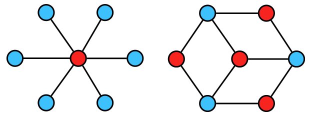
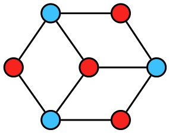

前述のグラフの彩色問題において、彩色数(グラフの頂点を彩色するのに必要な最小の色数)が2であるグラフを**二部グラフ**という。



グラフが与えられたとき、それが二部グラフであるかを判定するには、適当な点から彩色して行っていけば良い。２色のみで塗れたら、二部グラフと判定できる。これには深さ優先探索を用いてやると良い。

```python

V=10                            #頂点の数(入力)
G=[[] for _ in range(V)]        #グラフ（入力）

color=[0 for _ in range(V)]    #頂点の色

def dfs(v,c):
    color[v]=c
    for i in range(len(G[v])):
        #隣接している頂点が同じ色ならfalse
        if(color[G[v][i]]==c):
            return false
        #隣接している頂点がまだ塗られていないなら-cで塗る
        if(color[G[v][i]]==0 and not dfs(G[v][i],-c)):
            return false
    #全ての頂点を塗れたらTrue
    return True

for i in range(V):
    if(color[i]==0):
        #まだ頂点iが塗られていなければ1で塗る
        if(not dfs(i,1)):
            print("No")
            break
else:
    print("Yes")


```

試しに上の図の二部グラフをこれで判定してみよう(以下に図示する)



このグラフの上記コードのV,Gで表すと以下のようになる。

```python
V=7
G=[[1,3,5],[0,2,6],[1,3],[0,2,4],[3,5],[0,4,6],[1,5]]
```

実行結果

```
Yes
```