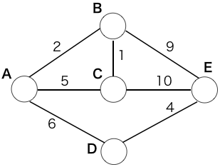

グラフ探索の手法の一つ、ダイクストラ法についてを述べる。

ダイクストラ法は重み付きのグラフにおいて、ある頂点から他の全ての頂点までの最小コストを計算する一つの手法である。

既に最小コストが確定している頂点から一つ一つ最小コストを決定していくので、動的計画法に少し似ているところがある。

## アルゴリズム

入出力は以下の通り。

- 入力
 - グラフ G = (V,E)
 - W(a,b):頂点aから頂点b(a,b∈V)を結ぶ辺の重み(コスト)。辺が存在しないときはW(a,b)=∞
 - 頂点s (s∈V)
- 出力
 - 頂点sから頂点vまでの最小コストd(v) (v∈V)
 - 頂点sから頂点vまでの最小コスト経路において、頂点vの一つ前の頂点p(v) (v∈V)

擬似的なアルゴリズムは以下の通り。

1. X=V とする 
2. 最小コストd(v)(v∈V)を用意し、全てのvにおいてd(v)=∞ と初期化、p(v) (v∈V) を用意し、全てのvにおいてp(v)=v と初期化する
3. d(s)=0とする
4. X=X-{s} とする
5. Xの全ての点v (v∈X) に対して以下の式の通りにコストを計算する。

    d(v) = min(d(v),d(s)+W(s,v))
6. 5.の式において、第２項の方が小さいならば、p(v)=sとする。
7. X={} (|X|=0) ならば、d(v),p(v)を出力して終了する
8. d(s) = min{d(v)|v∈X} となるsを求め、4.に戻る

計算量はn=|V|とした時、5.~8.の処理が1+2+・・・+n回行われるため、O(|V|<sup>2</sup>)となる。

例として以下のグラフで、頂点Aから他の全ての点までの最短経路を求めてみる。



まずは始点となるAのコストを0、その他の頂点のコストを∞とする。また、Aをコスト確定済みとしてXに加える。

(図中、頂点内の左にその頂点のコスト、右にその頂点までの最小コスト経路における直前の頂点を記載する。またコスト確定した頂点(Xから除いた頂点)を黄色く、コストが確定していない頂点を白く表示する。)


次に、Aから各頂点のコスト及び直前の頂点を計算する。この時、Aに隣接する頂点はコストが下図のように定まる。


次に、コストが確定していない頂点(上図で白の頂点)からコストが最も小さい頂点を選び、その頂点をコスト確定とする。

この場合は頂点Bが該当する。


ここから頂点Bに隣接しコスト確定していない頂点に対してコストを計算する、という一連の動作を全ての頂点のコストが確定するまで行っていくと、最終的には以下の図のようになり、始点Aから全ての頂点までの最小コスト及び経路が求められる。


コードによる実装例は以下の通り。(Python)

```python
INF=float("inf")

#始点,頂点の数,辺(頂点ごとの隣接行列)
def dijkstra(start,v,e):
    pre=[i for i in range(v)]
    x=set([i for i in range(v)])
    dist=[INF for _ in range(v)]

    dist[start]=0

    s=start
    while(len(x)>0):
        x.remove(s)

        min_x=-1
        min_dx=float("inf")
        for xi in x:
            if(dist[xi]>dist[s]+e[s][xi]):
                dist[xi]=dist[s]+e[s][xi]
                pre[xi]=s

            if(min_dx>dist[xi]):
                min_dx=dist[xi]
                min_x=xi

        s=min_x

    return dist,pre

#例題のデータ
edge=[[INF,2  ,5  ,6  ,INF],
      [2  ,INF,1  ,INF,9  ],
      [5  ,1  ,INF,INF,10 ],
      [6  ,INF,INF,INF,4  ],
      [INF,9  ,10 ,4  ,INF]]
print(dijkstra(0, 5, edge))
```

実行結果

```
([0, 2, 3, 6, 10], [0, 0, 1, 0, 3])
```