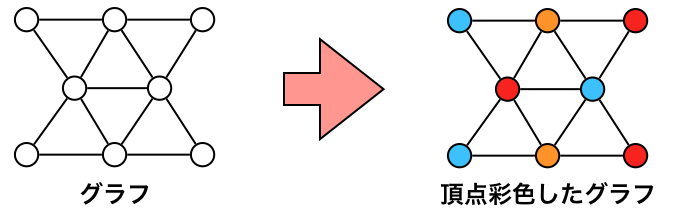
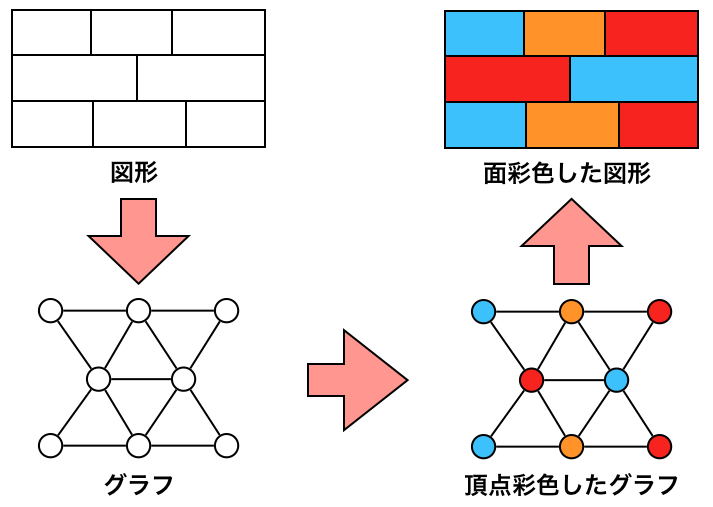
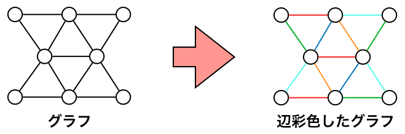

競プロでグラフの彩色問題が出てきたので、今回はグラフの頂点彩色問題について、復習がてら記事を書いてみる。

# グラフの彩色

そもそもグラフの彩色とは何か？

>グラフ彩色（英: Graph coloring）とは、グラフの何らかの要素に、ある制約条件を満たすように色を割り当てることである。最も単純なものは、隣接する頂点同士が同じ色にならないように全頂点に彩色する問題である。これを頂点彩色という。同様に辺彩色は、隣接する辺同士が同じ色にならないように全辺を彩色する問題、面彩色は、平面グラフの辺で囲まれた各領域（面）を隣接する面同士が同じ色にならないように彩色する問題である。
>(Wikipedia引用)

要は、グラフの隣接する頂点が全て違う色になるように頂点を色分けできるか？というものである。  
辺彩色の場合は辺、面彩色の場合は面になる。  

頂点彩色の一例は以下の図のようなものがある。

# 頂点彩色のアルゴリズム (Welsh・Powellのアルゴリズム)

グラフの頂点彩色のアルゴリズムとしてWelsh・Powellのアルゴリズムが知られている。
これは彩色を貪欲法で行う方法であり、ある頂点の色に隣接する頂点で使っていない色を設定していき、それまでに使ったどの色も頂点に設定できない場合は新たな色を設定するというアルゴリズムである。  
調べる頂点の順番によっては最適な彩色が行えないため、最適な彩色を行うために頂点は次数の大きい順に行う。

疑似的なアルゴリズムを以下に示す。

1. グラフGの頂点次数の大きい順にソートし、 Vi (i=1,2,…n)とする。  
2. i = 1 とする  
3. c = 1 とする  
4. Vi の隣接点で色cを持つものが存在しなければ、Vi に色cを与えて6.へ進む  
5. c = c + 1 として4.に戻る  
6. i < |V| ならば、i = i + 1 として3.に戻る。i = |V| なら終了。  

# 面彩色

面彩色は頂点彩色を応用して行える。
面をグラフの一つの頂点とみなし、接している面（頂点）同士を辺で繋げたグラフに頂点彩色を行い、彩色された頂点の色をそのまま対応する面に置き換えれば面彩色が行える。

イメージとしては以下のような図。

# 辺彩色

辺彩色は専用のアルゴリズムがある？と聞いたが調べても見つからず、そのため問題にもよるが、これも頂点彩色を応用して行えると予想している。  
１つの辺において、隣接辺（＝辺が結んでいる頂点が結んでいる他の辺）の数が大きい順に辺をソートし、  
大きい辺から頂点彩色アルゴリズムを応用して行えば、彩色が行える（・・・はず）

1. グラフGの辺を隣接辺の数の大きい順にソートし、 Ei (i=1,2,…n)とする。  
2. i = 1 とする  
3. c = 1 とする  
4. Ei の隣接辺で色cを持つものが存在しなければ、Ei に色cを与えて6.へ進む  
5. c = c + 1 として4.に戻る  
6. i < |E| ならば、i = i + 1 として3.に戻る。i = |E| なら終了。  

イメージとしては以下のような図。  

