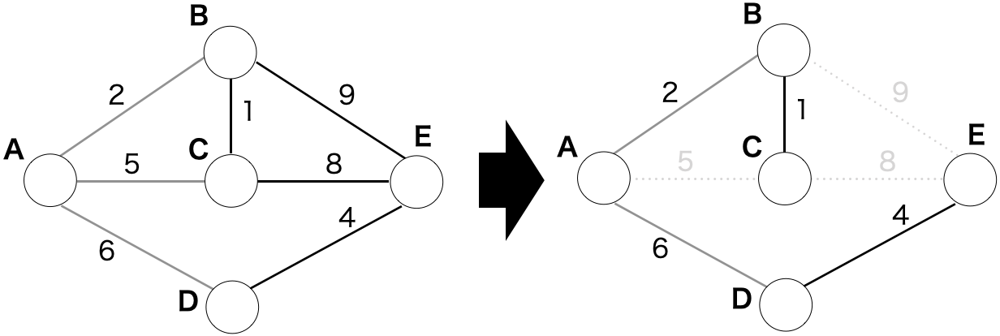
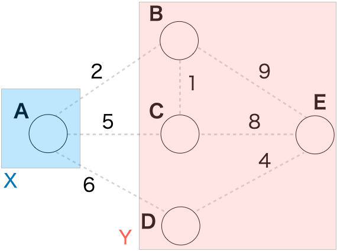
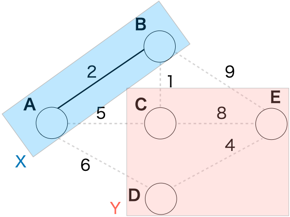
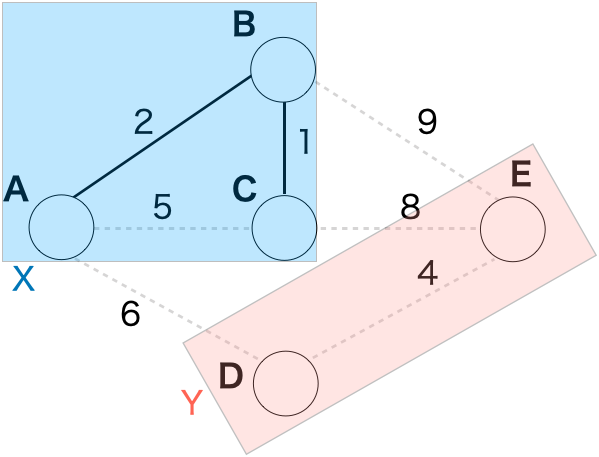
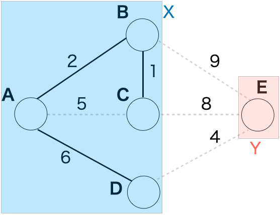
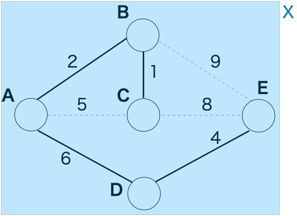
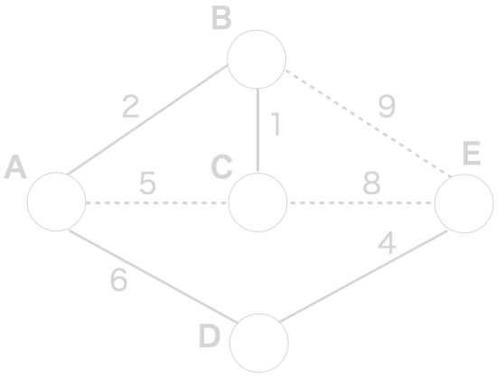
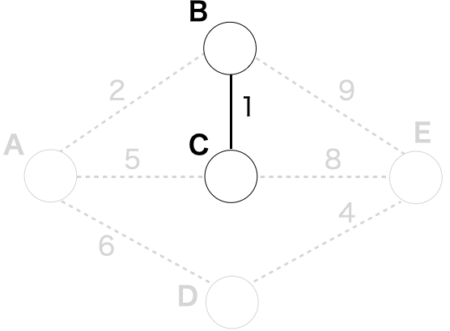
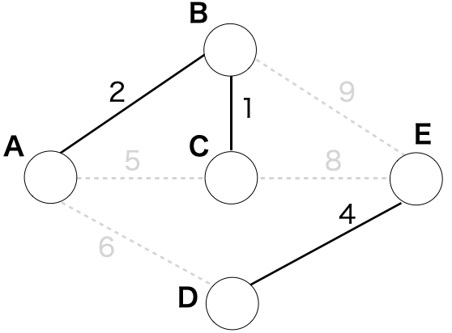
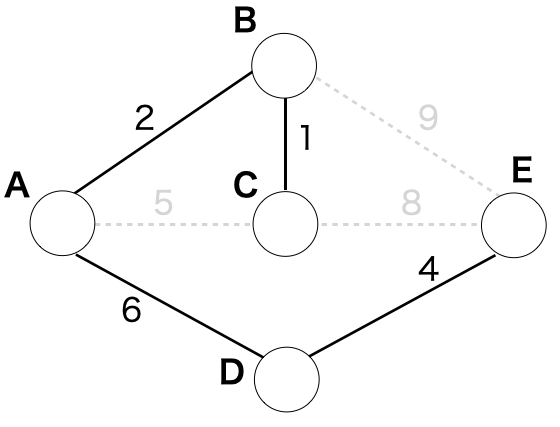

無向グラフが与えられたときに、その内のある辺だけを用いてグラフ中の任意の２頂点を連結(ある頂点から他のどの頂点への経路が存在する)にした木のことを **全域木(Spanning Tree)** という。

辺にコストがあったときに、使われる辺のコストの和を最小にした全域木のことを **最小全域木(Minimum Spanning Tree)** という。

例えばベルマンフォード・ダイクストラ法で用いたグラフの最小全域木は以下のように表される。



最小全域木を求めるアルゴリズムとして、一般に**プリム法**と**クラスカル法**の2つが知られている。

## プリム法

プリム法は、グラフのある頂点から辺を付け足して行って最小全域木を求めていく手法である。

始め、1つの頂点vからなるグラフTを考えたとき、ここからグラフTとその他の頂点を結ぶ最小コストの辺をグラフTに追加していく、と言う操作を繰り返すことにより、最小全域木が作成できる。

プリム法のアルゴリズムは以下の通り。

入出力：

- 入力
 - グラフ G = (V,E)
 - W(a,b):頂点aから頂点b(a,b∈V)を結ぶ辺の重み(コスト)。辺が存在しないときはW(a,b)=∞
 - 頂点s (s∈V)
- 出力
 - 最小全域木 X = (V',E')

アルゴリズム：

1. X=a (a∈V)、Y=V-X とする。aは何でも良い。
2. 頂点x (x∈X) 、頂点y (y∈Y)を結ぶ辺で、Xに追加したときに閉路をなさない辺のうち、最小のコストを持つ辺eを探す。
3. X=X+(eのY側の要素)、Y=Y-(eのY側の要素)とする。
4. Y={} (|Y|=0) ならば、Xを出力して終了する。そうでない時は、2.に戻る。

例として、以下のグラフに対しプリム法を適用した場合を追って説明する。


まずは頂点Aを最小全域木Xとし、その他の頂点をグラフYとする。



次に、グラフXとグラフYを結ぶ辺のうち、Xに加えた時に閉路をなさず、最小コストである辺を探す。この場合は、頂点A-Bを結ぶ辺が該当する。

この辺、及び、頂点BをXに加え、またYから除外する。



この動作を繰り返していく。この状態において、グラフXとグラフYを結ぶ辺のうち、Xに加えた時に閉路をなさず、最小コストである辺は、頂点B-Cを結ぶ辺が該当する。よって、頂点CをXに加え、またYから除外する。



次は、頂点A-Dを結ぶ辺が該当する。



次は、頂点D-Eを結ぶ辺が該当する。



Yの頂点がなくなったので、Xを出力して終了する。このXが、最小全域木である。

以上が、プリム法による最小全域木の導出である。これをコードで実装した例を以下に示す。

```python
INF=float("inf")

# 設定（ユーザ側で入力）
V=0     #頂点数
cost=[[INF for _ in range(V)] for _ in range(V)]    #cost[i][j]:頂点iから頂点jへのコスト

# 設定（入力しない）
ans_cost=[[INF for _ in range(V)] for _ in range(V)]  #cost_x[i][j]:(最小全域木の)頂点iから頂点jへのコスト
min_cost=[INF for _ in range(V)]                    #min_cost[i]:Xから頂点iへの最小コスト
y_nearest_x=[INF for _ in range(V)]                 #y_nearest_x[i]:頂点iへのコストが最も低いXの頂点
used=[False for _ in range(V)]                      #used[i]:頂点iがXに含まれているか示す
for i in range(V):
    ans_cost[i][i]=0

#初めの点の初期設定
min_cost[0]=0
y_nearest_x[0]=0

while True:
    v=-1
    
    #Xに属さない頂点のうちXからの辺のコストが最小になる頂点を探す
    for u in range(V):
        if(not used[u] and (v==-1 or min_cost[u] < min_cost[v])):
            v=u

    #全て見終わったら終了
    if(v==-1):
        break

    #頂点vをXに追加する
    used[v]=True
    ans_cost[v][y_nearest_x[v]]=cost[v][y_nearest_x[v]]
    ans_cost[y_nearest_x[v]][v]=cost[y_nearest_x[v]][v]

    #xからの最終コスト更新
    for u in range(V):
        if(cost[v][u]<min_cost[u]):
            min_cost[u]=cost[v][u]
            y_nearest_x[u]=v

print(ans_cost)
```

このコードにおいて、先程の例で示したグラフを表す以下の値を入力する。

```python
V=5
cost=[[0,2,5,6,INF],[2,0,1,INF,9],[5,1,0,INF,10],[6,INF,INF,0,4],[INF,9,10,4,0]]
```

すると、実行結果は以下のようになる。

```
[[0, 2, inf, 6, inf], [2, 0, 1, inf, inf], [inf, 1, 0, inf, inf], [6, inf, inf, 0, 4], [inf, inf, inf, 4, 0]]
```

## クラスカル法

最小全域木を求める2つ目のアルゴリズムとして、クラスカル法を示す。

クラスカル法は、辺をコストの低い順から、閉路ができないように全ての頂点が含まれるまで追加していくという手法である。この方法で、最小全域木が作成される。

クラスカル法のアルゴリズムは以下の通り。

入出力：

- 入力
 - グラフ G = (V,E)
 - W(a,b):頂点aから頂点b(a,b∈V)を結ぶ辺の重み(コスト)。辺が存在しないときはW(a,b)=∞
- 出力
 - 最小全域木 X = (V',E')

アルゴリズム：

1. Eをコストの小さい順にソートする。
2. コストが最小の辺e (e∈E)を取り出し、eをEから除外する(E=E-e)。
3. eをXに追加したときに閉路ができなければ、eをXに追加する。結んでいる頂点もXに追加する。
4. Xに全ての頂点が含まれたら、Xを出力して終了する。そうでない時は、2.に戻る。

3.の閉路ができるかを判定する方法については、Union-FInd木を用いると判定しやすい。辺を追加するときに、結ぶ頂点が同じUnion-Find木にあるならば、閉路ができると判断できる。

これも図を使って流れを説明してみよう。プリム法でも用いた以下のグラフを利用する。


まずは、辺も頂点もない以下の状態から始まる。



次に、一番コストが低い辺を探して、最小全域木に加える。この場合は、頂点B-C間の辺である。



同様にして、次に最もコストが低い頂点A-B間の辺、さらに次に最もコストが低い頂点D-E間の辺を加える。



次だが、最もコストの低い頂点A-C間の辺は加えると閉路ができてしまうので、ここでは加えない。その次にコストの低い頂点A-D間の辺を加える。



これで、全ての頂点が含まれたので、このグラフを出力して終了する。このグラフが、最小全域木となる。

では次に、コードでの実装例を以下に示す。(なお、コード中で使用しているUnion-Find木のスクリプトは[こちら](https://github.com/WAT36/python/blob/master/procon/union_find.py)を参照。)


```python
from union_find import UnionFind_fast

INF=float("inf")

#辺
class edge:
    def __init__(self,start,end,cost):
        self.start=start
        self.end=end
        self.cost=cost

def e_comp(e1,e2):
    return e1.cost < e2.cost


# 設定（ユーザ側で入力）
V=0     #頂点数
cost=[[INF for _ in range(V)] for _ in range(V)]    #cost[i][j]:頂点iから頂点jへのコスト

# 設定（入力しない）
es=[edge(i,j,cost[i][j]) for i in range(V) for j in range(i+1,V) if cost[i][j] != INF ]
es=sorted(es,key=lambda ei:ei.cost)
ans_cost=[[INF for _ in range(V)] for _ in range(V)]  #cost_x[i][j]:(最小全域木の)頂点iから頂点jへのコスト
uf=UnionFind_fast(V)

for i in range(len(es)):
    ei=es[i]
    if(not uf.same(ei.start,ei.end)):
        uf.unite(ei.start,ei.end)
        ans_cost[ei.start][ei.end]=cost[ei.start][ei.end]
        ans_cost[ei.end][ei.start]=cost[ei.end][ei.start]

print(ans_cost)

```

ここで、プリム法と同じく以下の設定値を入力して実行してみる。

```python
V=5
cost=[[0,2,5,6,INF],[2,0,1,INF,9],[5,1,0,INF,10],[6,INF,INF,0,4],[INF,9,10,4,0]]
```

実行結果は以下の通り。

```
[[inf, 2, inf, 6, inf], [2, inf, 1, inf, inf], [inf, 1, inf, inf, inf], [6, inf, inf, inf, 4], [inf, inf, inf, 4, inf]]
```
