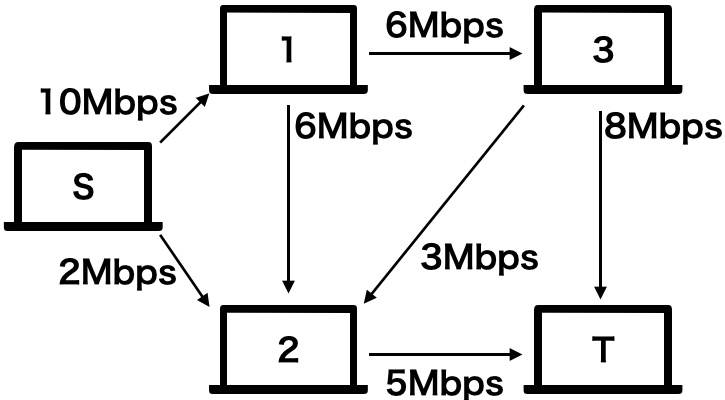
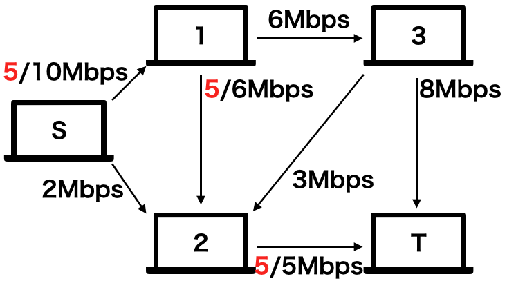
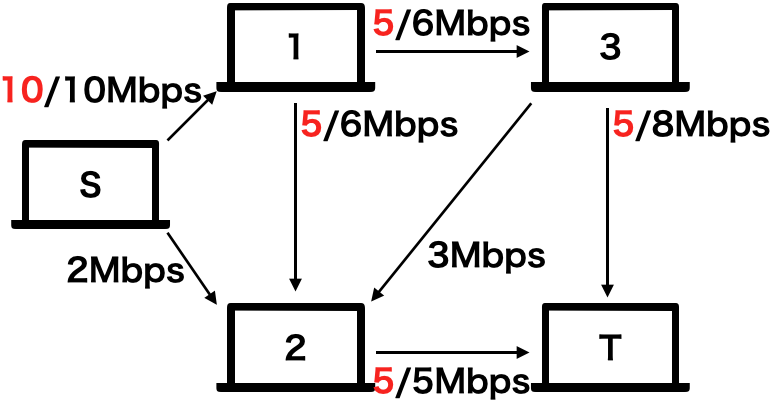
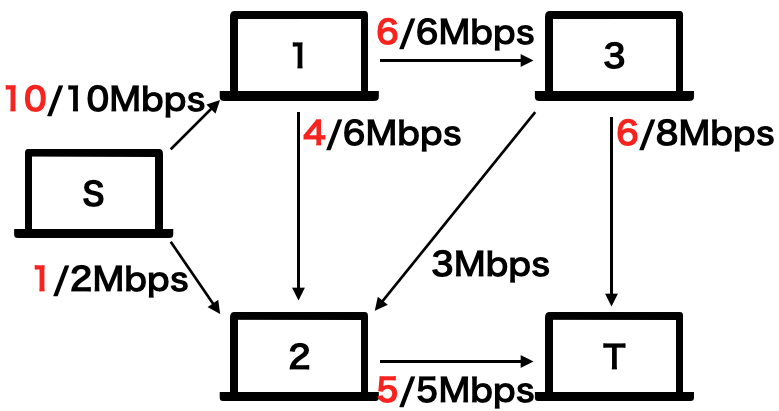
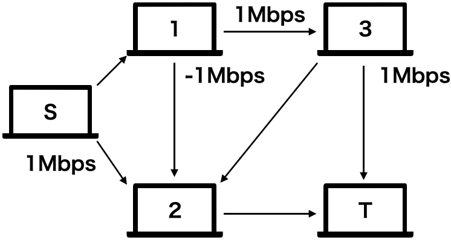

グラフにおける最大流・最小流問題についてを述べる。

以下に例題を示す。

```

ネットワーク上の2台のコンピュータS,Tがあり、SからTにデータを送りたいとする。
このネットワークには全部でN台のコンピュータがあり、いくつかのコンピュータの間は一方向性の通信ケーブルで接続されていて、
それぞれ１秒間に通信できる最大のデータ量が決まっています。他のコンピュータが通信を行なっていない時、
sからtへどれだけのデータを送信することができるでしょうか。

```



まずは、貪欲法を用いて流せるところに目一杯データを流すという方法が考えられる。以下のアルゴリズムを考える。

1. 流れているデータ量が最大に達していない辺のみを用いたsからtへのパスを見つける
2. そのようなパスが存在しなければ終了。存在すれば、そのパスに沿って目一杯流し、1.へ戻る

このアルゴリズムで試した場合、以下のような流れになる。





これが最適なのか？というと、実はもっと最適な方法があり、以下の通りである。



最初の貪欲法では最適解を導けないという事だろうか。

ここで、最適解と貪欲法で導いた解との、各辺におけるフローの差をとると以下の通りになる。



この図から、最適解は貪欲法で求めた解から更に一部のフローを押し戻す(図中の-1の辺)形で、新たにフローを足していると見ることができる。

ここで、先程のアルゴリズムを改良し、以下のように考えてみよう。

1. 流れているデータ量が最大に達していない辺、またはすでにデータが流れている辺の逆辺を用いたsからtへのパスを見つける
2. そのようなパスが存在しなければ終了。存在すれば、そのパスに沿って目一杯流し、1.へ戻る

これを最初の貪欲法で求めた状態から適用すると、s→2→1→3→tと大きさ1のフローを流せば最適解になる。(2→1は逆辺)

このアルゴリズムをコードで実装した例を以下に記載する。

```python
INF=float("inf")

class edge:
    def __init__(self,to,cap,rev):
            self.to=to
            self.cap=cap
            self.rev=rev

#頂点の数
V=0

#グラフ
G=[]
#DFSですでに使われたかのフラグ
used=[]

#初期化
def init(v):
    global G
    global used
    G=[[] for _ in range(v)]
    used=[False for _ in range(v)]

#fromからtoへ向かう容量capの辺をグラフに追加する
def add_edge(from_v,to_v,cap):
    global G
    #from->toの容量capの辺,逆辺はto->fromの辺
    G[from_v].append(edge(to_v,cap,len(G[to_v])))
    G[to_v].append(edge(from_v,0,len(G[from_v])-1))


#増加パスをDFSで探す
def dfs(v,t,f):
    global G
    global used
    if(v==t):
        return f
    used[v]=True
    for i in range(len(G[v])):
        e=G[v][i]
        if(not used[e.to] and e.cap > 0):
            d = dfs(e.to,t,min(f,e.cap))
            if(d>0):
                e.cap-=d
                G[e.to][e.rev].cap+=d
                return d
    return 0

#sからtへの最大流を求める
def max_flow(s,t):
    global used
    flow=0
    while True:
        used=[False for _ in range(V)]
        f=dfs(s,t,INF)
        if(f==0):
            return flow
        flow+=f

#初期化
V=5
init(V)

#入力(辺)
add_edge(0,1,10)
add_edge(0,2,2)
add_edge(1,2,6)
add_edge(1,3,6)
add_edge(3,2,3)
add_edge(2,4,5)
add_edge(3,4,8)

#実行
ans=max_flow(0,4)
print(ans)
```

実行結果

```
11
```


となり、最適解が求められる。