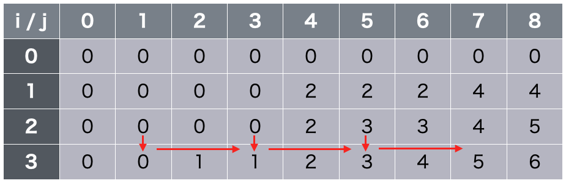

動的計画法の応用問題をいくつか紹介する。

## 最長共通部分列問題

例えば以下のような問題。

```
２つの文字列s,tの共通部分文字列の長さの最大値を求めなさい。

ただし、文字列xの部分文字列とは、xから連続するn文字 (0≦n≦|x|) を取り出してできる文字列のことである。
```

２つの文字列の部分文字列として当てはまる文字列のうち、最長となるものの長さを求める問題で、このような問題は**最長共通部分列問題(LCS: Longest Common Subsequence)**と呼ばれている。この問題も、動的計画法で行える。

２次元リストdp[i][j]を「sのi文字目までの文字列とtのj文字目までの文字列における最長共通部分文字列の長さ」とする。

この時、以下の式が成り立つ。


  dp[i+1][j+1] = 
    \begin{cases}
        max(dp[i][j]+1,dp[i][j+1],dp[i+1][j]) & ( (sのi+1文字目) = (tのj+1文字目) ) \\
        max(dp[i][j+1],dp[i+1][j]) & (それ以外)
    \end{cases}


図で表すと、以下のようになる。


実装例を以下に示す。

```python
s=input() #文字列s
t=input() #文字列t

dp=[[0 for _ in range(len(t)+1)] for _ in range(len(s)+1)]
for i in range(len(s)):
    for j in range(len(t)):
        if(s[i]==t[j]):
            dp[i+1][j+1] = max(dp[i][j]+1,dp[i+1][j],dp[i][j+1])
        else:
            dp[i+1][j+1] = max(dp[i+1][j],dp[i][j+1])

print(dp[len(s)][len(t)]) #sとtの最長共通部分文字列の長さ = 答え
```

<hr>

## 個数制限なしナップザック問題

```
重さがwi、価値がviであるようなn個の品物があった時、重さの総和がWを超えないように品物を選ぶ時の、価値の総和の最大値を求めよ。

ただし、同じ品物を複数回選んでも良い。
```

前述の動的計画法の章では１つの品物は複数回選べない指定であったが、同じ品物を複数回取れるとなるとどのようにすれば良いか。


この問題も動的計画法を応用してできる。２次元リストdp[i][j]を以下のように設定する。

dp[i+1][j] = i番目までの品物から重さの総和がj以下となるような時の、価値の総和の最大値

すると、漸化式は以下のようになる。


\begin{cases}
    dp[0][j] &= 0  \\
    dp[i+1][j] &= max( dp[i][j-k*w[i]] + k*v[i] 　|　 0 \leq  k \leq \frac{j}{w[i]} )
\end{cases}


実装例を以下に示す。

```python
#個数制限なしナップザック問題

#個数,最大の重さ
n,W=map(int,input().split())
#価値と重さ
v=[]
w=[]

#vi,wiでi番目の品物の価値と重さ
for i in range(n):
    vi,wi=map(int,input().split())
    v.append(vi)
    w.append(wi)

#dp
dp=[[0 for _ in range(W+1)] for _ in range(n+1)]

#計算
for i in range(n):
    for j in range(W+1):
        k=0
        while(k*w[i]<=j):
            dp[i+1][j] = max(dp[i+1][j],dp[i][j-k*w[i]]+k*v[i])
            k+=1

#答え
print(dp[n][W])
```

これで良いか、と言いたいところだが、コードを見てくれたらわかるように、このアルゴリズムだと計算量がO(nW<sup>2</sup>)となり不十分である。

計算過程を図にすると以下の通りである。(値は例)


図を見てわかるように、dp[i+1][j]のところでk≧1の計算をするときに計算を複数回行う箇所がある。

ここが改善のポイントで、dp[i][j]からi番目の品物をk個選んだ結果をdp[i+1][j+k*w[i]]とするのではなく、i番目の品物を0個選んだ結果(dp[i+1][j] (= i番目までの品物から重さの総和がj以下となるような時の、価値の総和の最大値))にi番目の品物を1個選んだときの結果を利用していけばよい。(dp[i+1][j+w[i]]=dp[i+1][j]+v[i]) k≧1での複数回計算をせずとも、この計算1回だけを行えば,kに関するループがなくなる。

図で表すと以下のようになる。



コード例は以下の通り。(計算部分のみ抜粋)

```python
#計算
for i in range(n):
    for j in range(W+1):
        if(j<w[i]):
            dp[i+1][j]=dp[i][j]
        else:
            dp[i+1][j]=max(dp[i][j],dp[i+1][j-w[i]]+v[i])
```

<hr>

### 値が大きい時

続いて、例その２。

```
重さがwi、価値がviであるようなn個の品物があった時、重さの総和がWを超えないように品物を選ぶ時の、価値の総和の最大値を求めよ。

ただし、同じ品物を複数回選んでも良い。

(制約)
1≦n≦100
1≦wi≦10000000
1≦vi≦100
1≦W≦1000000000

```

先ほどと同じ問題だが、今度は各変数の最大値がかなり大きな数になっており、先ほどと同じアルゴリズムを適用するとかなり長い時間がかかってしまう。

しかし、今回は価値の値が小さいので、そちらを使って動的計画法を利用することを考えてみる。

２次元リストdp[i][j]を以下のように設定する。

dp[i+1][j] = i番目までの品物から価値の総和がjとなるように選んだ時の、重さの総和の最小値（存在しない場合はINF）

この時、漸化式は以下のようになる。


\begin{cases}
    dp[0][0] &= 0  \\
    dp[0][j] &= INF  \\
    dp[i+1][j] &= min( dp[i][j],dp[i][j-v[i]]+w[i] )
\end{cases}



コード例は以下の通り。(計算部分のみ抜粋)

```python
import math
dp=[[math.inf for _ in range(n*max(v)+1)] for _ in range(n+1)]
dp[0][0]=0
#計算
for i in range(n):
    for j in range(n*max(v)+1):
        if(j<v[i]):
            dp[i+1][j]=dp[i][j]
        else:
            dp[i+1][j]=min(dp[i][j],dp[i][j-v[i]]+w[i])
```

<hr>

## 個数制限付き部分和問題

```
n種類の数aiがそれぞれmi個ずつあります。これらの中からいくつか選び、その総和をちょうどKにすることができるか判定しなさい。

(制約)
・1≦n≦100
・1≦ai,mi≦100000
・1≦K≦100000
```

解き方は様々あるが、一例として2次元リストdpを以下のように設定してみよう。

dp[i][j]:i番目までの数値でjが作れるか

i番目までの数値でjを作るには、i-1番目までの数値で j-α×(i番目の数値) が作れる必要がある。(αは0以上の整数)

したがって、漸化式は以下のようになる。


dp[i][j] = 
\begin{cases}
    True  & (dp[i-1][j-k*a_i] = True となるk (0 \leqq k \leqq m_{i} かつ k a_i \leqq j) が存在する場合)  \\
    False & (otherwise)
\end{cases}


コード例は以下の通り。

```python
n=3
a=[3,5,8]
m=[3,2,2]
K=17

dp=[[False for _ in range(K+1)] for _ in range(n+1)]
dp[0][0]=True

for i in range(n):
    for j in range(K+1):
        if(dp[i][j]):
            k=0
            while j+k*a[i]<=K:
                dp[i+1][j+k*a[i]]=True
                k+=1

print(dp[n][K])
```

<hr>

## 最長増加部分列問題

増加部分列とは、数列aiにおいて、全てのl＜mにおいてal＜amが成り立つ部分列のことである。

最長増加部分列問題(LIS:Longest Increasing Subsequence)とは、数列の内の最も長い部分列を求める問題である。

例題を以下に記載する。

```
長さnの数列a<sub>0</sub>,a<sub>1</sub>,・・・a<sub>n-1</sub>があります。この数列の増加部分列のうち、最長のものの長さを求めなさい。

(制約)
1≦n≦1000
0≦ai≦1000000
```

この問題も動的計画法を用いることで解くことができる。リストdpを以下のように設定する。

dp[i]: 最後がa<sub>i</sub>であるような最長の部分文字列の長さ

この時、dp[i]は以下の式で表される。


dp[i][j] = max(1,dp[j]+1 　|　 j < i かつ a_{j} < a_{i} )


コード例を以下に示す。計算量はO(n<sup>2</sup>)である。

```python
n=5
a=[4,2,3,1,5]

dp=[0 for _ in range(n)]

for i in range(n):
    dp[i]=1
    for j in range(i):
        if(a[j] < a[i]):
            dp[i]=max(dp[i],dp[j]+1)

print(max(dp))
```

実行結果

```
3
```

<hr>

## 分割数


```
n個の互いに区別できない品物を、m個以下に分割する方法の総数を求め、Mで割った余りを答えなさい。

(制約)
1≦m≦n≦1000
2≦M≦10000
```

このような問題をnのm分割という。n=mの時はnの分割数という。

これに動的計画法を適用してみよう。リストdpを以下のように定める。

dp[i][j]:jのi分割の総数

ここでjのi分割の個数は、j-iのi分割にそれぞれ1を足したパターン、及びjのi-1分割に1を追加したパターンとみることができるので、以下のように表せられる。


dp[i][j] = dp[i][j-1] + dp[i-1][j]


例として、n,m≦10の場合でどうなるかを見てみよう。

```python
n=10
m=10
M=(10**9)+7

dp=[[0 for _ in range(n+1)] for _ in range(m+1)]

dp[0][0]=1
print(dp[0])
for i in range(1,m+1):
    for j in range(n+1):
        if(j-i>=0):
            dp[i][j]=(dp[i-1][j]+dp[i][j-1])%M
        else:
            dp[i][j]=dp[i-1][j]
    print(dp[i])
```

実行結果

```
[1, 0, 0, 0, 0, 0, 0, 0, 0, 0, 0]
[1, 1, 1, 1, 1, 1, 1, 1, 1, 1, 1]
[1, 1, 2, 3, 4, 5, 6, 7, 8, 9, 10]
[1, 1, 2, 5, 9, 14, 20, 27, 35, 44, 54]
[1, 1, 2, 5, 14, 28, 48, 75, 110, 154, 208]
[1, 1, 2, 5, 14, 42, 90, 165, 275, 429, 637]
[1, 1, 2, 5, 14, 42, 132, 297, 572, 1001, 1638]
[1, 1, 2, 5, 14, 42, 132, 429, 1001, 2002, 3640]
[1, 1, 2, 5, 14, 42, 132, 429, 1430, 3432, 7072]
[1, 1, 2, 5, 14, 42, 132, 429, 1430, 4862, 11934]
[1, 1, 2, 5, 14, 42, 132, 429, 1430, 4862, 16796]
```

<hr>

## 重複組み合わせ

```
n種類の品物があり、i番目の品物はai個あります。異なる種類の品物同士は区別できますが、同じ種類の品物同士は区別できません。

これらの品物の中からm個選ぶ組み合わせの総数を求め、Mで割った余りを答えなさい。

(制約)
1≦n≦1000
1≦m≦1000
1≦ai≦1000
2≦M≦10000
```

高校数学Aでも出てきた重複組み合わせの問題である。これも動的計画法を適用して考えてみよう。リストdpを以下のように定めてみる。

dp[i][j]:i番目までの品物からj個選ぶ組み合わせの総数

i番目までの品物からj個選ぶためには、i-1番目までの品物からj-k個選んで、i番目の品物をk個加えれば良いので、以下の漸化式が成り立つ。


\tag{1} dp[i][j] = \sum_{k=0}^{ min(j,a_{i-1}) } dp[i-1][j-k] 


ここで、


\tag{2} 
\begin{aligned}
&\sum_{k=0}^{ min(j,a_{i-1}) } dp[i-1][j-k] \\
&= \sum_{k=0}^{ min(j,a_{i-1}) } dp[i-1][j-1-k] + dp[i-1][j] - dp[i-1][j-1-a_{i-1}] 
\end{aligned}


となるので、式(1)から式(2)は


\tag{3} dp[i][j] = dp[i][j-1] + dp[i-1][j] - dp[i-1][j-1-a_{i-1}] 


と表される。

コード例は以下の通り。

```python
n=3
m=3
a=[1,2,3]
M=(10**9)+7

dp=[[0 for _ in range(m+1)] for _ in range(n+1)]

for i in range(n+1):
    # 1個も選ばない方法は1通り
    dp[i][0]=1

for i in range(1,n+1):
    for j in range(1,m+1):
        if(j-1-a[i-1]>=0):
            dp[i][j]=(dp[i][j-1]+dp[i-1][j]-dp[i-1][j-1-a[i-1]])%M
        else:
            dp[i][j]=(dp[i][j-1]+dp[i-1][j])%M

print(dp[n][m])
```

実行結果

```
6
```

<hr>

## ビットDP

続いて、ビットDPについてを示す。

例題として、**巡回セールスマン問題**と呼ばれる問題を利用する。

```
以下のグラフにおいて、頂点0からスタートして全ての頂点をちょうど一度ずつ巡って帰ってくる閉路のうち、重みの総和の最小値を求めなさい。
グラフは、距離行列d(i,j)として与えられる。

(制約)
2≦n≦15
0≦d(i,j)≦1000
```


実は、巡回セールスマン問題は一般的に計算時間がかかる問題となっており、大きい数での場合はプログラミングコンテストでの一般的な制限時間下では解けないことが多いが、この例題のような小さいサイズでなら解答可能であり、プログラミングコンテストでも出題されることがある。

スタート地点を指定した時、頂点の訪問順は(n-1)!通りあるが、計算量が大きくなるためこれを律儀に計算することは不可能である。実は、この巡回セールスマン問題においてもDPが適用できる。

すでに訪れた頂点の集合をS、現在頂点vにいる状態から残りの全ての頂点をめぐって頂点0(スタート地点)に変えるような経路の重みの最小値をdp[S][v]とおく。

すると、Vを全ての頂点の集合とした時、以下の式が成り立つ。


\begin{aligned}
dp[V][0] &= 0  \\
dp[S][v] &= min( dp[S \cup {u}][u] + d(v,u) | u \notin S  ) 
\end{aligned}


ここで、リストdpのインデックスには集合が使われているが、これをどのように表現すれば良いだろうか？

これには一例として、整数のビット表現を用いて表す方法がある。今回の例では頂点が5つなので、0b00000~0b11111の数字で集合を表す。例えば頂点0のみが訪問済みの場合は、2^0の位のみを1、あとは全て0とした数の0b00001、頂点4のみ訪れてない場合は2^4の位を0、あとは全部1の0b01111とする。

コードでの実装例を以下に示す。

```python
INF=float("inf")

#入力
n=5
d=[[INF for _ in range(n)] for _ in range(n)]

#DP
dp=[[-1 for _ in range(n)] for _ in range(2**n)]
#経路
route="0"

def rec(S,v,r):
    if(dp[S][v] >= 0):
        return dp[S][v],r
    
    if(S == 2**n - 1 and v == 0):
        #全ての頂点を訪れて戻ってきた
        dp[S][v] = 0
        return dp[S][v],r
    
    res = INF
    ans_route=r
    for u in range(n):
        #uがまだ訪れてない? -> Sの2^u桁目が0
        if d[v][u] != INF and (not (S >> u & 1)):
            #次にuに移動する
            res_u,res_route=rec(S | 1 << u , u , r+" -> "+str(u))
            #uに移動した結果の重みが小さいならばその結果を保存する
            if(res>res_u + d[v][u]):
                res=res_u + d[v][u]
                ans_route=res_route
    dp[S][v] = res
    return dp[S][v],ans_route

ans,route=rec(0,0,route)
print("答:{0},経路:{1}".format(ans,route))


```

試しに、例のグラフのデータを入力して実行してみよう。

```python
n=5
d=[[INF,3,INF,4,INF],[INF,INF,5,INF,INF],[4,INF,INF,5,INF],[INF,INF,INF,INF,3],[7,6,INF,INF,INF]]
```

実行結果は以下の通り。

```
答:22,経路:0 -> 3 -> 4 -> 1 -> 2 -> 0
```